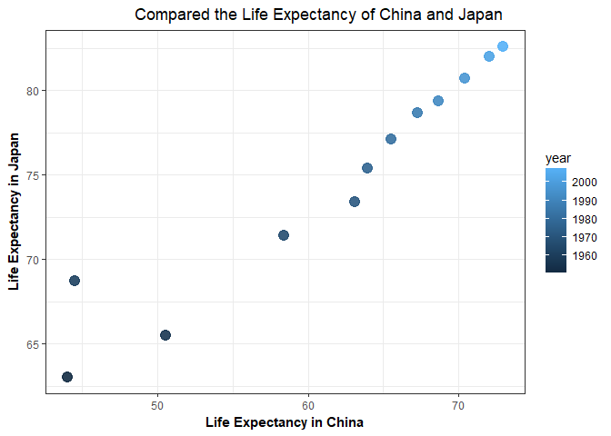
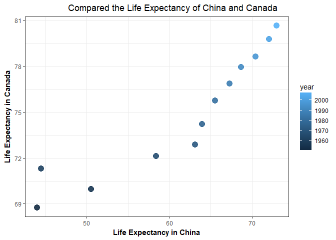
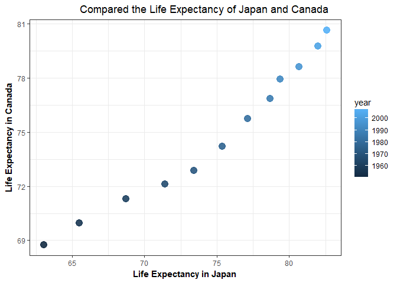

homework04
================

Load the data
-------------

``` r
suppressPackageStartupMessages(library(tidyverse))  
suppressPackageStartupMessages(library(gapminder))
### First time install.packages("kableExtra")
suppressPackageStartupMessages(library(kableExtra))
```

    ## Warning: package 'kableExtra' was built under R version 3.4.2

General data reshaping and relationship to aggregation
------------------------------------------------------

### Activity \#1

-   Make you own cheatsheet.

### Activity \#2

-   Make a tibble with one row per year and columns for life expectancy for two or more countries.
    -   Use knitr::kable() to make this table look pretty in your rendered homework.
    -   Take advantage of this new data shape to scatterplot life expectancy for one country against that of another.

``` r
p1<- gapminder %>% 
  filter(country %in% c("China", "Canada", "Japan")) %>% 
  select(country,lifeExp, year) %>% 
  spread(key =country, value =lifeExp)
knitr::kable(p1,format = "html") %>% 
  kable_styling(bootstrap_options = c("striped", "hover")) %>% 
    row_spec(12, bold = T, color = "white", background = "#D7261E")
```

<table class="table table-striped table-hover" style="margin-left: auto; margin-right: auto;">
<thead>
<tr>
<th style="text-align:right;">
year
</th>
<th style="text-align:right;">
Canada
</th>
<th style="text-align:right;">
China
</th>
<th style="text-align:right;">
Japan
</th>
</tr>
</thead>
<tbody>
<tr>
<td style="text-align:right;">
1952
</td>
<td style="text-align:right;">
68.750
</td>
<td style="text-align:right;">
44.00000
</td>
<td style="text-align:right;">
63.030
</td>
</tr>
<tr>
<td style="text-align:right;">
1957
</td>
<td style="text-align:right;">
69.960
</td>
<td style="text-align:right;">
50.54896
</td>
<td style="text-align:right;">
65.500
</td>
</tr>
<tr>
<td style="text-align:right;">
1962
</td>
<td style="text-align:right;">
71.300
</td>
<td style="text-align:right;">
44.50136
</td>
<td style="text-align:right;">
68.730
</td>
</tr>
<tr>
<td style="text-align:right;">
1967
</td>
<td style="text-align:right;">
72.130
</td>
<td style="text-align:right;">
58.38112
</td>
<td style="text-align:right;">
71.430
</td>
</tr>
<tr>
<td style="text-align:right;">
1972
</td>
<td style="text-align:right;">
72.880
</td>
<td style="text-align:right;">
63.11888
</td>
<td style="text-align:right;">
73.420
</td>
</tr>
<tr>
<td style="text-align:right;">
1977
</td>
<td style="text-align:right;">
74.210
</td>
<td style="text-align:right;">
63.96736
</td>
<td style="text-align:right;">
75.380
</td>
</tr>
<tr>
<td style="text-align:right;">
1982
</td>
<td style="text-align:right;">
75.760
</td>
<td style="text-align:right;">
65.52500
</td>
<td style="text-align:right;">
77.110
</td>
</tr>
<tr>
<td style="text-align:right;">
1987
</td>
<td style="text-align:right;">
76.860
</td>
<td style="text-align:right;">
67.27400
</td>
<td style="text-align:right;">
78.670
</td>
</tr>
<tr>
<td style="text-align:right;">
1992
</td>
<td style="text-align:right;">
77.950
</td>
<td style="text-align:right;">
68.69000
</td>
<td style="text-align:right;">
79.360
</td>
</tr>
<tr>
<td style="text-align:right;">
1997
</td>
<td style="text-align:right;">
78.610
</td>
<td style="text-align:right;">
70.42600
</td>
<td style="text-align:right;">
80.690
</td>
</tr>
<tr>
<td style="text-align:right;">
2002
</td>
<td style="text-align:right;">
79.770
</td>
<td style="text-align:right;">
72.02800
</td>
<td style="text-align:right;">
82.000
</td>
</tr>
<tr>
<td style="text-align:right;font-weight: bold;color: white;background-color: #D7261E;">
2007
</td>
<td style="text-align:right;font-weight: bold;color: white;background-color: #D7261E;">
80.653
</td>
<td style="text-align:right;font-weight: bold;color: white;background-color: #D7261E;">
72.96100
</td>
<td style="text-align:right;font-weight: bold;color: white;background-color: #D7261E;">
82.603
</td>
</tr>
</tbody>
</table>
From the table above, it very easy to compare the life expectancy for different countries in different years. And the same time, it can find some trends in each country's column. Moreover, I find the highest life expectancy for these three countries are in 2007.

``` r
p1 %>% 
  ggplot(aes(x = China, y = Japan)) +
  geom_point(size= 4,aes(color = year), alpha = 0.9) +
  theme_bw() +
  theme(axis.title.x = element_text(size=11),
        axis.title.y = element_text(size=11),
        axis.title = element_text(size = 15, face = "bold"),
        plot.title = element_text(hjust = 0.8))+
  ggtitle("Compared the Life Expectancy of China and Japan")+
  labs( y = "Life Expectancy in Japan", x = "Life Expectancy in China")+
  scale_color_continuous("year")
```



From the graph above, it shows that the lfe expectancy of Japan are much higher than China in 1960. And China's life expectancy increased dramatically. Therefore, they almost have the same Life expectancy at the end of 2007.

``` r
p1 %>% 
  ggplot(aes(x = China, y = Canada)) +
  geom_point(size= 4,aes(color = year), alpha = 0.9) +
 theme_bw() +
  theme(axis.title.x = element_text(size=11),
        axis.title.y = element_text(size=11),
        axis.title = element_text(size = 15, face = "bold"),
        plot.title = element_text(hjust = 0.8))+
  ggtitle("Compared the Life Expectancy of China and Canada")+
  labs( y = "Life Expectancy in Canada", x = "Life Expectancy in China")+
  scale_color_continuous("year")
```



We could find that life exoecatancy of both China and Canada rose smoothly before 1965, and had a huge change after 1965.

``` r
p1 %>% 
  ggplot(aes(x = Japan, y = Canada)) +
  geom_point(size= 4,aes(color = year), alpha = 0.9) +
   theme_bw() +
  theme(axis.title.x = element_text(size=11),
        axis.title.y = element_text(size=11),
        axis.title = element_text(size = 15, face = "bold"),
        plot.title = element_text(hjust = 0.8))+
  ggtitle("Compared the Life Expectancy of Japan and Canada")+
  labs( y = "Life Expectancy in Canada", x = "Life Expectancy in Japan")+
  scale_color_continuous("year")
```



When we compared life expectancy in Japan and Life expectancy, they increased at certain ratio from 1960 to 2007.

Join, merge, look up
--------------------

### Activity \#1

-   Create a second data frame, complementary to Gapminder. Join this with (part of) Gapminder using a dplyr join function and make some observations about the process and result. Explore the different types of joins. Examples of a second data frame you could build:
    -   One row per country, a country variable and one or more variables with extra info, such as language spoken, NATO membership, national animal, or capitol city. If you really want to be helpful, you could attempt to make a pull request to resolve this issue, where I would like to bring ISO country codes into the gapminder package.
    -   One row per continent, a continent variable and one or more variables with extra info, such as northern versus southern hemisphere.

``` r
country<-c("China","Canada","Germany","Japan","Brazil","Italy","Greece","Iceland","Austria","Finland","Denmark","Vatican City State")
NATO<-c(0,1,1,0,0,1,1,1,0,0,1,0)
capitol_city<-c("Beijing","Ottawa","Berlin","Tokyo","Brasília","Rome", "Athens", "Reykjavík","Canberra","Helsinki","Copenhagen","Vatican")
language_spoken<-c("Mandarin", "English"," German","Japanese", "Portuguese", "Italian", "Greek","Icelandic","English", "Finnish ", "Danish","Vatican")
more_info <- data.frame(country, NATO, capitol_city,language_spoken)
knitr::kable(more_info)
```

| country            |  NATO| capitol\_city | language\_spoken |
|:-------------------|-----:|:--------------|:-----------------|
| China              |     0| Beijing       | Mandarin         |
| Canada             |     1| Ottawa        | English          |
| Germany            |     1| Berlin        | German           |
| Japan              |     0| Tokyo         | Japanese         |
| Brazil             |     0| Brasília      | Portuguese       |
| Italy              |     1| Rome          | Italian          |
| Greece             |     1| Athens        | Greek            |
| Iceland            |     1| Reykjavík     | Icelandic        |
| Austria            |     0| Canberra      | English          |
| Finland            |     0| Helsinki      | Finnish          |
| Denmark            |     1| Copenhagen    | Danish           |
| Vatican City State |     0| Vatican       | Vatican          |

I found a dataframe with extra three columns, which includes whether they belong to NATO, capital city of the country and primary language spoken in a country.

#### left\_join

``` r
leftjoin<- gapminder %>% 
  left_join(more_info)
```

    ## Joining, by = "country"

    ## Warning: Column `country` joining factors with different levels, coercing
    ## to character vector

``` r
knitr::kable(head(leftjoin))
```

| country     | continent |  year|  lifeExp|       pop|  gdpPercap|  NATO| capitol\_city | language\_spoken |
|:------------|:----------|-----:|--------:|---------:|----------:|-----:|:--------------|:-----------------|
| Afghanistan | Asia      |  1952|   28.801|   8425333|   779.4453|    NA| NA            | NA               |
| Afghanistan | Asia      |  1957|   30.332|   9240934|   820.8530|    NA| NA            | NA               |
| Afghanistan | Asia      |  1962|   31.997|  10267083|   853.1007|    NA| NA            | NA               |
| Afghanistan | Asia      |  1967|   34.020|  11537966|   836.1971|    NA| NA            | NA               |
| Afghanistan | Asia      |  1972|   36.088|  13079460|   739.9811|    NA| NA            | NA               |
| Afghanistan | Asia      |  1977|   38.438|  14880372|   786.1134|    NA| NA            | NA               |

`left_join` includes all observations in `gapminder`, regardless of whether they match or not. There are a lot of NAs but we don’t lose observations from your primary `gapminder`.

#### right\_join

``` r
rightjoin<- gapminder %>% 
  right_join(more_info)
```

    ## Joining, by = "country"

    ## Warning: Column `country` joining factors with different levels, coercing
    ## to character vector

``` r
knitr::kable(rightjoin)
```

| country            | continent |  year|   lifeExp|         pop|   gdpPercap|  NATO| capitol\_city | language\_spoken |
|:-------------------|:----------|-----:|---------:|-----------:|-----------:|-----:|:--------------|:-----------------|
| China              | Asia      |  1952|  44.00000|   556263527|    400.4486|     0| Beijing       | Mandarin         |
| China              | Asia      |  1957|  50.54896|   637408000|    575.9870|     0| Beijing       | Mandarin         |
| China              | Asia      |  1962|  44.50136|   665770000|    487.6740|     0| Beijing       | Mandarin         |
| China              | Asia      |  1967|  58.38112|   754550000|    612.7057|     0| Beijing       | Mandarin         |
| China              | Asia      |  1972|  63.11888|   862030000|    676.9001|     0| Beijing       | Mandarin         |
| China              | Asia      |  1977|  63.96736|   943455000|    741.2375|     0| Beijing       | Mandarin         |
| China              | Asia      |  1982|  65.52500|  1000281000|    962.4214|     0| Beijing       | Mandarin         |
| China              | Asia      |  1987|  67.27400|  1084035000|   1378.9040|     0| Beijing       | Mandarin         |
| China              | Asia      |  1992|  68.69000|  1164970000|   1655.7842|     0| Beijing       | Mandarin         |
| China              | Asia      |  1997|  70.42600|  1230075000|   2289.2341|     0| Beijing       | Mandarin         |
| China              | Asia      |  2002|  72.02800|  1280400000|   3119.2809|     0| Beijing       | Mandarin         |
| China              | Asia      |  2007|  72.96100|  1318683096|   4959.1149|     0| Beijing       | Mandarin         |
| Canada             | Americas  |  1952|  68.75000|    14785584|  11367.1611|     1| Ottawa        | English          |
| Canada             | Americas  |  1957|  69.96000|    17010154|  12489.9501|     1| Ottawa        | English          |
| Canada             | Americas  |  1962|  71.30000|    18985849|  13462.4855|     1| Ottawa        | English          |
| Canada             | Americas  |  1967|  72.13000|    20819767|  16076.5880|     1| Ottawa        | English          |
| Canada             | Americas  |  1972|  72.88000|    22284500|  18970.5709|     1| Ottawa        | English          |
| Canada             | Americas  |  1977|  74.21000|    23796400|  22090.8831|     1| Ottawa        | English          |
| Canada             | Americas  |  1982|  75.76000|    25201900|  22898.7921|     1| Ottawa        | English          |
| Canada             | Americas  |  1987|  76.86000|    26549700|  26626.5150|     1| Ottawa        | English          |
| Canada             | Americas  |  1992|  77.95000|    28523502|  26342.8843|     1| Ottawa        | English          |
| Canada             | Americas  |  1997|  78.61000|    30305843|  28954.9259|     1| Ottawa        | English          |
| Canada             | Americas  |  2002|  79.77000|    31902268|  33328.9651|     1| Ottawa        | English          |
| Canada             | Americas  |  2007|  80.65300|    33390141|  36319.2350|     1| Ottawa        | English          |
| Germany            | Europe    |  1952|  67.50000|    69145952|   7144.1144|     1| Berlin        | German           |
| Germany            | Europe    |  1957|  69.10000|    71019069|  10187.8267|     1| Berlin        | German           |
| Germany            | Europe    |  1962|  70.30000|    73739117|  12902.4629|     1| Berlin        | German           |
| Germany            | Europe    |  1967|  70.80000|    76368453|  14745.6256|     1| Berlin        | German           |
| Germany            | Europe    |  1972|  71.00000|    78717088|  18016.1803|     1| Berlin        | German           |
| Germany            | Europe    |  1977|  72.50000|    78160773|  20512.9212|     1| Berlin        | German           |
| Germany            | Europe    |  1982|  73.80000|    78335266|  22031.5327|     1| Berlin        | German           |
| Germany            | Europe    |  1987|  74.84700|    77718298|  24639.1857|     1| Berlin        | German           |
| Germany            | Europe    |  1992|  76.07000|    80597764|  26505.3032|     1| Berlin        | German           |
| Germany            | Europe    |  1997|  77.34000|    82011073|  27788.8842|     1| Berlin        | German           |
| Germany            | Europe    |  2002|  78.67000|    82350671|  30035.8020|     1| Berlin        | German           |
| Germany            | Europe    |  2007|  79.40600|    82400996|  32170.3744|     1| Berlin        | German           |
| Japan              | Asia      |  1952|  63.03000|    86459025|   3216.9563|     0| Tokyo         | Japanese         |
| Japan              | Asia      |  1957|  65.50000|    91563009|   4317.6944|     0| Tokyo         | Japanese         |
| Japan              | Asia      |  1962|  68.73000|    95831757|   6576.6495|     0| Tokyo         | Japanese         |
| Japan              | Asia      |  1967|  71.43000|   100825279|   9847.7886|     0| Tokyo         | Japanese         |
| Japan              | Asia      |  1972|  73.42000|   107188273|  14778.7864|     0| Tokyo         | Japanese         |
| Japan              | Asia      |  1977|  75.38000|   113872473|  16610.3770|     0| Tokyo         | Japanese         |
| Japan              | Asia      |  1982|  77.11000|   118454974|  19384.1057|     0| Tokyo         | Japanese         |
| Japan              | Asia      |  1987|  78.67000|   122091325|  22375.9419|     0| Tokyo         | Japanese         |
| Japan              | Asia      |  1992|  79.36000|   124329269|  26824.8951|     0| Tokyo         | Japanese         |
| Japan              | Asia      |  1997|  80.69000|   125956499|  28816.5850|     0| Tokyo         | Japanese         |
| Japan              | Asia      |  2002|  82.00000|   127065841|  28604.5919|     0| Tokyo         | Japanese         |
| Japan              | Asia      |  2007|  82.60300|   127467972|  31656.0681|     0| Tokyo         | Japanese         |
| Brazil             | Americas  |  1952|  50.91700|    56602560|   2108.9444|     0| Brasília      | Portuguese       |
| Brazil             | Americas  |  1957|  53.28500|    65551171|   2487.3660|     0| Brasília      | Portuguese       |
| Brazil             | Americas  |  1962|  55.66500|    76039390|   3336.5858|     0| Brasília      | Portuguese       |
| Brazil             | Americas  |  1967|  57.63200|    88049823|   3429.8644|     0| Brasília      | Portuguese       |
| Brazil             | Americas  |  1972|  59.50400|   100840058|   4985.7115|     0| Brasília      | Portuguese       |
| Brazil             | Americas  |  1977|  61.48900|   114313951|   6660.1187|     0| Brasília      | Portuguese       |
| Brazil             | Americas  |  1982|  63.33600|   128962939|   7030.8359|     0| Brasília      | Portuguese       |
| Brazil             | Americas  |  1987|  65.20500|   142938076|   7807.0958|     0| Brasília      | Portuguese       |
| Brazil             | Americas  |  1992|  67.05700|   155975974|   6950.2830|     0| Brasília      | Portuguese       |
| Brazil             | Americas  |  1997|  69.38800|   168546719|   7957.9808|     0| Brasília      | Portuguese       |
| Brazil             | Americas  |  2002|  71.00600|   179914212|   8131.2128|     0| Brasília      | Portuguese       |
| Brazil             | Americas  |  2007|  72.39000|   190010647|   9065.8008|     0| Brasília      | Portuguese       |
| Italy              | Europe    |  1952|  65.94000|    47666000|   4931.4042|     1| Rome          | Italian          |
| Italy              | Europe    |  1957|  67.81000|    49182000|   6248.6562|     1| Rome          | Italian          |
| Italy              | Europe    |  1962|  69.24000|    50843200|   8243.5823|     1| Rome          | Italian          |
| Italy              | Europe    |  1967|  71.06000|    52667100|  10022.4013|     1| Rome          | Italian          |
| Italy              | Europe    |  1972|  72.19000|    54365564|  12269.2738|     1| Rome          | Italian          |
| Italy              | Europe    |  1977|  73.48000|    56059245|  14255.9847|     1| Rome          | Italian          |
| Italy              | Europe    |  1982|  74.98000|    56535636|  16537.4835|     1| Rome          | Italian          |
| Italy              | Europe    |  1987|  76.42000|    56729703|  19207.2348|     1| Rome          | Italian          |
| Italy              | Europe    |  1992|  77.44000|    56840847|  22013.6449|     1| Rome          | Italian          |
| Italy              | Europe    |  1997|  78.82000|    57479469|  24675.0245|     1| Rome          | Italian          |
| Italy              | Europe    |  2002|  80.24000|    57926999|  27968.0982|     1| Rome          | Italian          |
| Italy              | Europe    |  2007|  80.54600|    58147733|  28569.7197|     1| Rome          | Italian          |
| Greece             | Europe    |  1952|  65.86000|     7733250|   3530.6901|     1| Athens        | Greek            |
| Greece             | Europe    |  1957|  67.86000|     8096218|   4916.2999|     1| Athens        | Greek            |
| Greece             | Europe    |  1962|  69.51000|     8448233|   6017.1907|     1| Athens        | Greek            |
| Greece             | Europe    |  1967|  71.00000|     8716441|   8513.0970|     1| Athens        | Greek            |
| Greece             | Europe    |  1972|  72.34000|     8888628|  12724.8296|     1| Athens        | Greek            |
| Greece             | Europe    |  1977|  73.68000|     9308479|  14195.5243|     1| Athens        | Greek            |
| Greece             | Europe    |  1982|  75.24000|     9786480|  15268.4209|     1| Athens        | Greek            |
| Greece             | Europe    |  1987|  76.67000|     9974490|  16120.5284|     1| Athens        | Greek            |
| Greece             | Europe    |  1992|  77.03000|    10325429|  17541.4963|     1| Athens        | Greek            |
| Greece             | Europe    |  1997|  77.86900|    10502372|  18747.6981|     1| Athens        | Greek            |
| Greece             | Europe    |  2002|  78.25600|    10603863|  22514.2548|     1| Athens        | Greek            |
| Greece             | Europe    |  2007|  79.48300|    10706290|  27538.4119|     1| Athens        | Greek            |
| Iceland            | Europe    |  1952|  72.49000|      147962|   7267.6884|     1| Reykjavík     | Icelandic        |
| Iceland            | Europe    |  1957|  73.47000|      165110|   9244.0014|     1| Reykjavík     | Icelandic        |
| Iceland            | Europe    |  1962|  73.68000|      182053|  10350.1591|     1| Reykjavík     | Icelandic        |
| Iceland            | Europe    |  1967|  73.73000|      198676|  13319.8957|     1| Reykjavík     | Icelandic        |
| Iceland            | Europe    |  1972|  74.46000|      209275|  15798.0636|     1| Reykjavík     | Icelandic        |
| Iceland            | Europe    |  1977|  76.11000|      221823|  19654.9625|     1| Reykjavík     | Icelandic        |
| Iceland            | Europe    |  1982|  76.99000|      233997|  23269.6075|     1| Reykjavík     | Icelandic        |
| Iceland            | Europe    |  1987|  77.23000|      244676|  26923.2063|     1| Reykjavík     | Icelandic        |
| Iceland            | Europe    |  1992|  78.77000|      259012|  25144.3920|     1| Reykjavík     | Icelandic        |
| Iceland            | Europe    |  1997|  78.95000|      271192|  28061.0997|     1| Reykjavík     | Icelandic        |
| Iceland            | Europe    |  2002|  80.50000|      288030|  31163.2020|     1| Reykjavík     | Icelandic        |
| Iceland            | Europe    |  2007|  81.75700|      301931|  36180.7892|     1| Reykjavík     | Icelandic        |
| Austria            | Europe    |  1952|  66.80000|     6927772|   6137.0765|     0| Canberra      | English          |
| Austria            | Europe    |  1957|  67.48000|     6965860|   8842.5980|     0| Canberra      | English          |
| Austria            | Europe    |  1962|  69.54000|     7129864|  10750.7211|     0| Canberra      | English          |
| Austria            | Europe    |  1967|  70.14000|     7376998|  12834.6024|     0| Canberra      | English          |
| Austria            | Europe    |  1972|  70.63000|     7544201|  16661.6256|     0| Canberra      | English          |
| Austria            | Europe    |  1977|  72.17000|     7568430|  19749.4223|     0| Canberra      | English          |
| Austria            | Europe    |  1982|  73.18000|     7574613|  21597.0836|     0| Canberra      | English          |
| Austria            | Europe    |  1987|  74.94000|     7578903|  23687.8261|     0| Canberra      | English          |
| Austria            | Europe    |  1992|  76.04000|     7914969|  27042.0187|     0| Canberra      | English          |
| Austria            | Europe    |  1997|  77.51000|     8069876|  29095.9207|     0| Canberra      | English          |
| Austria            | Europe    |  2002|  78.98000|     8148312|  32417.6077|     0| Canberra      | English          |
| Austria            | Europe    |  2007|  79.82900|     8199783|  36126.4927|     0| Canberra      | English          |
| Finland            | Europe    |  1952|  66.55000|     4090500|   6424.5191|     0| Helsinki      | Finnish          |
| Finland            | Europe    |  1957|  67.49000|     4324000|   7545.4154|     0| Helsinki      | Finnish          |
| Finland            | Europe    |  1962|  68.75000|     4491443|   9371.8426|     0| Helsinki      | Finnish          |
| Finland            | Europe    |  1967|  69.83000|     4605744|  10921.6363|     0| Helsinki      | Finnish          |
| Finland            | Europe    |  1972|  70.87000|     4639657|  14358.8759|     0| Helsinki      | Finnish          |
| Finland            | Europe    |  1977|  72.52000|     4738902|  15605.4228|     0| Helsinki      | Finnish          |
| Finland            | Europe    |  1982|  74.55000|     4826933|  18533.1576|     0| Helsinki      | Finnish          |
| Finland            | Europe    |  1987|  74.83000|     4931729|  21141.0122|     0| Helsinki      | Finnish          |
| Finland            | Europe    |  1992|  75.70000|     5041039|  20647.1650|     0| Helsinki      | Finnish          |
| Finland            | Europe    |  1997|  77.13000|     5134406|  23723.9502|     0| Helsinki      | Finnish          |
| Finland            | Europe    |  2002|  78.37000|     5193039|  28204.5906|     0| Helsinki      | Finnish          |
| Finland            | Europe    |  2007|  79.31300|     5238460|  33207.0844|     0| Helsinki      | Finnish          |
| Denmark            | Europe    |  1952|  70.78000|     4334000|   9692.3852|     1| Copenhagen    | Danish           |
| Denmark            | Europe    |  1957|  71.81000|     4487831|  11099.6593|     1| Copenhagen    | Danish           |
| Denmark            | Europe    |  1962|  72.35000|     4646899|  13583.3135|     1| Copenhagen    | Danish           |
| Denmark            | Europe    |  1967|  72.96000|     4838800|  15937.2112|     1| Copenhagen    | Danish           |
| Denmark            | Europe    |  1972|  73.47000|     4991596|  18866.2072|     1| Copenhagen    | Danish           |
| Denmark            | Europe    |  1977|  74.69000|     5088419|  20422.9015|     1| Copenhagen    | Danish           |
| Denmark            | Europe    |  1982|  74.63000|     5117810|  21688.0405|     1| Copenhagen    | Danish           |
| Denmark            | Europe    |  1987|  74.80000|     5127024|  25116.1758|     1| Copenhagen    | Danish           |
| Denmark            | Europe    |  1992|  75.33000|     5171393|  26406.7399|     1| Copenhagen    | Danish           |
| Denmark            | Europe    |  1997|  76.11000|     5283663|  29804.3457|     1| Copenhagen    | Danish           |
| Denmark            | Europe    |  2002|  77.18000|     5374693|  32166.5001|     1| Copenhagen    | Danish           |
| Denmark            | Europe    |  2007|  78.33200|     5468120|  35278.4187|     1| Copenhagen    | Danish           |
| Vatican City State | NA        |    NA|        NA|          NA|          NA|     0| Vatican       | Vatican          |

`right_join` includes all observations in `more_info`. It’s equivalent to left\_join(y, x), but the columns will be ordered differently.

#### full\_join

`full_join()` includes all observations from x and y.

``` r
fulljoin<- gapminder %>% 
  full_join(more_info)
```

    ## Joining, by = "country"

    ## Warning: Column `country` joining factors with different levels, coercing
    ## to character vector

``` r
knitr::kable(head(fulljoin))
```

| country     | continent |  year|  lifeExp|       pop|  gdpPercap|  NATO| capitol\_city | language\_spoken |
|:------------|:----------|-----:|--------:|---------:|----------:|-----:|:--------------|:-----------------|
| Afghanistan | Asia      |  1952|   28.801|   8425333|   779.4453|    NA| NA            | NA               |
| Afghanistan | Asia      |  1957|   30.332|   9240934|   820.8530|    NA| NA            | NA               |
| Afghanistan | Asia      |  1962|   31.997|  10267083|   853.1007|    NA| NA            | NA               |
| Afghanistan | Asia      |  1967|   34.020|  11537966|   836.1971|    NA| NA            | NA               |
| Afghanistan | Asia      |  1972|   36.088|  13079460|   739.9811|    NA| NA            | NA               |
| Afghanistan | Asia      |  1977|   38.438|  14880372|   786.1134|    NA| NA            | NA               |

#### semi\_join

`semi_join(x, y)` keeps all observations in x that have a match in y.

``` r
semijoin<- gapminder %>% 
  semi_join(more_info)
```

    ## Joining, by = "country"

    ## Warning: Column `country` joining factors with different levels, coercing
    ## to character vector

``` r
knitr::kable(semijoin)
```

| country | continent |  year|   lifeExp|         pop|   gdpPercap|
|:--------|:----------|-----:|---------:|-----------:|-----------:|
| Austria | Europe    |  1952|  66.80000|     6927772|   6137.0765|
| Austria | Europe    |  1957|  67.48000|     6965860|   8842.5980|
| Austria | Europe    |  1962|  69.54000|     7129864|  10750.7211|
| Austria | Europe    |  1967|  70.14000|     7376998|  12834.6024|
| Austria | Europe    |  1972|  70.63000|     7544201|  16661.6256|
| Austria | Europe    |  1977|  72.17000|     7568430|  19749.4223|
| Austria | Europe    |  1982|  73.18000|     7574613|  21597.0836|
| Austria | Europe    |  1987|  74.94000|     7578903|  23687.8261|
| Austria | Europe    |  1992|  76.04000|     7914969|  27042.0187|
| Austria | Europe    |  1997|  77.51000|     8069876|  29095.9207|
| Austria | Europe    |  2002|  78.98000|     8148312|  32417.6077|
| Austria | Europe    |  2007|  79.82900|     8199783|  36126.4927|
| Brazil  | Americas  |  1952|  50.91700|    56602560|   2108.9444|
| Brazil  | Americas  |  1957|  53.28500|    65551171|   2487.3660|
| Brazil  | Americas  |  1962|  55.66500|    76039390|   3336.5858|
| Brazil  | Americas  |  1967|  57.63200|    88049823|   3429.8644|
| Brazil  | Americas  |  1972|  59.50400|   100840058|   4985.7115|
| Brazil  | Americas  |  1977|  61.48900|   114313951|   6660.1187|
| Brazil  | Americas  |  1982|  63.33600|   128962939|   7030.8359|
| Brazil  | Americas  |  1987|  65.20500|   142938076|   7807.0958|
| Brazil  | Americas  |  1992|  67.05700|   155975974|   6950.2830|
| Brazil  | Americas  |  1997|  69.38800|   168546719|   7957.9808|
| Brazil  | Americas  |  2002|  71.00600|   179914212|   8131.2128|
| Brazil  | Americas  |  2007|  72.39000|   190010647|   9065.8008|
| Canada  | Americas  |  1952|  68.75000|    14785584|  11367.1611|
| Canada  | Americas  |  1957|  69.96000|    17010154|  12489.9501|
| Canada  | Americas  |  1962|  71.30000|    18985849|  13462.4855|
| Canada  | Americas  |  1967|  72.13000|    20819767|  16076.5880|
| Canada  | Americas  |  1972|  72.88000|    22284500|  18970.5709|
| Canada  | Americas  |  1977|  74.21000|    23796400|  22090.8831|
| Canada  | Americas  |  1982|  75.76000|    25201900|  22898.7921|
| Canada  | Americas  |  1987|  76.86000|    26549700|  26626.5150|
| Canada  | Americas  |  1992|  77.95000|    28523502|  26342.8843|
| Canada  | Americas  |  1997|  78.61000|    30305843|  28954.9259|
| Canada  | Americas  |  2002|  79.77000|    31902268|  33328.9651|
| Canada  | Americas  |  2007|  80.65300|    33390141|  36319.2350|
| China   | Asia      |  1952|  44.00000|   556263527|    400.4486|
| China   | Asia      |  1957|  50.54896|   637408000|    575.9870|
| China   | Asia      |  1962|  44.50136|   665770000|    487.6740|
| China   | Asia      |  1967|  58.38112|   754550000|    612.7057|
| China   | Asia      |  1972|  63.11888|   862030000|    676.9001|
| China   | Asia      |  1977|  63.96736|   943455000|    741.2375|
| China   | Asia      |  1982|  65.52500|  1000281000|    962.4214|
| China   | Asia      |  1987|  67.27400|  1084035000|   1378.9040|
| China   | Asia      |  1992|  68.69000|  1164970000|   1655.7842|
| China   | Asia      |  1997|  70.42600|  1230075000|   2289.2341|
| China   | Asia      |  2002|  72.02800|  1280400000|   3119.2809|
| China   | Asia      |  2007|  72.96100|  1318683096|   4959.1149|
| Denmark | Europe    |  1952|  70.78000|     4334000|   9692.3852|
| Denmark | Europe    |  1957|  71.81000|     4487831|  11099.6593|
| Denmark | Europe    |  1962|  72.35000|     4646899|  13583.3135|
| Denmark | Europe    |  1967|  72.96000|     4838800|  15937.2112|
| Denmark | Europe    |  1972|  73.47000|     4991596|  18866.2072|
| Denmark | Europe    |  1977|  74.69000|     5088419|  20422.9015|
| Denmark | Europe    |  1982|  74.63000|     5117810|  21688.0405|
| Denmark | Europe    |  1987|  74.80000|     5127024|  25116.1758|
| Denmark | Europe    |  1992|  75.33000|     5171393|  26406.7399|
| Denmark | Europe    |  1997|  76.11000|     5283663|  29804.3457|
| Denmark | Europe    |  2002|  77.18000|     5374693|  32166.5001|
| Denmark | Europe    |  2007|  78.33200|     5468120|  35278.4187|
| Finland | Europe    |  1952|  66.55000|     4090500|   6424.5191|
| Finland | Europe    |  1957|  67.49000|     4324000|   7545.4154|
| Finland | Europe    |  1962|  68.75000|     4491443|   9371.8426|
| Finland | Europe    |  1967|  69.83000|     4605744|  10921.6363|
| Finland | Europe    |  1972|  70.87000|     4639657|  14358.8759|
| Finland | Europe    |  1977|  72.52000|     4738902|  15605.4228|
| Finland | Europe    |  1982|  74.55000|     4826933|  18533.1576|
| Finland | Europe    |  1987|  74.83000|     4931729|  21141.0122|
| Finland | Europe    |  1992|  75.70000|     5041039|  20647.1650|
| Finland | Europe    |  1997|  77.13000|     5134406|  23723.9502|
| Finland | Europe    |  2002|  78.37000|     5193039|  28204.5906|
| Finland | Europe    |  2007|  79.31300|     5238460|  33207.0844|
| Germany | Europe    |  1952|  67.50000|    69145952|   7144.1144|
| Germany | Europe    |  1957|  69.10000|    71019069|  10187.8267|
| Germany | Europe    |  1962|  70.30000|    73739117|  12902.4629|
| Germany | Europe    |  1967|  70.80000|    76368453|  14745.6256|
| Germany | Europe    |  1972|  71.00000|    78717088|  18016.1803|
| Germany | Europe    |  1977|  72.50000|    78160773|  20512.9212|
| Germany | Europe    |  1982|  73.80000|    78335266|  22031.5327|
| Germany | Europe    |  1987|  74.84700|    77718298|  24639.1857|
| Germany | Europe    |  1992|  76.07000|    80597764|  26505.3032|
| Germany | Europe    |  1997|  77.34000|    82011073|  27788.8842|
| Germany | Europe    |  2002|  78.67000|    82350671|  30035.8020|
| Germany | Europe    |  2007|  79.40600|    82400996|  32170.3744|
| Greece  | Europe    |  1952|  65.86000|     7733250|   3530.6901|
| Greece  | Europe    |  1957|  67.86000|     8096218|   4916.2999|
| Greece  | Europe    |  1962|  69.51000|     8448233|   6017.1907|
| Greece  | Europe    |  1967|  71.00000|     8716441|   8513.0970|
| Greece  | Europe    |  1972|  72.34000|     8888628|  12724.8296|
| Greece  | Europe    |  1977|  73.68000|     9308479|  14195.5243|
| Greece  | Europe    |  1982|  75.24000|     9786480|  15268.4209|
| Greece  | Europe    |  1987|  76.67000|     9974490|  16120.5284|
| Greece  | Europe    |  1992|  77.03000|    10325429|  17541.4963|
| Greece  | Europe    |  1997|  77.86900|    10502372|  18747.6981|
| Greece  | Europe    |  2002|  78.25600|    10603863|  22514.2548|
| Greece  | Europe    |  2007|  79.48300|    10706290|  27538.4119|
| Iceland | Europe    |  1952|  72.49000|      147962|   7267.6884|
| Iceland | Europe    |  1957|  73.47000|      165110|   9244.0014|
| Iceland | Europe    |  1962|  73.68000|      182053|  10350.1591|
| Iceland | Europe    |  1967|  73.73000|      198676|  13319.8957|
| Iceland | Europe    |  1972|  74.46000|      209275|  15798.0636|
| Iceland | Europe    |  1977|  76.11000|      221823|  19654.9625|
| Iceland | Europe    |  1982|  76.99000|      233997|  23269.6075|
| Iceland | Europe    |  1987|  77.23000|      244676|  26923.2063|
| Iceland | Europe    |  1992|  78.77000|      259012|  25144.3920|
| Iceland | Europe    |  1997|  78.95000|      271192|  28061.0997|
| Iceland | Europe    |  2002|  80.50000|      288030|  31163.2020|
| Iceland | Europe    |  2007|  81.75700|      301931|  36180.7892|
| Italy   | Europe    |  1952|  65.94000|    47666000|   4931.4042|
| Italy   | Europe    |  1957|  67.81000|    49182000|   6248.6562|
| Italy   | Europe    |  1962|  69.24000|    50843200|   8243.5823|
| Italy   | Europe    |  1967|  71.06000|    52667100|  10022.4013|
| Italy   | Europe    |  1972|  72.19000|    54365564|  12269.2738|
| Italy   | Europe    |  1977|  73.48000|    56059245|  14255.9847|
| Italy   | Europe    |  1982|  74.98000|    56535636|  16537.4835|
| Italy   | Europe    |  1987|  76.42000|    56729703|  19207.2348|
| Italy   | Europe    |  1992|  77.44000|    56840847|  22013.6449|
| Italy   | Europe    |  1997|  78.82000|    57479469|  24675.0245|
| Italy   | Europe    |  2002|  80.24000|    57926999|  27968.0982|
| Italy   | Europe    |  2007|  80.54600|    58147733|  28569.7197|
| Japan   | Asia      |  1952|  63.03000|    86459025|   3216.9563|
| Japan   | Asia      |  1957|  65.50000|    91563009|   4317.6944|
| Japan   | Asia      |  1962|  68.73000|    95831757|   6576.6495|
| Japan   | Asia      |  1967|  71.43000|   100825279|   9847.7886|
| Japan   | Asia      |  1972|  73.42000|   107188273|  14778.7864|
| Japan   | Asia      |  1977|  75.38000|   113872473|  16610.3770|
| Japan   | Asia      |  1982|  77.11000|   118454974|  19384.1057|
| Japan   | Asia      |  1987|  78.67000|   122091325|  22375.9419|
| Japan   | Asia      |  1992|  79.36000|   124329269|  26824.8951|
| Japan   | Asia      |  1997|  80.69000|   125956499|  28816.5850|
| Japan   | Asia      |  2002|  82.00000|   127065841|  28604.5919|
| Japan   | Asia      |  2007|  82.60300|   127467972|  31656.0681|

The table above only keep the data in `gapminder` and none of the columns are from `more_info`. Vatican City State will not show up in above table, since Vatican City State only in the data `more_info`.

``` r
semijoin2<- semi_join(more_info,gapminder)
```

    ## Joining, by = "country"

    ## Warning: Column `country` joining factors with different levels, coercing
    ## to character vector

``` r
knitr::kable(semijoin2)
```

| country |  NATO| capitol\_city | language\_spoken |
|:--------|-----:|:--------------|:-----------------|
| China   |     0| Beijing       | Mandarin         |
| Canada  |     1| Ottawa        | English          |
| Germany |     1| Berlin        | German           |
| Japan   |     0| Tokyo         | Japanese         |
| Brazil  |     0| Brasília      | Portuguese       |
| Italy   |     1| Rome          | Italian          |
| Greece  |     1| Athens        | Greek            |
| Iceland |     1| Reykjavík     | Icelandic        |
| Austria |     0| Canberra      | English          |
| Finland |     0| Helsinki      | Finnish          |
| Denmark |     1| Copenhagen    | Danish           |

This time only keep the data in `more_info` and none of the columns are from `gapminder`. Vatican City State is dropped.

### anti\_join

`anti_join(x, y)` drops all observations in x that have a match in y

``` r
antijoin<- anti_join(more_info,gapminder, by="country")
```

    ## Warning: Column `country` joining factors with different levels, coercing
    ## to character vector

``` r
knitr::kable(antijoin)
```

| country            |  NATO| capitol\_city | language\_spoken |
|:-------------------|-----:|:--------------|:-----------------|
| Vatican City State |     0| Vatican       | Vatican          |

The table above will give us Vatican city of State.

### Inner\_join

`inner_join(x, y)`: Return all rows from x where there are matching values in y, and all columns from x and y. If there are multiple matches between x and y, all combination of the matches are returned. This is a mutating join.

``` r
innerjoin<- inner_join(gapminder,more_info, by="country")
```

    ## Warning: Column `country` joining factors with different levels, coercing
    ## to character vector

``` r
knitr::kable(innerjoin)
```

| country | continent |  year|   lifeExp|         pop|   gdpPercap|  NATO| capitol\_city | language\_spoken |
|:--------|:----------|-----:|---------:|-----------:|-----------:|-----:|:--------------|:-----------------|
| Austria | Europe    |  1952|  66.80000|     6927772|   6137.0765|     0| Canberra      | English          |
| Austria | Europe    |  1957|  67.48000|     6965860|   8842.5980|     0| Canberra      | English          |
| Austria | Europe    |  1962|  69.54000|     7129864|  10750.7211|     0| Canberra      | English          |
| Austria | Europe    |  1967|  70.14000|     7376998|  12834.6024|     0| Canberra      | English          |
| Austria | Europe    |  1972|  70.63000|     7544201|  16661.6256|     0| Canberra      | English          |
| Austria | Europe    |  1977|  72.17000|     7568430|  19749.4223|     0| Canberra      | English          |
| Austria | Europe    |  1982|  73.18000|     7574613|  21597.0836|     0| Canberra      | English          |
| Austria | Europe    |  1987|  74.94000|     7578903|  23687.8261|     0| Canberra      | English          |
| Austria | Europe    |  1992|  76.04000|     7914969|  27042.0187|     0| Canberra      | English          |
| Austria | Europe    |  1997|  77.51000|     8069876|  29095.9207|     0| Canberra      | English          |
| Austria | Europe    |  2002|  78.98000|     8148312|  32417.6077|     0| Canberra      | English          |
| Austria | Europe    |  2007|  79.82900|     8199783|  36126.4927|     0| Canberra      | English          |
| Brazil  | Americas  |  1952|  50.91700|    56602560|   2108.9444|     0| Brasília      | Portuguese       |
| Brazil  | Americas  |  1957|  53.28500|    65551171|   2487.3660|     0| Brasília      | Portuguese       |
| Brazil  | Americas  |  1962|  55.66500|    76039390|   3336.5858|     0| Brasília      | Portuguese       |
| Brazil  | Americas  |  1967|  57.63200|    88049823|   3429.8644|     0| Brasília      | Portuguese       |
| Brazil  | Americas  |  1972|  59.50400|   100840058|   4985.7115|     0| Brasília      | Portuguese       |
| Brazil  | Americas  |  1977|  61.48900|   114313951|   6660.1187|     0| Brasília      | Portuguese       |
| Brazil  | Americas  |  1982|  63.33600|   128962939|   7030.8359|     0| Brasília      | Portuguese       |
| Brazil  | Americas  |  1987|  65.20500|   142938076|   7807.0958|     0| Brasília      | Portuguese       |
| Brazil  | Americas  |  1992|  67.05700|   155975974|   6950.2830|     0| Brasília      | Portuguese       |
| Brazil  | Americas  |  1997|  69.38800|   168546719|   7957.9808|     0| Brasília      | Portuguese       |
| Brazil  | Americas  |  2002|  71.00600|   179914212|   8131.2128|     0| Brasília      | Portuguese       |
| Brazil  | Americas  |  2007|  72.39000|   190010647|   9065.8008|     0| Brasília      | Portuguese       |
| Canada  | Americas  |  1952|  68.75000|    14785584|  11367.1611|     1| Ottawa        | English          |
| Canada  | Americas  |  1957|  69.96000|    17010154|  12489.9501|     1| Ottawa        | English          |
| Canada  | Americas  |  1962|  71.30000|    18985849|  13462.4855|     1| Ottawa        | English          |
| Canada  | Americas  |  1967|  72.13000|    20819767|  16076.5880|     1| Ottawa        | English          |
| Canada  | Americas  |  1972|  72.88000|    22284500|  18970.5709|     1| Ottawa        | English          |
| Canada  | Americas  |  1977|  74.21000|    23796400|  22090.8831|     1| Ottawa        | English          |
| Canada  | Americas  |  1982|  75.76000|    25201900|  22898.7921|     1| Ottawa        | English          |
| Canada  | Americas  |  1987|  76.86000|    26549700|  26626.5150|     1| Ottawa        | English          |
| Canada  | Americas  |  1992|  77.95000|    28523502|  26342.8843|     1| Ottawa        | English          |
| Canada  | Americas  |  1997|  78.61000|    30305843|  28954.9259|     1| Ottawa        | English          |
| Canada  | Americas  |  2002|  79.77000|    31902268|  33328.9651|     1| Ottawa        | English          |
| Canada  | Americas  |  2007|  80.65300|    33390141|  36319.2350|     1| Ottawa        | English          |
| China   | Asia      |  1952|  44.00000|   556263527|    400.4486|     0| Beijing       | Mandarin         |
| China   | Asia      |  1957|  50.54896|   637408000|    575.9870|     0| Beijing       | Mandarin         |
| China   | Asia      |  1962|  44.50136|   665770000|    487.6740|     0| Beijing       | Mandarin         |
| China   | Asia      |  1967|  58.38112|   754550000|    612.7057|     0| Beijing       | Mandarin         |
| China   | Asia      |  1972|  63.11888|   862030000|    676.9001|     0| Beijing       | Mandarin         |
| China   | Asia      |  1977|  63.96736|   943455000|    741.2375|     0| Beijing       | Mandarin         |
| China   | Asia      |  1982|  65.52500|  1000281000|    962.4214|     0| Beijing       | Mandarin         |
| China   | Asia      |  1987|  67.27400|  1084035000|   1378.9040|     0| Beijing       | Mandarin         |
| China   | Asia      |  1992|  68.69000|  1164970000|   1655.7842|     0| Beijing       | Mandarin         |
| China   | Asia      |  1997|  70.42600|  1230075000|   2289.2341|     0| Beijing       | Mandarin         |
| China   | Asia      |  2002|  72.02800|  1280400000|   3119.2809|     0| Beijing       | Mandarin         |
| China   | Asia      |  2007|  72.96100|  1318683096|   4959.1149|     0| Beijing       | Mandarin         |
| Denmark | Europe    |  1952|  70.78000|     4334000|   9692.3852|     1| Copenhagen    | Danish           |
| Denmark | Europe    |  1957|  71.81000|     4487831|  11099.6593|     1| Copenhagen    | Danish           |
| Denmark | Europe    |  1962|  72.35000|     4646899|  13583.3135|     1| Copenhagen    | Danish           |
| Denmark | Europe    |  1967|  72.96000|     4838800|  15937.2112|     1| Copenhagen    | Danish           |
| Denmark | Europe    |  1972|  73.47000|     4991596|  18866.2072|     1| Copenhagen    | Danish           |
| Denmark | Europe    |  1977|  74.69000|     5088419|  20422.9015|     1| Copenhagen    | Danish           |
| Denmark | Europe    |  1982|  74.63000|     5117810|  21688.0405|     1| Copenhagen    | Danish           |
| Denmark | Europe    |  1987|  74.80000|     5127024|  25116.1758|     1| Copenhagen    | Danish           |
| Denmark | Europe    |  1992|  75.33000|     5171393|  26406.7399|     1| Copenhagen    | Danish           |
| Denmark | Europe    |  1997|  76.11000|     5283663|  29804.3457|     1| Copenhagen    | Danish           |
| Denmark | Europe    |  2002|  77.18000|     5374693|  32166.5001|     1| Copenhagen    | Danish           |
| Denmark | Europe    |  2007|  78.33200|     5468120|  35278.4187|     1| Copenhagen    | Danish           |
| Finland | Europe    |  1952|  66.55000|     4090500|   6424.5191|     0| Helsinki      | Finnish          |
| Finland | Europe    |  1957|  67.49000|     4324000|   7545.4154|     0| Helsinki      | Finnish          |
| Finland | Europe    |  1962|  68.75000|     4491443|   9371.8426|     0| Helsinki      | Finnish          |
| Finland | Europe    |  1967|  69.83000|     4605744|  10921.6363|     0| Helsinki      | Finnish          |
| Finland | Europe    |  1972|  70.87000|     4639657|  14358.8759|     0| Helsinki      | Finnish          |
| Finland | Europe    |  1977|  72.52000|     4738902|  15605.4228|     0| Helsinki      | Finnish          |
| Finland | Europe    |  1982|  74.55000|     4826933|  18533.1576|     0| Helsinki      | Finnish          |
| Finland | Europe    |  1987|  74.83000|     4931729|  21141.0122|     0| Helsinki      | Finnish          |
| Finland | Europe    |  1992|  75.70000|     5041039|  20647.1650|     0| Helsinki      | Finnish          |
| Finland | Europe    |  1997|  77.13000|     5134406|  23723.9502|     0| Helsinki      | Finnish          |
| Finland | Europe    |  2002|  78.37000|     5193039|  28204.5906|     0| Helsinki      | Finnish          |
| Finland | Europe    |  2007|  79.31300|     5238460|  33207.0844|     0| Helsinki      | Finnish          |
| Germany | Europe    |  1952|  67.50000|    69145952|   7144.1144|     1| Berlin        | German           |
| Germany | Europe    |  1957|  69.10000|    71019069|  10187.8267|     1| Berlin        | German           |
| Germany | Europe    |  1962|  70.30000|    73739117|  12902.4629|     1| Berlin        | German           |
| Germany | Europe    |  1967|  70.80000|    76368453|  14745.6256|     1| Berlin        | German           |
| Germany | Europe    |  1972|  71.00000|    78717088|  18016.1803|     1| Berlin        | German           |
| Germany | Europe    |  1977|  72.50000|    78160773|  20512.9212|     1| Berlin        | German           |
| Germany | Europe    |  1982|  73.80000|    78335266|  22031.5327|     1| Berlin        | German           |
| Germany | Europe    |  1987|  74.84700|    77718298|  24639.1857|     1| Berlin        | German           |
| Germany | Europe    |  1992|  76.07000|    80597764|  26505.3032|     1| Berlin        | German           |
| Germany | Europe    |  1997|  77.34000|    82011073|  27788.8842|     1| Berlin        | German           |
| Germany | Europe    |  2002|  78.67000|    82350671|  30035.8020|     1| Berlin        | German           |
| Germany | Europe    |  2007|  79.40600|    82400996|  32170.3744|     1| Berlin        | German           |
| Greece  | Europe    |  1952|  65.86000|     7733250|   3530.6901|     1| Athens        | Greek            |
| Greece  | Europe    |  1957|  67.86000|     8096218|   4916.2999|     1| Athens        | Greek            |
| Greece  | Europe    |  1962|  69.51000|     8448233|   6017.1907|     1| Athens        | Greek            |
| Greece  | Europe    |  1967|  71.00000|     8716441|   8513.0970|     1| Athens        | Greek            |
| Greece  | Europe    |  1972|  72.34000|     8888628|  12724.8296|     1| Athens        | Greek            |
| Greece  | Europe    |  1977|  73.68000|     9308479|  14195.5243|     1| Athens        | Greek            |
| Greece  | Europe    |  1982|  75.24000|     9786480|  15268.4209|     1| Athens        | Greek            |
| Greece  | Europe    |  1987|  76.67000|     9974490|  16120.5284|     1| Athens        | Greek            |
| Greece  | Europe    |  1992|  77.03000|    10325429|  17541.4963|     1| Athens        | Greek            |
| Greece  | Europe    |  1997|  77.86900|    10502372|  18747.6981|     1| Athens        | Greek            |
| Greece  | Europe    |  2002|  78.25600|    10603863|  22514.2548|     1| Athens        | Greek            |
| Greece  | Europe    |  2007|  79.48300|    10706290|  27538.4119|     1| Athens        | Greek            |
| Iceland | Europe    |  1952|  72.49000|      147962|   7267.6884|     1| Reykjavík     | Icelandic        |
| Iceland | Europe    |  1957|  73.47000|      165110|   9244.0014|     1| Reykjavík     | Icelandic        |
| Iceland | Europe    |  1962|  73.68000|      182053|  10350.1591|     1| Reykjavík     | Icelandic        |
| Iceland | Europe    |  1967|  73.73000|      198676|  13319.8957|     1| Reykjavík     | Icelandic        |
| Iceland | Europe    |  1972|  74.46000|      209275|  15798.0636|     1| Reykjavík     | Icelandic        |
| Iceland | Europe    |  1977|  76.11000|      221823|  19654.9625|     1| Reykjavík     | Icelandic        |
| Iceland | Europe    |  1982|  76.99000|      233997|  23269.6075|     1| Reykjavík     | Icelandic        |
| Iceland | Europe    |  1987|  77.23000|      244676|  26923.2063|     1| Reykjavík     | Icelandic        |
| Iceland | Europe    |  1992|  78.77000|      259012|  25144.3920|     1| Reykjavík     | Icelandic        |
| Iceland | Europe    |  1997|  78.95000|      271192|  28061.0997|     1| Reykjavík     | Icelandic        |
| Iceland | Europe    |  2002|  80.50000|      288030|  31163.2020|     1| Reykjavík     | Icelandic        |
| Iceland | Europe    |  2007|  81.75700|      301931|  36180.7892|     1| Reykjavík     | Icelandic        |
| Italy   | Europe    |  1952|  65.94000|    47666000|   4931.4042|     1| Rome          | Italian          |
| Italy   | Europe    |  1957|  67.81000|    49182000|   6248.6562|     1| Rome          | Italian          |
| Italy   | Europe    |  1962|  69.24000|    50843200|   8243.5823|     1| Rome          | Italian          |
| Italy   | Europe    |  1967|  71.06000|    52667100|  10022.4013|     1| Rome          | Italian          |
| Italy   | Europe    |  1972|  72.19000|    54365564|  12269.2738|     1| Rome          | Italian          |
| Italy   | Europe    |  1977|  73.48000|    56059245|  14255.9847|     1| Rome          | Italian          |
| Italy   | Europe    |  1982|  74.98000|    56535636|  16537.4835|     1| Rome          | Italian          |
| Italy   | Europe    |  1987|  76.42000|    56729703|  19207.2348|     1| Rome          | Italian          |
| Italy   | Europe    |  1992|  77.44000|    56840847|  22013.6449|     1| Rome          | Italian          |
| Italy   | Europe    |  1997|  78.82000|    57479469|  24675.0245|     1| Rome          | Italian          |
| Italy   | Europe    |  2002|  80.24000|    57926999|  27968.0982|     1| Rome          | Italian          |
| Italy   | Europe    |  2007|  80.54600|    58147733|  28569.7197|     1| Rome          | Italian          |
| Japan   | Asia      |  1952|  63.03000|    86459025|   3216.9563|     0| Tokyo         | Japanese         |
| Japan   | Asia      |  1957|  65.50000|    91563009|   4317.6944|     0| Tokyo         | Japanese         |
| Japan   | Asia      |  1962|  68.73000|    95831757|   6576.6495|     0| Tokyo         | Japanese         |
| Japan   | Asia      |  1967|  71.43000|   100825279|   9847.7886|     0| Tokyo         | Japanese         |
| Japan   | Asia      |  1972|  73.42000|   107188273|  14778.7864|     0| Tokyo         | Japanese         |
| Japan   | Asia      |  1977|  75.38000|   113872473|  16610.3770|     0| Tokyo         | Japanese         |
| Japan   | Asia      |  1982|  77.11000|   118454974|  19384.1057|     0| Tokyo         | Japanese         |
| Japan   | Asia      |  1987|  78.67000|   122091325|  22375.9419|     0| Tokyo         | Japanese         |
| Japan   | Asia      |  1992|  79.36000|   124329269|  26824.8951|     0| Tokyo         | Japanese         |
| Japan   | Asia      |  1997|  80.69000|   125956499|  28816.5850|     0| Tokyo         | Japanese         |
| Japan   | Asia      |  2002|  82.00000|   127065841|  28604.5919|     0| Tokyo         | Japanese         |
| Japan   | Asia      |  2007|  82.60300|   127467972|  31656.0681|     0| Tokyo         | Japanese         |

Vatican City State is dropped, since `inner_join` keeps the data in bote dataframe.
