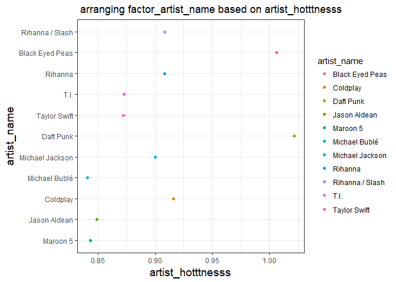
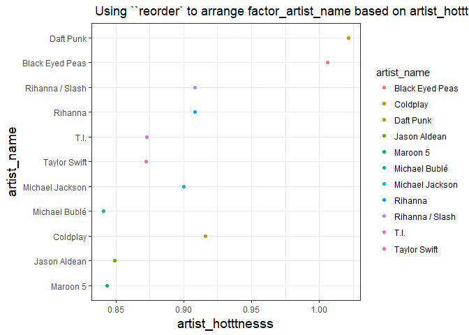
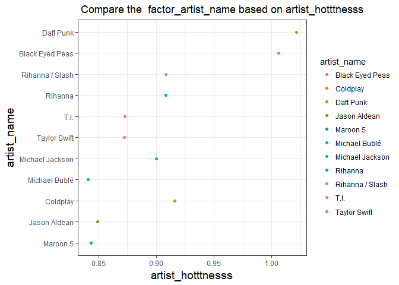

hm05\_Luo\_yanchao
================

Load the data
-------------

``` r
suppressPackageStartupMessages(library(gapminder))
suppressPackageStartupMessages(library(tidyverse))
suppressPackageStartupMessages(library(forcats))
```

    ## Warning: package 'forcats' was built under R version 3.4.2

``` r
suppressPackageStartupMessages(library(singer))
```

Factor management
-----------------

**Step goals:**

-   Define factor variables;
-   Drop factor / levels;
-   Reorder levels based on knowledge from data.

I choose the Joey’s Singer data.

#### Factorise

*Transform some of the variable in the singer\_locations dataframe into factors: pay attention at what levels you introduce and their order. Try and consider the difference between the base R as.factor and the forcats-provided functions.*

##### Factor inspection

``` r
singer_locations
```

    ## # A tibble: 10,100 x 14
    ##              track_id                       title            song_id
    ##                 <chr>                       <chr>              <chr>
    ##  1 TRWICRA128F42368DB       The Conversation (Cd) SOSURTI12A81C22FB8
    ##  2 TRXJANY128F42246FC               Lonely Island SODESQP12A6D4F98EF
    ##  3 TRIKPCA128F424A553       Here's That Rainy Day SOQUYQD12A8C131619
    ##  4 TRYEATD128F92F87C9             Rego Park Blues SOEZGRC12AB017F1AC
    ##  5 TRBYYXH128F4264585                       Games SOPIOCP12A8C13A322
    ##  6 TRKFFKR128F9303AE3                  More Pipes SOHQSPY12AB0181325
    ##  7 TRSSNNI128F42661D8              out OF my MIND SOIHOMM12A8C139A02
    ##  8 TRXSSXI128F428FAD4 Endlich Ein Grund Zur Panik SODTXQY12A6D4F748E
    ##  9 TRDKANB128F4261BDE                 I Am A Rock SOCZZEQ12A8C1318A9
    ## 10 TRJQSXM128F932A05B             A perfect world SOFJTIS12AB0184236
    ## # ... with 10,090 more rows, and 11 more variables: release <chr>,
    ## #   artist_id <chr>, artist_name <chr>, year <int>, duration <dbl>,
    ## #   artist_hotttnesss <dbl>, artist_familiarity <dbl>, latitude <dbl>,
    ## #   longitude <dbl>, name <chr>, city <chr>

``` r
str(singer_locations)
```

    ## Classes 'tbl_df', 'tbl' and 'data.frame':    10100 obs. of  14 variables:
    ##  $ track_id          : chr  "TRWICRA128F42368DB" "TRXJANY128F42246FC" "TRIKPCA128F424A553" "TRYEATD128F92F87C9" ...
    ##  $ title             : chr  "The Conversation (Cd)" "Lonely Island" "Here's That Rainy Day" "Rego Park Blues" ...
    ##  $ song_id           : chr  "SOSURTI12A81C22FB8" "SODESQP12A6D4F98EF" "SOQUYQD12A8C131619" "SOEZGRC12AB017F1AC" ...
    ##  $ release           : chr  "Even If It Kills Me" "The Duke Of Earl" "Imprompture" "Still River" ...
    ##  $ artist_id         : chr  "ARACDPV1187FB58DF4" "ARYBUAO1187FB3F4EB" "AR4111G1187B9B58AB" "ARQDZP31187B98D623" ...
    ##  $ artist_name       : chr  "Motion City Soundtrack" "Gene Chandler" "Paul Horn" "Ronnie Earl & the Broadcasters" ...
    ##  $ year              : int  2007 2004 1998 1995 1968 2006 2003 2007 1966 2006 ...
    ##  $ duration          : num  170 107 528 695 237 ...
    ##  $ artist_hotttnesss : num  0.641 0.394 0.431 0.362 0.411 ...
    ##  $ artist_familiarity: num  0.823 0.57 0.504 0.477 0.53 ...
    ##  $ latitude          : num  NA 41.9 40.7 NA 42.3 ...
    ##  $ longitude         : num  NA -87.6 -74 NA -83 ...
    ##  $ name              : chr  NA "Gene Chandler" "Paul Horn" NA ...
    ##  $ city              : chr  NA "Chicago, IL" "New York, NY" NA ...
    ##  - attr(*, "spec")=List of 2
    ##   ..$ cols   :List of 14
    ##   .. ..$ track_id          : list()
    ##   .. .. ..- attr(*, "class")= chr  "collector_character" "collector"
    ##   .. ..$ title             : list()
    ##   .. .. ..- attr(*, "class")= chr  "collector_character" "collector"
    ##   .. ..$ song_id           : list()
    ##   .. .. ..- attr(*, "class")= chr  "collector_character" "collector"
    ##   .. ..$ release           : list()
    ##   .. .. ..- attr(*, "class")= chr  "collector_character" "collector"
    ##   .. ..$ artist_id         : list()
    ##   .. .. ..- attr(*, "class")= chr  "collector_character" "collector"
    ##   .. ..$ artist_name       : list()
    ##   .. .. ..- attr(*, "class")= chr  "collector_character" "collector"
    ##   .. ..$ year              : list()
    ##   .. .. ..- attr(*, "class")= chr  "collector_integer" "collector"
    ##   .. ..$ duration          : list()
    ##   .. .. ..- attr(*, "class")= chr  "collector_double" "collector"
    ##   .. ..$ artist_hotttnesss : list()
    ##   .. .. ..- attr(*, "class")= chr  "collector_double" "collector"
    ##   .. ..$ artist_familiarity: list()
    ##   .. .. ..- attr(*, "class")= chr  "collector_double" "collector"
    ##   .. ..$ latitude          : list()
    ##   .. .. ..- attr(*, "class")= chr  "collector_double" "collector"
    ##   .. ..$ longitude         : list()
    ##   .. .. ..- attr(*, "class")= chr  "collector_double" "collector"
    ##   .. ..$ name              : list()
    ##   .. .. ..- attr(*, "class")= chr  "collector_character" "collector"
    ##   .. ..$ city              : list()
    ##   .. .. ..- attr(*, "class")= chr  "collector_character" "collector"
    ##   ..$ default: list()
    ##   .. ..- attr(*, "class")= chr  "collector_guess" "collector"
    ##   ..- attr(*, "class")= chr "col_spec"

``` r
#########################
nrow(singer_locations)
```

    ## [1] 10100

``` r
length(unique(singer_locations$artist_name))
```

    ## [1] 7498

``` r
length(unique(singer_locations$name))
```

    ## [1] 2913

``` r
length(unique(singer_locations$artist_id))
```

    ## [1] 7346

``` r
##########################
```

From the R output above. `str(singer_locations)` gives us no variables are vector. And `nrow(singer_locations)` shows that there are 10100 rows in total. I found unique of `artist_id`, `artist_name`,`name` are less than total `nrows`, so I want to factorise `artist_id`, `artist_name`,`name`.

Using `as.factor`.

``` r
newsinger_locations <- singer_locations %>%
  mutate(factor_name = as.factor(singer_locations$name), 
         factor_artist_name = as.factor(singer_locations$artist_name), 
         factor_artist_id = as.factor(singer_locations$artist_id))
head(newsinger_locations)
```

    ## # A tibble: 6 x 17
    ##             track_id                 title            song_id
    ##                <chr>                 <chr>              <chr>
    ## 1 TRWICRA128F42368DB The Conversation (Cd) SOSURTI12A81C22FB8
    ## 2 TRXJANY128F42246FC         Lonely Island SODESQP12A6D4F98EF
    ## 3 TRIKPCA128F424A553 Here's That Rainy Day SOQUYQD12A8C131619
    ## 4 TRYEATD128F92F87C9       Rego Park Blues SOEZGRC12AB017F1AC
    ## 5 TRBYYXH128F4264585                 Games SOPIOCP12A8C13A322
    ## 6 TRKFFKR128F9303AE3            More Pipes SOHQSPY12AB0181325
    ## # ... with 14 more variables: release <chr>, artist_id <chr>,
    ## #   artist_name <chr>, year <int>, duration <dbl>,
    ## #   artist_hotttnesss <dbl>, artist_familiarity <dbl>, latitude <dbl>,
    ## #   longitude <dbl>, name <chr>, city <chr>, factor_name <fctr>,
    ## #   factor_artist_name <fctr>, factor_artist_id <fctr>

using `forcats`

    newsinger_locations2 <- singer_locations %>%
      mutate(factor_name2 = as_factor(singer_locations$name),
             factor_artist_name2 = as_factor(singer_locations$artist_name), 
             factor_year2 = as_factor(singer_locations$artist_id)) 
    head(newsinger_locations2)

At this time the `as_factor` not work. So I check the data, and found that the reason may due to many `NA` in the data.

So check the "NA"

``` r
if(sum(is.na(singer_locations$name)!=0)) print("variable `name` has NA")
```

    ## [1] "variable `name` has NA"

``` r
if(sum(is.na(singer_locations$artist_name)!=0)) print("variable `artist_name` has NA")
if(sum(is.na(singer_locations$artist_id)!=0)) print("variable `artist_id` has NA")
```

From the code above, I found variable `name` has "NA". Assign "no information" for "NA"

``` r
newsinger_locations3 <- singer_locations %>%
  mutate(name= ifelse(is.na(name), "no information", singer_locations$name)) %>% 
  mutate(factor_name = as_factor(name), 
         factor_artist_name = as_factor(artist_name),
         factor_artist_id = as_factor(artist_id))
head(newsinger_locations3)
```

    ## # A tibble: 6 x 17
    ##             track_id                 title            song_id
    ##                <chr>                 <chr>              <chr>
    ## 1 TRWICRA128F42368DB The Conversation (Cd) SOSURTI12A81C22FB8
    ## 2 TRXJANY128F42246FC         Lonely Island SODESQP12A6D4F98EF
    ## 3 TRIKPCA128F424A553 Here's That Rainy Day SOQUYQD12A8C131619
    ## 4 TRYEATD128F92F87C9       Rego Park Blues SOEZGRC12AB017F1AC
    ## 5 TRBYYXH128F4264585                 Games SOPIOCP12A8C13A322
    ## 6 TRKFFKR128F9303AE3            More Pipes SOHQSPY12AB0181325
    ## # ... with 14 more variables: release <chr>, artist_id <chr>,
    ## #   artist_name <chr>, year <int>, duration <dbl>,
    ## #   artist_hotttnesss <dbl>, artist_familiarity <dbl>, latitude <dbl>,
    ## #   longitude <dbl>, name <chr>, city <chr>, factor_name <fctr>,
    ## #   factor_artist_name <fctr>, factor_artist_id <fctr>

It is work after we removing the "NA".

-   Name

``` r
nlevels(newsinger_locations$factor_name)
```

    ## [1] 2912

``` r
nlevels(newsinger_locations3$factor_name)
```

    ## [1] 2913

``` r
head(levels(newsinger_locations$factor_name))
```

    ## [1] "<U+00C4>I-TIEM" "10 Years"    "10cc"        "11/5_ Billy" "13 Cats"    
    ## [6] "17 Hippies"

``` r
head(levels(newsinger_locations3$factor_name))
```

    ## [1] "no information" "Gene Chandler"  "Paul Horn"      "Dorothy Ashby" 
    ## [5] "Barleyjuice"    "Madlib"

-   artist\_name

Compare nlevels between `as.factor` and `as_factor`.

``` r
nlevels(newsinger_locations$factor_artist_name)
```

    ## [1] 7498

``` r
nlevels(newsinger_locations3$factor_artist_name)
```

    ## [1] 7498

``` r
head(levels(newsinger_locations$factor_artist_name))
```

    ## [1] "'t Hof Van Commerce" "'Til Tuesday"        "*Shels"             
    ## [4] "[re:jazz]"           "+44"                 "<U+00C4>I-TIEM"

``` r
head(levels(newsinger_locations3$factor_artist_name))
```

    ## [1] "Motion City Soundtrack"         "Gene Chandler"                 
    ## [3] "Paul Horn"                      "Ronnie Earl & the Broadcasters"
    ## [5] "Dorothy Ashby"                  "Barleyjuice"

-   artist\_id

``` r
nlevels(newsinger_locations$factor_artist_id)
```

    ## [1] 7346

``` r
nlevels(newsinger_locations3$factor_artist_id)
```

    ## [1] 7346

``` r
head(levels(newsinger_locations$factor_artist_id))
```

    ## [1] "AR002UA1187B9A637D" "AR00DG71187B9B7FCB" "AR00J9R1187B98D920"
    ## [4] "AR00JIO1187B9A5A15" "AR00L9V1187FB4353A" "AR00MBZ1187B9B5DB1"

``` r
head(levels(newsinger_locations3$factor_artist_id))
```

    ## [1] "ARACDPV1187FB58DF4" "ARYBUAO1187FB3F4EB" "AR4111G1187B9B58AB"
    ## [4] "ARQDZP31187B98D623" "AR75GYU1187B9AE47A" "ARCENE01187B9AF929"

Actually,`as_factor`creates levels in the order in which they appear, which will be the same as the original data. On the other hand `as.factor` will change the levels order of the factor. Therefore, if there is no "NA". `as_factor` is better than `as.factor`, because it will keep the original order.

##### Drop 0

*Filter the singer\_locations data to remove observations associated with the uncorrectly inputed year 0. Additionally, remove unused factor levels. Provide concrete information on the data before and after removing these rows and levels; address the number of rows and the levels of the affected factors.*

Using the new dataset `newsinger_locations3`

``` r
Check_0<-newsinger_locations3 %>%
  filter(year==0) 

nrow(Check_0)
```

    ## [1] 100

We had 100 observations where year equal to "0".

`droplevels()` operates on all the factors in a data frame or on a single factor.

``` r
remove_0 <- newsinger_locations3 %>%
  filter(year != 0) %>%
  droplevels()
nrow(remove_0)
```

    ## [1] 10000

There are 100 row remove compared with the previous data.

Check how many levels change after removing the "0".

-   name

``` r
nlevels(remove_0$factor_name)
```

    ## [1] 2879

``` r
nlevels(newsinger_locations3$factor_name)-nlevels(remove_0$factor_name)
```

    ## [1] 34

Before we have 2913 levels of variable `name`, only 2879 levels change after removing the "0". it reduces 34 levels.

-   artist\_name

``` r
nlevels(remove_0$factor_artist_name)
```

    ## [1] 7408

``` r
nlevels(newsinger_locations3$factor_artist_name)-nlevels(remove_0$factor_artist_name)
```

    ## [1] 90

Before we have 7498 levels of variable `name`, only 7408 levels change after removing the "0". it reduces 90 levels.

-   artist\_id

``` r
nlevels(remove_0$factor_artist_id)
```

    ## [1] 7258

``` r
nlevels(newsinger_locations3$factor_artist_id)-nlevels(remove_0$factor_artist_id)
```

    ## [1] 88

Before we have 7346 levels of variable `name`, only 7258 levels change after removing the "0". it reduces 88 levels.

##### Reorder the levels of year, artist\_name or title.

*Use the forcats package to change the order of the factor levels, based on a principled summary of one of the quantitative variables. Consider experimenting with a summary statistic beyond the most basic choice of the median.*

Factor variables `artist_name` `year` `title`.

``` r
newsinger_locations4 <- singer_locations %>%
  mutate(factor_artist_name = as_factor(artist_name),
         factor_title = as_factor(title))
```

-   Reorder the `title` by another variable `artist_hotttnesss`.

Order the mean value instead of median value and using backwards.

``` r
fct_reorder(newsinger_locations4$factor_title, newsinger_locations4$artist_hotttnesss, mean, desc = TRUE) %>% 
  levels() %>%  head() 
```

    ## [1] "Weightlessness"       "Farmers Earn Livings" "Hello There Babushka"
    ## [4] "Stop That Thing"      "Session 1"            "Cryin' Alone"

-   Reorder the `artist_name` by another variable `artist_hotttnesss`

Order the maximum value of artist\_hotttnesss and using backwards

``` r
fct_reorder(newsinger_locations4$factor_artist_name, newsinger_locations4$artist_hotttnesss, max,desc = TRUE) %>% 
  levels() %>%  head()
```

    ## [1] "Motion City Soundtrack"         "Gene Chandler"                 
    ## [3] "Paul Horn"                      "Ronnie Earl & the Broadcasters"
    ## [5] "Dorothy Ashby"                  "Barleyjuice"

##### Common part:

*Characterize the (derived) data before and after your factor re-leveling.*

*Explore the effects of arrange(). Does merely arranging the data have any effect on, say, a figure?* *Explore the effects of reordering a factor and factor reordering coupled with arrange(). Especially, what effect does this have on a figure?*

-   Using `arrange` function to see how to change the factor `title` and `artist_name`. Because the data is so large, I want to consider subset of data. I only interested hotttnesss larger than 0.84.

``` r
newsinger_locations4 %>% 
  arrange(artist_hotttnesss) %>% 
  filter(artist_hotttnesss>0.840) %>% 
  ggplot(aes(x=artist_hotttnesss,y=factor_artist_name)) + 
  geom_point(aes(colour=artist_name)) +
 labs(x="artist_hotttnesss", 
          y="artist_name",
          title=" Using `arrange` to compare factor_artist_name based on artist_hotttnesss")+
  theme_bw()+
  theme( axis.title = element_text(size=14))
```



Onlying use the `arrange` function, it will only arrange the `artist_hotttnesss` and keep the order of `artist_name`. + Using `reordering` function to see how to change the factor `title` and `artist_name`.

``` r
newsinger_locations4 %>% 
  filter(artist_hotttnesss>0.840) %>% 
  ggplot(aes(x=artist_hotttnesss,y=fct_reorder(factor_artist_name, artist_hotttnesss,max,desc = TRUE))) + 
  geom_point(aes(colour=artist_name)) +
 labs(x="artist_hotttnesss", 
          y="artist_name",
          title=" Using ``reorder` to arrange factor_artist_name based on artist_hotttnesss")+
  theme_bw()+
  theme( axis.title = element_text(size=14))
```



Using `reorder` often makes plots much better. We could see who is the most popular artist and how hot he is.

-   Using `reorder` and `arrange` function to see how to change the factor `title` and `artist_name`.

``` r
newsinger_locations4 %>% 
  arrange(artist_hotttnesss) %>% 
  filter(artist_hotttnesss>0.840) %>% 
  ggplot(aes(x=artist_hotttnesss,y=fct_reorder(factor_artist_name, artist_hotttnesss,max,desc = TRUE))) + 
  geom_point(aes(colour=artist_name)) +
 labs(x="artist_hotttnesss", 
          y="artist_name",
          title=" Compare the  factor_artist_name based on artist_hotttnesss")+
  theme_bw()+
  theme( axis.title = element_text(size=14))
```



There is no change compared with the graph, which only use `reorder` function.

File I/O
--------

*Experiment with one or more of `write_csv()`/`read_csv()` (and/or TSV friends), `saveRDS()`/`readRDS()`, `dput()`/`dget()`. Create something new, probably by filtering or grouped-summarization of Singer or Gapminder. I highly recommend you fiddle with the factor levels, i.e. make them non-alphabetical (see previous section). Explore whether this survives the round trip of writing to file then reading back in.*

##### `write_csv` and `read_csv()`.

``` r
artist_hotttnesss_max <- newsinger_locations4 %>%
  mutate(factor_artist_name = fct_reorder(factor_artist_name, artist_hotttnesss,max, desc = TRUE)) %>%
  group_by(factor_artist_name) %>%
   summarise(max_artist_hotttnesss=max(artist_hotttnesss))
```

``` r
readr::write_csv(artist_hotttnesss_max, "artist_hotttnesss")
head(write_csv(artist_hotttnesss_max, "artist_hotttnesss"))
```

    ## # A tibble: 6 x 2
    ##               factor_artist_name max_artist_hotttnesss
    ##                           <fctr>                 <dbl>
    ## 1         Motion City Soundtrack             0.6410183
    ## 2                  Gene Chandler             0.3937627
    ## 3                      Paul Horn             0.4306226
    ## 4 Ronnie Earl & the Broadcasters             0.3622792
    ## 5                  Dorothy Ashby             0.4107520
    ## 6                    Barleyjuice             0.3762635

Using `read_csv()`.

``` r
readr::read_csv("artist_hotttnesss")
```

    ## Parsed with column specification:
    ## cols(
    ##   factor_artist_name = col_character(),
    ##   max_artist_hotttnesss = col_double()
    ## )

    ## # A tibble: 7,498 x 2
    ##                factor_artist_name max_artist_hotttnesss
    ##                             <chr>                 <dbl>
    ##  1         Motion City Soundtrack             0.6410183
    ##  2                  Gene Chandler             0.3937627
    ##  3                      Paul Horn             0.4306226
    ##  4 Ronnie Earl & the Broadcasters             0.3622792
    ##  5                  Dorothy Ashby             0.4107520
    ##  6                    Barleyjuice             0.3762635
    ##  7                 Vertigo Angels             0.1814601
    ##  8                Wir Sind Helden             0.4743547
    ##  9              Simon & Garfunkel             0.5103250
    ## 10                    Rabia Sorda             0.4196401
    ## # ... with 7,488 more rows

``` r
str(readr::read_csv("artist_hotttnesss"))
```

    ## Parsed with column specification:
    ## cols(
    ##   factor_artist_name = col_character(),
    ##   max_artist_hotttnesss = col_double()
    ## )

    ## Classes 'tbl_df', 'tbl' and 'data.frame':    7498 obs. of  2 variables:
    ##  $ factor_artist_name   : chr  "Motion City Soundtrack" "Gene Chandler" "Paul Horn" "Ronnie Earl & the Broadcasters" ...
    ##  $ max_artist_hotttnesss: num  0.641 0.394 0.431 0.362 0.411 ...
    ##  - attr(*, "spec")=List of 2
    ##   ..$ cols   :List of 2
    ##   .. ..$ factor_artist_name   : list()
    ##   .. .. ..- attr(*, "class")= chr  "collector_character" "collector"
    ##   .. ..$ max_artist_hotttnesss: list()
    ##   .. .. ..- attr(*, "class")= chr  "collector_double" "collector"
    ##   ..$ default: list()
    ##   .. ..- attr(*, "class")= chr  "collector_guess" "collector"
    ##   ..- attr(*, "class")= chr "col_spec"

I found we do not change the characteristic of `artist_name` from `chr` to `Factor`.

##### `saveRDS()` and `readRDS()`

`saveRDS()` serializes an R object to a binary file. `saveRDS()` has more arguments, in particular compress for controlling compression, so read the help for more advanced usage.

``` r
saveRDS(artist_hotttnesss_max, "artist_hotttnesss_max.rds")
artist_hotttnesss_max1<-readRDS("artist_hotttnesss_max.rds")
str(artist_hotttnesss_max1)
```

    ## Classes 'tbl_df', 'tbl' and 'data.frame':    7498 obs. of  2 variables:
    ##  $ factor_artist_name   : Factor w/ 7498 levels "Motion City Soundtrack",..: 1 2 3 4 5 6 7 8 9 10 ...
    ##  $ max_artist_hotttnesss: num  0.641 0.394 0.431 0.362 0.411 ...

I found this time we have change the `artist_name` as `Factor`.

`dput()`/`dget()`

``` r
dput(artist_hotttnesss_max, "artist_hotttnesss_max_dput.txt")
artist_hotttnesss_max2 <- dget("artist_hotttnesss_max_dput.txt")
str(artist_hotttnesss_max2)
```

    ## Classes 'tbl_df', 'tbl' and 'data.frame':    7498 obs. of  2 variables:
    ##  $ factor_artist_name   : Factor w/ 7498 levels "Motion City Soundtrack",..: 1 2 3 4 5 6 7 8 9 10 ...
    ##  $ max_artist_hotttnesss: num  0.641 0.394 0.431 0.362 0.411 ...

Using `dput` will change the `artist_name` as `Factor`.

Visualization design
--------------------
