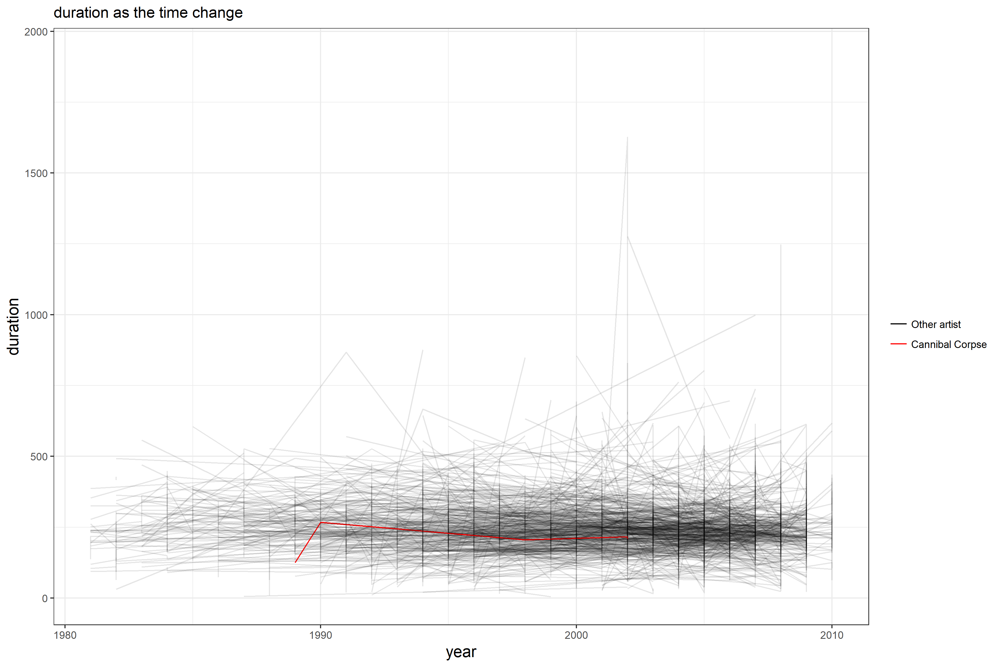

## Load the data
```{r}
suppressPackageStartupMessages(library(gapminder))
suppressPackageStartupMessages(library(tidyverse))
suppressPackageStartupMessages(library(forcats))
suppressPackageStartupMessages(library(singer))
```

## Factor management

**Step goals:**

+ Define factor variables;
+ Drop factor / levels;
+ Reorder levels based on knowledge from data.

I choose the Joey’s Singer data. 

#### Factorise 
*Transform some of the variable in the singer_locations dataframe into factors: pay attention at what levels you introduce and their order. Try and consider the difference between the base R as.factor and the forcats-provided functions.*

#### Factor inspection

```{r}
singer_locations


str(singer_locations)
nrow(singer_locations)
length(unique(singer_locations$artist_name))
length(unique(singer_locations$name))
length(unique(singer_locations$artist_id))

```

From the R output above. `str(singer_locations)` shows that no variables are vector. And `nrow(singer_locations)` shows that there are 10100 rows in total.  I found unique of `artist_id`, `artist_name`,`name` are less than total `nrows`, so I want to factorize `artist_id`, `artist_name`,`name`.

Using `as.factor`.

```{r}
newsinger_locations <- singer_locations %>%
  mutate(factor_name = as.factor(singer_locations$name), 
         factor_artist_name = as.factor(singer_locations$artist_name), 
         factor_artist_id = as.factor(singer_locations$artist_id))
head(newsinger_locations)
```


using `forcats`
```
newsinger_locations2 <- singer_locations %>%
  mutate(factor_name = as_factor(singer_locations$name),
         factor_artist_name = as_factor(singer_locations$artist_name), 
         factor_artist_id = as_factor(singer_locations$artist_id)) 
head(newsinger_locations2)
```

At this time the `as_factor` not work. So I check the data and found that the reason may due to many `NA` in the data.

Check the "NA"
```{r}
if(sum(is.na(singer_locations$name)!=0)) print("variable `name` has NA")
if(sum(is.na(singer_locations$artist_name)!=0)) print("variable `artist_name` has NA")
if(sum(is.na(singer_locations$artist_id)!=0)) print("variable `artist_id` has NA")
```

From the code above, I found variable `name` has "NA".

Assign "no information" for "NA".
```{r}
newsinger_locations3 <- singer_locations %>%
  mutate(name= ifelse(is.na(name), "no information", singer_locations$name)) %>% 
  mutate(factor_name = as_factor(name), 
         factor_artist_name = as_factor(artist_name),
         factor_artist_id = as_factor(artist_id))
head(newsinger_locations3)
```

It is work after we removing the "NA". 

+ Name

```{r}
nlevels(newsinger_locations$factor_name)
nlevels(newsinger_locations3$factor_name)
head(levels(newsinger_locations$factor_name))
head(levels(newsinger_locations3$factor_name))
```

+ artist_name

Compare nlevels between `as.factor` and `as_factor`.
```{r}
nlevels(newsinger_locations$factor_artist_name)
nlevels(newsinger_locations3$factor_artist_name)
head(levels(newsinger_locations$factor_artist_name))
head(levels(newsinger_locations3$factor_artist_name))
```

+ artist_id
```{r}
nlevels(newsinger_locations$factor_artist_id)
nlevels(newsinger_locations3$factor_artist_id)
head(levels(newsinger_locations$factor_artist_id))
head(levels(newsinger_locations3$factor_artist_id))

```

Actually,`as_factor`creates levels in the order in which they appear, and it will be the same as the original data. On the other hand 
`as.factor` will change the levels order of the factor. Therefore, if there is no "NA". `as_factor` is better than `as.factor `, because it will keep the original order. 

#### Drop 0

*Filter the singer_locations data to remove observations associated with the uncorrectly inputed  year 0. Additionally, remove unused factor levels. Provide concrete information on the data before and after removing these rows and levels; address the number of rows and the levels of the affected factors.*

Using the new dataset `newsinger_locations3`

```{r}
Check_0<-newsinger_locations3 %>%
  filter(year==0) 

nrow(Check_0)
```

We had 100 observations where year equal to "0".

`droplevels()` operates on all the factors in a data frame or on a single factor.

```{r}
remove_0 <- newsinger_locations3 %>%
  filter(year != 0) %>%
  droplevels()
nrow(remove_0)
```

There are 100 rows remove compared with the previous data.

Check how many levels change after removing the "0".

+ name
```{r}
nlevels(remove_0$factor_name)

nlevels(newsinger_locations3$factor_name)-nlevels(remove_0$factor_name)

```

Before we have 2913 levels of variable `name`, only 2879 levels change after removing the "0". it reduces 34 levels.

+ artist_name

```{r}
nlevels(remove_0$factor_artist_name)

nlevels(newsinger_locations3$factor_artist_name)-nlevels(remove_0$factor_artist_name)

```

Before we have 7498 levels of variable `name`, only 7408 levels change after removing the "0". it reduces 90 levels.

+ artist_id

```{r}
nlevels(remove_0$factor_artist_id)

nlevels(newsinger_locations3$factor_artist_id)-nlevels(remove_0$factor_artist_id)

```

Before we have 7346 levels of variable `name`, only 7258 levels change after removing the "0". it reduces 88 levels.

```{r}
table <- data.frame( nlevels(newsinger_locations3$factor_name), nlevels(remove_0$factor_name), nlevels(newsinger_locations3$factor_artist_name), nlevels(remove_0$factor_artist_name), nlevels(newsinger_locations3$factor_artist_id), nlevels(remove_0$factor_artist_id))
names(table) <- c("`name` before", "`name` after ", "`artist_name` before", "`artist_name` after","`artist_id` before","`artist_id` after")
knitr::kable(table)
```

#### Reorder the levels of year, artist_name or title.

*Use the forcats package to change the order of the factor levels, based on a principled summary of one of the quantitative variables. Consider experimenting with a summary statistic beyond the most basic choice of the median.*

Factor variables  `artist_name` `year` `title`.
```{r}
newsinger_locations4 <- singer_locations %>%
  mutate(factor_artist_name = as_factor(artist_name),
         factor_title = as_factor(title))
```

+ Reorder the `title` by another variable `artist_hotttnesss  `.

(1) Original order

```{r}
head(levels(newsinger_locations4$factor_title))
```

(2) Order the mean value instead of median value and using backwards.

```{r}
fct_reorder(newsinger_locations4$factor_title, newsinger_locations4$artist_hotttnesss, mean, desc = TRUE) %>% 
  levels() %>%  head() 
```

The levels of `title` are reordered so that the mean of artist_hotttnesss are in descending order. 

+ Reorder the `artist_name` by another variable `artist_hotttnesss`

(1) Original order

```{r}
head(levels(newsinger_locations4$factor_artist_name))
```

(2) Order the minimum value of artist_hotttnesss.

```{r}
fct_reorder(newsinger_locations4$factor_artist_name, newsinger_locations4$artist_hotttnesss, min) %>% 
  levels() %>%  head()
```

The levels of `artist_name` are reordered follow by the minimum of artist_hotttnesss. 

#### Common part:


*Characterize the (derived) data before and after your factor re-leveling.*

*Explore the effects of arrange(). Does merely arranging the data have any effect on, say, a figure?*
*Explore the effects of reordering a factor and factor reordering coupled with arrange(). Especially, what effect does this have on a figure?*

+ Using `arrange` function to see how to change the factor `title` and `artist_name`.
Because the data is so large, I want to consider subset of data(only seethe artist_hotttnessslarger than 0.840 ). 

Plot before `arrange`.
```{r}

newsinger_locations4 %>% 
  filter(artist_hotttnesss>0.840) %>% 
  ggplot(aes(x=factor_artist_name,y=artist_hotttnesss)) + 
  geom_point(aes(colour=artist_name)) +
 labs(y="artist_hotttnesss", 
          x="artist_name",
          title=" Using `arrange` to compare factor_artist_name based on artist_hotttnesss")+
  theme_bw()+
  theme( axis.title = element_text(size=14))
```


```{r}

newsinger_locations4 %>% 
  arrange(artist_hotttnesss) %>% 
  filter(artist_hotttnesss>0.840) %>% 
  ggplot(aes(x=factor_artist_name,y=artist_hotttnesss)) + 
  geom_point(aes(colour=artist_name)) +
 labs(y="artist_hotttnesss", 
          x="artist_name",
          title=" Using `arrange` to compare factor_artist_name based on artist_hotttnesss")+
  theme_bw()+
  theme( axis.title = element_text(size=14))
```

We can see that `arrange` does not have any effect on the plots, and the levels are the same before and after arrange.

+ Using `reordering` function to see how to change the factor `title` and `artist_name`.

```{r}

newsinger_locations4 %>% 
  filter(artist_hotttnesss>0.840) %>% 
  ggplot(aes(x=fct_reorder(factor_artist_name, artist_hotttnesss,max,desc = TRUE),y=artist_hotttnesss)) + 
  geom_point(aes(colour=artist_name)) +
 labs( y="artist_hotttnesss", 
          x="artist_name",
          title=" Using ``reorder` to arrange factor_artist_name based on artist_hotttnesss")+
  theme_bw()+
  theme( axis.title = element_text(size=14))
```

Using `reorder` often makes plots much better. We could see who is the most popular artist and how hot he is.


+ Using `reorder` and `arrange` function to see how to change the factor `title` and `artist_name`.

```{r}
newsinger_locations4 %>% 
  arrange(artist_hotttnesss) %>% 
  filter(artist_hotttnesss>0.840) %>% 
  ggplot(aes(x=fct_reorder(factor_artist_name, artist_hotttnesss,max,desc = TRUE),y=artist_hotttnesss)) + 
  geom_point(aes(colour=artist_name)) +
 labs(y="artist_hotttnesss", 
          x="artist_name",
          title=" Compare the  factor_artist_name based on artist_hotttnesss")+
  theme_bw()+
  theme( axis.title = element_text(size=14))

```
`arrange()` does not change the order of the levels and has no effect on the plots.
There is no change for above plot compared with the graph, which only uses `reorder` function.

## File I/O

*Experiment with one or more of `write_csv()`/`read_csv()` (and/or TSV friends), `saveRDS()`/`readRDS()`,  `dput()`/`dget()`. Create something new, probably by filtering or grouped-summarization of Singer or Gapminder. I highly recommend you fiddle with the factor levels, i.e. make them non-alphabetical (see previous section). Explore whether this survives the round trip of writing to file then reading back in.*

#### Using `write_csv` and `read_csv()`.
```{r}
## When year larger than 2009, summary the maximum of hotness for each artist.
artist_hotttnesss_max <- newsinger_locations4 %>%
  select(year,factor_artist_name,artist_hotttnesss) %>%
  filter(year>2009) %>%
  group_by(factor_artist_name) %>% 
  summarise(max_artist_hotttnesss=max(artist_hotttnesss))
```

```{r}
readr::write_csv(artist_hotttnesss_max, "artist_hotttnesss")
```

```{r}
head(readr::read_csv("artist_hotttnesss"))
str(readr::read_csv("artist_hotttnesss"))
```

I found that `artist_name` is considered as a character instead of factor, when using `read_csv` functions.

#### Using `saveRDS()` and `readRDS()` 

`saveRDS()` serializes an R object to a binary file.
`saveRDS()` has more arguments, in particular compress for controlling compression, so read the help for more advanced usage. 

```{r}
saveRDS(artist_hotttnesss_max, "artist_hotttnesss_max.rds")
artist_hotttnesss_max1<-readRDS("artist_hotttnesss_max.rds")
str(artist_hotttnesss_max1)
```

I found this time we have change the `artist_name` to be a factor.

#### Using `dput()`/`dget()`

```{r}
dput(artist_hotttnesss_max, "artist_hotttnesss_max_dput.txt")
artist_hotttnesss_max2 <- dget("artist_hotttnesss_max_dput.txt")
str(artist_hotttnesss_max2)
```

Using `dget` will change  the `artist_name` to be a factor. There is no difference between `dget()` and `saveRDS()` at this time.

#### Testing whether reordering levels of `artist_name` after reading in and out:

```{r}

newsinger_locations_test <- singer_locations %>%
  mutate(factor_artist_name = as_factor(artist_name),
         factor_title = as_factor(title))
head(levels(newsinger_locations_test$factor_artist_name))

newsinger_locations_test$factor_artist_name<-fct_reorder(newsinger_locations_test$factor_artist_name,newsinger_locations_test$artist_hotttnesss,max)

head(levels(newsinger_locations_test$factor_artist_name))

```

we could found that `artist_name` are changed by `artist_hotttnesss`.  And I want to see whether save it to file in a way that will preserve this work upon re-import or not.

+ `write_csv` and `read_csv`

```{r}
write_csv(newsinger_locations_test, "reorder_singer_locations.csv")
reorder_singer_locations_csv <- read_csv("reorder_singer_locations.csv")
reorder_singer_locations_csv$factor_artist_name <- as.factor(reorder_singer_locations_csv$factor_artist_name)
head(levels(reorder_singer_locations_csv$factor_artist_name))
```

Note that the order of output should not reorder the levels.

+ `saveRDS` and `readRDS`
```{r}
saveRDS(newsinger_locations_test, "reorder_newsinger_locations_test.rds")
reorder_singer_locations_rds <- readRDS("reorder_newsinger_locations_test.rds")
head(levels(reorder_singer_locations_rds$factor_artist_name))
```

We can see that reordering works using `saveRDS` / `readRDS`.

+ `dput()`/`dget()`
```{r}
dput(newsinger_locations_test, "reorder_newsinger_locations_test.txt")
reorder_singer_locations_txt <- dget("reorder_newsinger_locations_test.txt")
head(levels(reorder_singer_locations_txt$factor_artist_name))
```

We can see that reordering works using `dput()`/`dget()`.

```{r}
artist_name_level <- tibble(original = head(levels(newsinger_locations_test$factor_artist_name)))
artist_name_level <- artist_name_level %>% 
  mutate(use_csv = head(levels(reorder_singer_locations_csv$factor_artist_name)),
         use_rds = head(levels(reorder_singer_locations_rds$factor_artist_name)),
         use_txt = head(levels(reorder_singer_locations_txt$factor_artist_name)))
knitr::kable(artist_name_level)
```

Note that compared with the original, post-reordering country factor levels are restored using the `saveRDS()` / `readRDS()` and `dput()`/`dget()` strategy but should revert to alphabetical ordering using `write_csv()` / `read_csv()`.


## Visualization design

*Remake at least one figure or create a new one, in light of something you learned in the recent class meetings about visualization design and color. Maybe juxtapose your first attempt and what you obtained after some time spent working on it. Reflect on the differences.*

I am interested in `hotttnesss` for different artist `duration` as the time change. Randomly pick a artist "Cannibal Corpse" to high light her/his `duration`.

#### The first graph:

```{r}
library(RColorBrewer)

colour_layer <- scale_colour_manual("", 
                        labels=c("Other artist", "Cannibal Corpse"),
                        values=c("black", "red"))
                        
 p<-newsinger_locations4%>% 
   filter(year>1980) %>% 
  ggplot(aes(year, duration))+
  geom_line(aes(group=factor_artist_name,
                color=factor_artist_name=="Cannibal Corpse",
                alpha=factor_artist_name=="Cannibal Corpse"))+
    colour_layer +
    scale_alpha_discrete(range=c(0.1, 1),
                         guide=FALSE)+
 labs(x="year", 
          y="duration",
          title="duration as the time change")+
  theme_bw()+
  theme( axis.title = element_text(size=14))
 p
```

#### The second graphs:

First I try to subset the data, set the hotness larger than 0.6 and year after 1999. And plot the ` factor_artist_name` vs related `artist_hotttnesss`. By the same time, color the `year` and size the `familiarity`.

```{r}
newsinger_locations4 %>% 
   arrange(artist_hotttnesss) %>% 
   mutate(factor_artist_name = fct_reorder(factor_artist_name, artist_hotttnesss,max, desc = TRUE)) %>%
  filter(artist_hotttnesss>0.6, year>1999) %>% 
ggplot( aes(x=factor_artist_name,y= artist_hotttnesss, size=artist_familiarity,colour=year)) +
    geom_point(alpha=0.5) +
  scale_colour_distiller(palette="Dark2")+
theme_bw() +
  labs(x="artist name", y="artist hotness", title="artists hotness and their familiarity")+
      theme( axis.title = element_text(size=14))

  
```

It is very hard to found artist and his related hotness.
using `fct_lump` function to found top 3 artists .

```{r}
newsinger_locations4 %>% 
   arrange(artist_hotttnesss) %>% 
   mutate(factor_artist_name1 = fct_reorder(factor_artist_name, artist_hotttnesss, desc = TRUE)) %>%
  filter(artist_hotttnesss>0.6, year>1999) %>% 
  mutate(topartist_names = fct_lump(factor_artist_name1, n=3)) %>% 
ggplot( aes(x=fct_reorder(topartist_names,artist_hotttnesss),y= artist_hotttnesss, size=artist_familiarity,colour=year)) +
    geom_point(alpha=0.5) +
    scale_colour_distiller(palette="Dark2")+
theme_bw() +
  labs(x="artist name", y="artist hotness", title="artists hotness and their familiarity")+
      theme( axis.title = element_text(size=14))

   
```

Many other items which is not useful when I only want to find top 3 `artists`. Therefore, I will remove `other` in plots.

```{r}
newsinger_locations4 %>% 
   arrange(artist_hotttnesss) %>% 
   mutate(factor_artist_name1 = fct_reorder(factor_artist_name, artist_hotttnesss, desc = TRUE)) %>%
  filter(artist_hotttnesss>0.6, year>1999) %>% 
  mutate(topartist_names = fct_lump(factor_artist_name1, n=3)) %>% 
    filter(topartist_names != "Other") %>%
  droplevels() %>% 
ggplot( aes(x=fct_reorder(topartist_names,artist_hotttnesss),y= artist_hotttnesss, size=artist_familiarity,colour=year)) +
    geom_point(alpha=0.5) +
    scale_colour_distiller(palette="Dark2")+
theme_bw() +
  labs(x="artist name", y="artist hotness", title="artists hotness and their familiarity")+
      theme( axis.title = element_text(size=14))
```

Removing the `other`, which is `artist` hotness not in the top three.
From the graph above, it can easy found that "Alicia Keys" has the highest artist hotness, and she also has higher familiarity and happen after 2007. 
However, "Joe Satriani" hotness ranks three but has the lower familiarity and happen in 2000.

## Writing figures to file

`ggsave` and plot again.

```{r}

ggsave("my plot.png", width=12, height=8, plot=p)

```



```{r}

ggsave("my plot.pdf", width=12, height=8, plot=p)

```


## But I want to do more!

## Report the process.

The first question:

If I try to factor `year` in the `mutate` , there is an error says no applicable method for 'as_factor' applied to an object of class "c('integer', 'numeric')".
```
 singer_locations %>%
  mutate (factor_year = as_factor(year))
```
But when I use "typeof" to see the data type.

```{r}
typeof(singer_locations$year)
```
So I am confused about why I can not use factor `year` in `mutate` function.

The second question:

If I want to use the `read_csv` function, the level of the `factor_artist_name` wil alsways shows unreadable code.

```{r}
write_csv(newsinger_locations_test, "reorder_singer_locations.csv")
reorder_singer_locations_csv <- read_csv("reorder_singer_locations.csv")
reorder_singer_locations_csv$factor_artist_name <- as.factor(reorder_singer_locations_csv$factor_artist_name)
head(levels(reorder_singer_locations_csv$factor_artist_name))
```

The right one should be below:

```
[1] "Motion City Soundtrack"         "Gene Chandler"                  "Paul Horn"                     
[4] "Ronnie Earl & the Broadcasters" "Dorothy Ashby"                  "Barleyjuice" 
```
