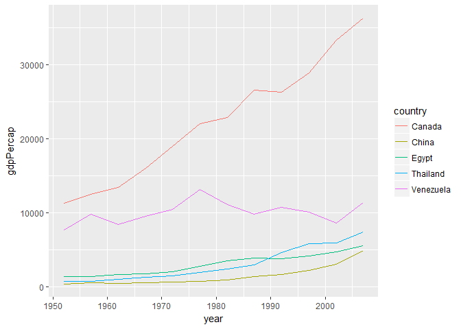
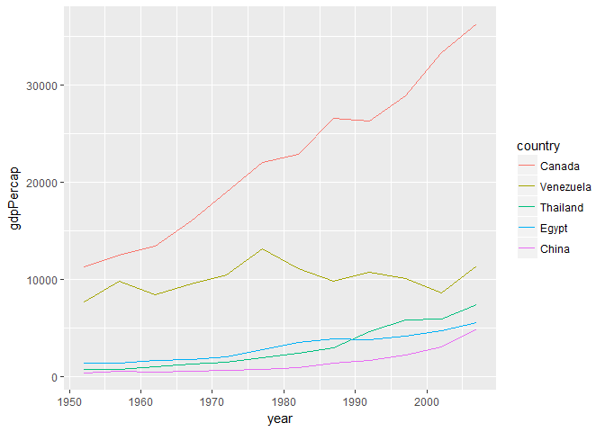

hm05\_Luo\_yanchao
================

Load the data
-------------

``` r
suppressPackageStartupMessages(library(gapminder))
suppressPackageStartupMessages(library(tidyverse))
suppressPackageStartupMessages(library(forcats))
```

    ## Warning: package 'forcats' was built under R version 3.4.2

``` r
suppressPackageStartupMessages(library(singer))
```

Factor management
-----------------

**Step goals:**

-   Define factor variables;
-   Drop factor / levels;
-   Reorder levels based on knowledge from data.

I choose the gapminder data.

#### Factorise

*Transform some of the variable in the singer\_locations dataframe into factors: pay attention at what levels you introduce and their order. Try and consider the difference between the base R as.factor and the forcats-provided functions.*

##### Factor inspection

``` r
head(gapminder)
```

    ## # A tibble: 6 x 6
    ##       country continent  year lifeExp      pop gdpPercap
    ##        <fctr>    <fctr> <int>   <dbl>    <int>     <dbl>
    ## 1 Afghanistan      Asia  1952  28.801  8425333  779.4453
    ## 2 Afghanistan      Asia  1957  30.332  9240934  820.8530
    ## 3 Afghanistan      Asia  1962  31.997 10267083  853.1007
    ## 4 Afghanistan      Asia  1967  34.020 11537966  836.1971
    ## 5 Afghanistan      Asia  1972  36.088 13079460  739.9811
    ## 6 Afghanistan      Asia  1977  38.438 14880372  786.1134

``` r
str(gapminder)
```

    ## Classes 'tbl_df', 'tbl' and 'data.frame':    1704 obs. of  6 variables:
    ##  $ country  : Factor w/ 142 levels "Afghanistan",..: 1 1 1 1 1 1 1 1 1 1 ...
    ##  $ continent: Factor w/ 5 levels "Africa","Americas",..: 3 3 3 3 3 3 3 3 3 3 ...
    ##  $ year     : int  1952 1957 1962 1967 1972 1977 1982 1987 1992 1997 ...
    ##  $ lifeExp  : num  28.8 30.3 32 34 36.1 ...
    ##  $ pop      : int  8425333 9240934 10267083 11537966 13079460 14880372 12881816 13867957 16317921 22227415 ...
    ##  $ gdpPercap: num  779 821 853 836 740 ...

``` r
nrow(gapminder)
```

    ## [1] 1704

``` r
levels(gapminder$continent)
```

    ## [1] "Africa"   "Americas" "Asia"     "Europe"   "Oceania"

``` r
nlevels(gapminder$continent)
```

    ## [1] 5

``` r
summary(gapminder$continent)
```

    ##   Africa Americas     Asia   Europe  Oceania 
    ##      624      300      396      360       24

From the R output above, we have total 1704 rows. And there are two factors: country and continent.

##### Drop Oceania

*Filter the singer\_locations data to remove observations associated with the uncorrectly inputed year 0. Additionally, remove unused factor levels. Provide concrete information on the data before and after removing these rows and levels; address the number of rows and the levels of the affected factors.*

``` r
new1<-gapminder %>%
  filter(year=="Oceania") 
nrow(gapminder)
```

    ## [1] 1704

We had 1704 observations where Oceania.

``` r
new2 <- gapminder %>% 
  filter(continent != "Oceania") %>% 
  droplevels()
nrow(new2)
```

    ## [1] 1680

There are 24 rows remove compared with the previous data.

Check how many levels change after removing the "Oceania".

-   country

``` r
nlevels(gapminder$country)
```

    ## [1] 142

``` r
nlevels(new2$country)
```

    ## [1] 140

``` r
nlevels(gapminder$country)-nlevels(new2$country)
```

    ## [1] 2

Before we have 142 levels of variable `country`, only 140 levels after removing the "Oceania". it reduces 2 levels.

``` r
gapminder %>% 
  filter(continent%in% "Oceania") %>% 
  select(country)
```

    ## # A tibble: 24 x 1
    ##      country
    ##       <fctr>
    ##  1 Australia
    ##  2 Australia
    ##  3 Australia
    ##  4 Australia
    ##  5 Australia
    ##  6 Australia
    ##  7 Australia
    ##  8 Australia
    ##  9 Australia
    ## 10 Australia
    ## # ... with 14 more rows

There are only two countries, which belongs to "Oceania".(New Zealand, Australia). SO this is the reasons why we drop 2 levels of `country` variable after removing the "Oceania".

``` r
levels(new2$continent)
```

    ## [1] "Africa"   "Americas" "Asia"     "Europe"

We can also see there is no `Oceania` factor in the new data.

##### Reorder the levels of `country` or `continent`.

*Use the forcats package to change the order of the factor levels, based on a principled summary of one of the quantitative variables. Consider experimenting with a summary statistic beyond the most basic choice of the median.*

-   Reorder the `country` by another variable `gdpPercap`.

``` r
fct_reorder(gapminder$country, gapminder$gdpPercap, max) %>% 
  levels() %>% head()
```

    ## [1] "Burundi"    "Ethiopia"   "Malawi"     "Zimbabwe"   "Liberia"   
    ## [6] "Mozambique"

order accoring to maximum gdpPercap instead of median.

``` r
fct_reorder(gapminder$country, gapminder$gdpPercap, mean) %>% 
  levels() %>% head()
```

    ## [1] "Myanmar"    "Burundi"    "Ethiopia"   "Eritrea"    "Mozambique"
    ## [6] "Malawi"

Order countries by mean gdpPercap.

``` r
fct_reorder(gapminder$country, gapminder$gdpPercap, .desc = TRUE) %>% 
  levels() %>% head()
```

    ## [1] "Kuwait"        "Switzerland"   "Norway"        "United States"
    ## [5] "Canada"        "Iceland"

Order countries by backward gdpPercap.

-   Reorder the `continent` by another variable`lifeExp`.

``` r
fct_reorder(gapminder$continent, gapminder$lifeExp,min) %>% 
  levels() %>% head()
```

    ## [1] "Africa"   "Asia"     "Americas" "Europe"   "Oceania"

The order accoring to minimum lifeExp instead of median.

``` r
fct_reorder(gapminder$continent, gapminder$lifeExp,sd) %>% 
  levels() %>% head()
```

    ## [1] "Oceania"  "Europe"   "Africa"   "Americas" "Asia"

Order countries by standard diviation lifeExp.

``` r
fct_reorder(gapminder$continent, gapminder$lifeExp, .desc = FALSE) %>% 
  levels() %>% head()
```

    ## [1] "Africa"   "Asia"     "Americas" "Europe"   "Oceania"

Order countries by forward lifeExp.

##### Common part:

*Explore the effects of arrange(). Does merely arranging the data have any effect on, say, a figure?* *Explore the effects of reordering a factor and factor reordering coupled with arrange(). Especially, what effect does this have on a figure? These explorations should involve the data, the factor levels, and some figures.*

Using reorder the `country` by another variable `gdpPercap` and order accoring to maximum gdpPercap instead of median.

``` r
h_countries <- c("Canada", "China", "Egypt","Venezuela", "Thailand")
new2<- gapminder %>%
  filter(country %in% h_countries) %>% 
  droplevels()
ggplot(new2, aes(x = year, y = gdpPercap, color = country)) +
  geom_line()
```



``` r
ggplot(new2, aes(x = year, y = gdpPercap,
                  color = fct_reorder2(country, year, gdpPercap,max))) +
  geom_line() +
  labs(color = "country")
```


