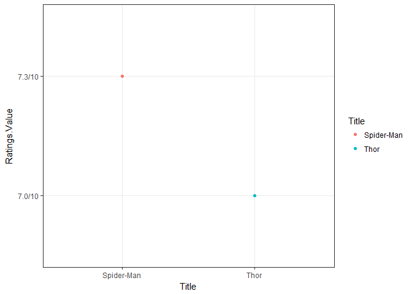
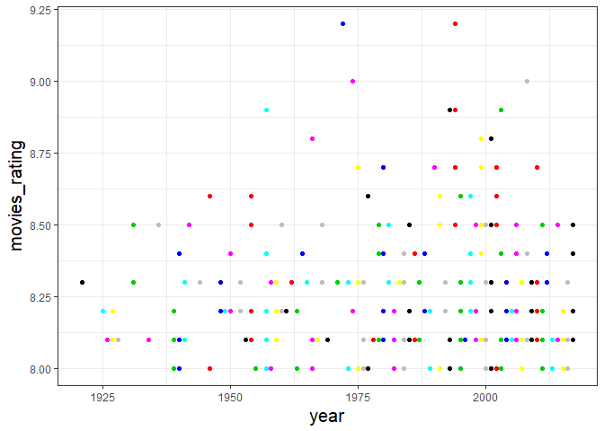
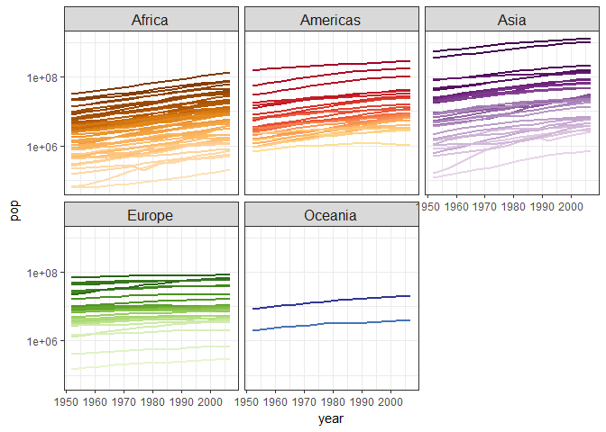

Hw10\_Luo\_Yanchao
================

Make API queries ??by hand?? using httr.
----------------------------------------

*GET() data from the API and convert it into a clean and tidy data frame. Store that as a file ready for (hypothetical!) downstream analysis. Do just enough basic exploration of the resulting data, possibly including some plots, that you and a reader are convinced you successfully downloaded and cleaned it.*

``` r
library(tidyverse)
```

    ## Loading tidyverse: ggplot2
    ## Loading tidyverse: tibble
    ## Loading tidyverse: tidyr
    ## Loading tidyverse: readr
    ## Loading tidyverse: purrr
    ## Loading tidyverse: dplyr

    ## Warning: package 'dplyr' was built under R version 3.4.2

    ## Conflicts with tidy packages ----------------------------------------------

    ## filter(): dplyr, stats
    ## lag():    dplyr, stats

``` r
library(magrittr)
```

    ## 
    ## Attaching package: 'magrittr'

    ## The following object is masked from 'package:purrr':
    ## 
    ##     set_names

    ## The following object is masked from 'package:tidyr':
    ## 
    ##     extract

``` r
library(purrr)
library(glue)
```

    ## 
    ## Attaching package: 'glue'

    ## The following object is masked from 'package:dplyr':
    ## 
    ##     collapse

``` r
library(stringr)
library(purrr)
library(knitr)
library(rvest)
```

    ## Warning: package 'rvest' was built under R version 3.4.2

    ## Loading required package: xml2

    ## Warning: package 'xml2' was built under R version 3.4.2

    ## 
    ## Attaching package: 'rvest'

    ## The following object is masked from 'package:purrr':
    ## 
    ##     pluck

    ## The following object is masked from 'package:readr':
    ## 
    ##     guess_encoding

``` r
library(xml2)
library(httr)
```

    ## Warning: package 'httr' was built under R version 3.4.2

``` r
library(gapminder)
library(geonames)
```

    ## No geonamesUsername set. See http://geonames.wordpress.com/2010/03/16/ddos-part-ii/ and set one with options(geonamesUsername="foo") for some services to work

``` r
library(countrycode)
```

    ## Warning: package 'countrycode' was built under R version 3.4.2

*Write a function to got the general idea about the two movies*

``` r
Find_movies<- function(title,year){
  query_string<- glue("http://www.omdbapi.com/?t={title}&y={year}&apikey=Yourkey")
  movie_result<- GET(query_string)
  movie_content<- content(movie_result)
  return(movie_content)
}

thor<- Find_movies("thor", "2011")

spider_man<-Find_movies("spider_man", "2002")

thor<-data.frame(thor)
spider_man<- data.frame(spider_man)
```

I found two movies "spider\_man" and "thor", and I make a dataframe in order for further analysis.

``` r
compared_two_movies<-full_join(thor,spider_man) 
```

    ## Joining, by = c("Title", "Year", "Rated", "Released", "Runtime", "Genre", "Director", "Writer", "Actors", "Plot", "Language", "Country", "Awards", "Poster", "Ratings.Source", "Ratings.Value", "Ratings.Source.1", "Ratings.Value.1", "Ratings.Source.2", "Ratings.Value.2", "Metascore", "imdbRating", "imdbVotes", "imdbID", "Type", "DVD", "BoxOffice", "Production", "Website", "Response")

    ## Warning: Column `Title` joining factors with different levels, coercing to
    ## character vector

    ## Warning: Column `Year` joining factors with different levels, coercing to
    ## character vector

    ## Warning: Column `Released` joining factors with different levels, coercing
    ## to character vector

    ## Warning: Column `Runtime` joining factors with different levels, coercing
    ## to character vector

    ## Warning: Column `Genre` joining factors with different levels, coercing to
    ## character vector

    ## Warning: Column `Director` joining factors with different levels, coercing
    ## to character vector

    ## Warning: Column `Writer` joining factors with different levels, coercing to
    ## character vector

    ## Warning: Column `Actors` joining factors with different levels, coercing to
    ## character vector

    ## Warning: Column `Plot` joining factors with different levels, coercing to
    ## character vector

    ## Warning: Column `Awards` joining factors with different levels, coercing to
    ## character vector

    ## Warning: Column `Poster` joining factors with different levels, coercing to
    ## character vector

    ## Warning: Column `Ratings.Value` joining factors with different levels,
    ## coercing to character vector

    ## Warning: Column `Ratings.Value.1` joining factors with different levels,
    ## coercing to character vector

    ## Warning: Column `Ratings.Value.2` joining factors with different levels,
    ## coercing to character vector

    ## Warning: Column `Metascore` joining factors with different levels, coercing
    ## to character vector

    ## Warning: Column `imdbRating` joining factors with different levels,
    ## coercing to character vector

    ## Warning: Column `imdbVotes` joining factors with different levels, coercing
    ## to character vector

    ## Warning: Column `imdbID` joining factors with different levels, coercing to
    ## character vector

    ## Warning: Column `DVD` joining factors with different levels, coercing to
    ## character vector

    ## Warning: Column `BoxOffice` joining factors with different levels, coercing
    ## to character vector

    ## Warning: Column `Production` joining factors with different levels,
    ## coercing to character vector

    ## Warning: Column `Website` joining factors with different levels, coercing
    ## to character vector

``` r
 knitr::kable(compared_two_movies)
```

| Title      | Year | Rated | Released    | Runtime | Genre                      | Director        | Writer                                                                                                                                                                                                            | Actors                                                            | Plot                                                                                                                                                                                                               | Language | Country | Awards                                                    | Poster                                                                                                                                            | Ratings.Source          | Ratings.Value | Ratings.Source.1 | Ratings.Value.1 | Ratings.Source.2 | Ratings.Value.2 | Metascore | imdbRating | imdbVotes | imdbID    | Type  | DVD         | BoxOffice    | Production         | Website                              | Response |
|:-----------|:-----|:------|:------------|:--------|:---------------------------|:----------------|:------------------------------------------------------------------------------------------------------------------------------------------------------------------------------------------------------------------|:------------------------------------------------------------------|:-------------------------------------------------------------------------------------------------------------------------------------------------------------------------------------------------------------------|:---------|:--------|:----------------------------------------------------------|:--------------------------------------------------------------------------------------------------------------------------------------------------|:------------------------|:--------------|:-----------------|:----------------|:-----------------|:----------------|:----------|:-----------|:----------|:----------|:------|:------------|:-------------|:-------------------|:-------------------------------------|:---------|
| Thor       | 2011 | PG-13 | 06 May 2011 | 115 min | Action, Adventure, Fantasy | Kenneth Branagh | Ashley Miller (screenplay), Zack Stentz (screenplay), Don Payne (screenplay), J. Michael Straczynski (story), Mark Protosevich (story), Stan Lee (comic book), Larry Lieber (comic book), Jack Kirby (comic book) | Chris Hemsworth, Natalie Portman, Tom Hiddleston, Anthony Hopkins | The powerful, but arrogant god Thor, is cast out of Asgard to live amongst humans in Midgard (Earth), where he soon becomes one of their finest defenders.                                                         | English  | USA     | 5 wins & 30 nominations.                                  | <https://images-na.ssl-images-amazon.com/images/M/MV5BOGE4NzU1YTAtNzA3Mi00ZTA2LTg2YmYtMDJmMThiMjlkYjg2XkEyXkFqcGdeQXVyNTgzMDMzMTg@._V1_SX300.jpg> | Internet Movie Database | 7.0/10        | Rotten Tomatoes  | 77%             | Metacritic       | 57/100          | 57        | 7.0        | 595,062   | tt0800369 | movie | 13 Sep 2011 | $181,015,141 | Paramount Pictures | <http://thor.marvel.com/>            | True     |
| Spider-Man | 2002 | PG-13 | 03 May 2002 | 121 min | Action, Adventure          | Sam Raimi       | Stan Lee (Marvel comic book), Steve Ditko (Marvel comic book), David Koepp (screenplay)                                                                                                                           | Tobey Maguire, Willem Dafoe, Kirsten Dunst, James Franco          | When bitten by a genetically modified spider, a nerdy, shy, and awkward high school student gains spider-like abilities that he eventually must use to fight evil as a superhero after tragedy befalls his family. | English  | USA     | Nominated for 2 Oscars. Another 15 wins & 58 nominations. | <https://images-na.ssl-images-amazon.com/images/M/MV5BZDEyN2NhMjgtMjdhNi00MmNlLWE5YTgtZGE4MzNjMTRlMGEwXkEyXkFqcGdeQXVyNDUyOTg3Njg@._V1_SX300.jpg> | Internet Movie Database | 7.3/10        | Rotten Tomatoes  | 89%             | Metacritic       | 73/100          | 73        | 7.3        | 589,948   | tt0145487 | movie | 01 Nov 2002 | $403,706,375 | Columbia Pictures  | <http://spiderman.sonypictures.com/> | True     |

There are many information in this table, using stat545 method to subset the data.

``` r
subset<-compared_two_movies %>% 
  select(Title, Year, Country, Awards, Ratings.Value) 
 knitr::kable(subset)
```

| Title      | Year | Country | Awards                                                    | Ratings.Value |
|:-----------|:-----|:--------|:----------------------------------------------------------|:--------------|
| Thor       | 2011 | USA     | 5 wins & 30 nominations.                                  | 7.0/10        |
| Spider-Man | 2002 | USA     | Nominated for 2 Oscars. Another 15 wins & 58 nominations. | 7.3/10        |

``` r
subset %>% 
  ggplot(aes(Title,Ratings.Value))+
  geom_point(aes(color=Title))+
  theme_bw() +
  theme(axis.title.x = element_text(size=11),
        axis.title.y = element_text(size=11))
```



``` r
subset
```

    ##        Title Year Country
    ## 1       Thor 2011     USA
    ## 2 Spider-Man 2002     USA
    ##                                                      Awards Ratings.Value
    ## 1                                  5 wins & 30 nominations.        7.0/10
    ## 2 Nominated for 2 Oscars. Another 15 wins & 58 nominations.        7.3/10

Scrape data
-----------

*Work through the final set of slides from the rOpenSci UseR! 2016 workshop. This will give you basic orientation, skills, and pointers on the rvest package.* *Scrape a multi-record dataset off the web! Convert it into a clean and tidy data frame. Store that as a file ready for (hypothetical!) downstream analysis. Do just enough basic* *exploration of the resulting data, possibly including some plots, that you and a reader are convinced you’ve successfully downloaded and cleaned it.*

We get a list of those title:

``` r
url_titles <- "http://www.imdb.com/title/tt0145487/?ref_=nv_sr_3"

spider <- read_html(url_titles)
```

``` r
initial <- html_nodes(spider, "em")
html_text(initial)
```

    ## [1] "Written by\nSoumitra"

get the cast name for the movie.

``` r
name <- html_nodes(spider, "#titleCast span.itemprop")
html_text(name) 
```

    ##  [1] "Tobey Maguire"    "Willem Dafoe"     "Kirsten Dunst"   
    ##  [4] "James Franco"     "Cliff Robertson"  "Rosemary Harris" 
    ##  [7] "J.K. Simmons"     "Joe Manganiello"  "Gerry Becker"    
    ## [10] "Bill Nunn"        "Jack Betts"       "Stanley Anderson"
    ## [13] "Ron Perkins"      "Michael Papajohn" "K.K. Dodds"

``` r
 html_nodes(spider, ".ratingValue span") %>%
  html_text()%>%
  paste0(collapse = '')
```

    ## [1] "7.3/10"

Right now we got the rate for the spider\_man.

Using the same way to find the thor information

We get a list of those title:

``` r
url_titles <- "http://www.imdb.com/title/tt0800369/?ref_=nv_sr_2"

thornew <- read_html(url_titles)
```

``` r
initial <- html_nodes(thornew, "em")
html_text(initial)
```

    ## [1] "Written by\nAnonymous"

We get the cast name for the movie.

``` r
name <- html_nodes(thornew, "#titleCast span.itemprop")
html_text(name) 
```

    ##  [1] "Chris Hemsworth"   "Natalie Portman"   "Tom Hiddleston"   
    ##  [4] "Anthony Hopkins"   "Stellan Skarsg<U+00E5>rd" "Kat Dennings"     
    ##  [7] "Clark Gregg"       "Colm Feore"        "Idris Elba"       
    ## [10] "Ray Stevenson"     "Tadanobu Asano"    "Josh Dallas"      
    ## [13] "Jaimie Alexander"  "Rene Russo"        "Adriana Barraza"

``` r
 html_nodes(thornew, ".ratingValue span") %>%
  html_text()%>%
  paste0(collapse = '')
```

    ## [1] "7.0/10"

From above, we got the same result as making API queries ??by hand?? using httr.

``` r
url_titles2 <- "http://www.imdb.com/chart/top?ref_=nv_mv_250_6"
```

Got the title.

``` r
top_movies<- read_html(url_titles2)
main <- top_movies %>% 
  html_nodes(".titleColumn") %>% 
  html_text(trim = TRUE)
```

Got the rating

``` r
movies_rating <- html_nodes(top_movies,".ratingColumn.imdbRating") %>% 
  html_text(trim = TRUE)
movies_rating<-as.numeric(movies_rating)
```

Using `gsub` function replaces all matches of a string.

``` r
year1 <- gsub("^.*\\(", "", main)
year2 <- gsub(".{1}$", "", year1)
year<- as.numeric(year2)
```

``` r
dataset<- data.frame(year, movies_rating)
```

``` r
dataset %>% 
  ggplot(aes(year,movies_rating))+
    geom_point(color=year)+
  theme_bw()+
  theme(axis.title.x = element_text(size=15),
        axis.title.y = element_text(size=15))
```



``` r
dataset
```

    ##     year movies_rating
    ## 1   1994           9.2
    ## 2   1972           9.2
    ## 3   1974           9.0
    ## 4   2008           9.0
    ## 5   1957           8.9
    ## 6   1993           8.9
    ## 7   1994           8.9
    ## 8   2003           8.9
    ## 9   1966           8.8
    ## 10  1999           8.8
    ## 11  2001           8.8
    ## 12  1994           8.7
    ## 13  1980           8.7
    ## 14  2010           8.7
    ## 15  2002           8.7
    ## 16  1975           8.7
    ## 17  1990           8.7
    ## 18  1999           8.7
    ## 19  1954           8.6
    ## 20  1977           8.6
    ## 21  2002           8.6
    ## 22  1995           8.6
    ## 23  1991           8.6
    ## 24  1946           8.6
    ## 25  1997           8.6
    ## 26  1995           8.6
    ## 27  1994           8.5
    ## 28  1998           8.5
    ## 29  2001           8.5
    ## 30  1998           8.5
    ## 31  1968           8.5
    ## 32  2014           8.5
    ## 33  1999           8.5
    ## 34  1960           8.5
    ## 35  1942           8.5
    ## 36  1931           8.5
    ## 37  2011           8.5
    ## 38  1936           8.5
    ## 39  2017           8.5
    ## 40  2002           8.5
    ## 41  1981           8.5
    ## 42  2006           8.5
    ## 43  1954           8.5
    ## 44  1991           8.5
    ## 45  1985           8.5
    ## 46  2014           8.5
    ## 47  2000           8.5
    ## 48  2006           8.5
    ## 49  1994           8.5
    ## 50  2000           8.5
    ## 51  1979           8.5
    ## 52  1979           8.4
    ## 53  1940           8.4
    ## 54  1950           8.4
    ## 55  1988           8.4
    ## 56  1964           8.4
    ## 57  2006           8.4
    ## 58  1988           8.4
    ## 59  1957           8.4
    ## 60  2012           8.4
    ## 61  1980           8.4
    ## 62  2008           8.4
    ## 63  1999           8.4
    ## 64  2017           8.4
    ## 65  1997           8.4
    ## 66  2012           8.4
    ## 67  2003           8.4
    ## 68  1986           8.4
    ## 69  1957           8.4
    ## 70  1984           8.4
    ## 71  1981           8.3
    ## 72  2016           8.3
    ## 73  1941           8.3
    ## 74  1958           8.3
    ## 75  1959           8.3
    ## 76  1983           8.3
    ## 77  1995           8.3
    ## 78  1992           8.3
    ## 79  1931           8.3
    ## 80  2000           8.3
    ## 81  2001           8.3
    ## 82  2007           8.3
    ## 83  2016           8.3
    ## 84  1971           8.3
    ## 85  1962           8.3
    ## 86  1984           8.3
    ## 87  1944           8.3
    ## 88  2004           8.3
    ## 89  1976           8.3
    ## 90  1962           8.3
    ## 91  1987           8.3
    ## 92  1968           8.3
    ## 93  1952           8.3
    ## 94  1995           8.3
    ## 95  2009           8.3
    ## 96  1973           8.3
    ## 97  2010           8.3
    ## 98  2009           8.3
    ## 99  1948           8.3
    ## 100 1921           8.3
    ## 101 2000           8.3
    ## 102 1975           8.3
    ## 103 1997           8.3
    ## 104 2012           8.3
    ## 105 1965           8.3
    ## 106 1997           8.3
    ## 107 1983           8.3
    ## 108 1960           8.2
    ## 109 1927           8.2
    ## 110 2011           8.2
    ## 111 1950           8.2
    ## 112 2017           8.2
    ## 113 1989           8.2
    ## 114 1950           8.2
    ## 115 1961           8.2
    ## 116 2005           8.2
    ## 117 2009           8.2
    ## 118 2005           8.2
    ## 119 1959           8.2
    ## 120 1948           8.2
    ## 121 1992           8.2
    ## 122 2004           8.2
    ## 123 1988           8.2
    ## 124 1980           8.2
    ## 125 1995           8.2
    ## 126 1997           8.2
    ## 127 1949           8.2
    ## 128 1963           8.2
    ## 129 1952           8.2
    ## 130 1974           8.2
    ## 131 2006           8.2
    ## 132 1988           8.2
    ## 133 2010           8.2
    ## 134 1985           8.2
    ## 135 1961           8.2
    ## 136 1925           8.2
    ## 137 2009           8.2
    ## 138 2015           8.2
    ## 139 2004           8.2
    ## 140 1954           8.2
    ## 141 1957           8.2
    ## 142 1957           8.2
    ## 143 2015           8.2
    ## 144 1998           8.2
    ## 145 1939           8.2
    ## 146 2001           8.2
    ## 147 1995           8.2
    ## 148 1982           8.2
    ## 149 1980           8.1
    ## 150 2005           8.1
    ## 151 2013           8.1
    ## 152 1957           8.1
    ## 153 1926           8.1
    ## 154 2011           8.1
    ## 155 1954           8.1
    ## 156 1996           8.1
    ## 157 2008           8.1
    ## 158 1939           8.1
    ## 159 1978           8.1
    ## 160 1927           8.1
    ## 161 1999           8.1
    ## 162 1996           8.1
    ## 163 1982           8.1
    ## 164 2007           8.1
    ## 165 1966           8.1
    ## 166 1998           8.1
    ## 167 2003           8.1
    ## 168 1953           8.1
    ## 169 1996           8.1
    ## 170 2007           8.1
    ## 171 1967           8.1
    ## 172 1985           8.1
    ## 173 1940           8.1
    ## 174 2016           8.1
    ## 175 2003           8.1
    ## 176 2010           8.1
    ## 177 2006           8.1
    ## 178 1928           8.1
    ## 179 2009           8.1
    ## 180 2014           8.1
    ## 181 2010           8.1
    ## 182 2007           8.1
    ## 183 2016           8.1
    ## 184 1979           8.1
    ## 185 1934           8.1
    ## 186 2014           8.1
    ## 187 2017           8.1
    ## 188 1986           8.1
    ## 189 1953           8.1
    ## 190 2004           8.1
    ## 191 1976           8.1
    ## 192 1993           8.1
    ## 193 1986           8.1
    ## 194 2013           8.1
    ## 195 2008           8.1
    ## 196 2014           8.1
    ## 197 1959           8.1
    ## 198 1966           8.1
    ## 199 2017           8.1
    ## 200 1959           8.1
    ## 201 1993           8.1
    ## 202 2003           8.1
    ## 203 2013           8.1
    ## 204 2015           8.1
    ## 205 2004           8.1
    ## 206 2015           8.1
    ## 207 1979           8.1
    ## 208 1998           8.1
    ## 209 2000           8.1
    ## 210 1969           8.1
    ## 211 2009           8.1
    ## 212 1984           8.1
    ## 213 1995           8.1
    ## 214 1987           8.1
    ## 215 1941           8.1
    ## 216 1973           8.0
    ## 217 2013           8.0
    ## 218 1957           8.0
    ## 219 2011           8.0
    ## 220 1940           8.0
    ## 221 1976           8.0
    ## 222 2002           8.0
    ## 223 1955           8.0
    ## 224 1958           8.0
    ## 225 2001           8.0
    ## 226 1982           8.0
    ## 227 2001           8.0
    ## 228 1975           8.0
    ## 229 1977           8.0
    ## 230 1984           8.0
    ## 231 2007           8.0
    ## 232 2015           8.0
    ## 233 1939           8.0
    ## 234 1993           8.0
    ## 235 1995           8.0
    ## 236 1963           8.0
    ## 237 2003           8.0
    ## 238 1975           8.0
    ## 239 1946           8.0
    ## 240 1995           8.0
    ## 241 2002           8.0
    ## 242 1984           8.0
    ## 243 2000           8.0
    ## 244 2011           8.0
    ## 245 1989           8.0
    ## 246 1991           8.0
    ## 247 2016           8.0
    ## 248 1966           8.0
    ## 249 2003           8.0
    ## 250 1975           8.0

Use an R package that wraps an API
----------------------------------

*Prompt 1*

``` r
options(geonamesUsername = "Your_name")
addInforation <- GNcountryInfo() %>%
    mutate(country = as.factor(
        countrycode(isoAlpha3, 'iso3c',  'country.name'))) 
```

    ## Warning in countrycode(isoAlpha3, "iso3c", "country.name"): Some values were not matched unambiguously: XKX

``` r
combine <- left_join(gapminder, addInforation, by = "country") %>%
    select(-c(countryName,continentName,continent.y))
```

    ## Warning: Column `country` joining factors with different levels, coercing
    ## to character vector

``` r
 combine %>%
    head(5) %>%
    knitr::kable()
```

| country     | continent.x |  year|  lifeExp|       pop|  gdpPercap| capital | languages         | geonameId | south     | isoAlpha3 | north     | fipsCode | population | east      | isoNumeric | areaInSqKm | countryCode | west      | currencyCode |
|:------------|:------------|-----:|--------:|---------:|----------:|:--------|:------------------|:----------|:----------|:----------|:----------|:---------|:-----------|:----------|:-----------|:-----------|:------------|:----------|:-------------|
| Afghanistan | Asia        |  1952|   28.801|   8425333|   779.4453| Kabul   | fa-AF,ps,uz-AF,tk | 1149361   | 29.377472 | AFG       | 38.483418 | AF       | 29121286   | 74.879448 | 004        | 647500.0   | AF          | 60.478443 | AFN          |
| Afghanistan | Asia        |  1957|   30.332|   9240934|   820.8530| Kabul   | fa-AF,ps,uz-AF,tk | 1149361   | 29.377472 | AFG       | 38.483418 | AF       | 29121286   | 74.879448 | 004        | 647500.0   | AF          | 60.478443 | AFN          |
| Afghanistan | Asia        |  1962|   31.997|  10267083|   853.1007| Kabul   | fa-AF,ps,uz-AF,tk | 1149361   | 29.377472 | AFG       | 38.483418 | AF       | 29121286   | 74.879448 | 004        | 647500.0   | AF          | 60.478443 | AFN          |
| Afghanistan | Asia        |  1967|   34.020|  11537966|   836.1971| Kabul   | fa-AF,ps,uz-AF,tk | 1149361   | 29.377472 | AFG       | 38.483418 | AF       | 29121286   | 74.879448 | 004        | 647500.0   | AF          | 60.478443 | AFN          |
| Afghanistan | Asia        |  1972|   36.088|  13079460|   739.9811| Kabul   | fa-AF,ps,uz-AF,tk | 1149361   | 29.377472 | AFG       | 38.483418 | AF       | 29121286   | 74.879448 | 004        | 647500.0   | AF          | 60.478443 | AFN          |

*Consider the following graph of population against time *

``` r
combine %>%
    filter(continent.x!= "Oceania") %>%
    ggplot(aes(x = year, y = pop, 
                         group = country, 
                         color = country)) +
  geom_line(lwd = 1, show.legend = FALSE) + 
    facet_wrap(~ continent.x) +
  scale_color_manual(values = country_colors) + 
    theme_bw() +
  theme(strip.text = element_text(size = rel(1.1))) + 
    scale_y_log10() 
```


