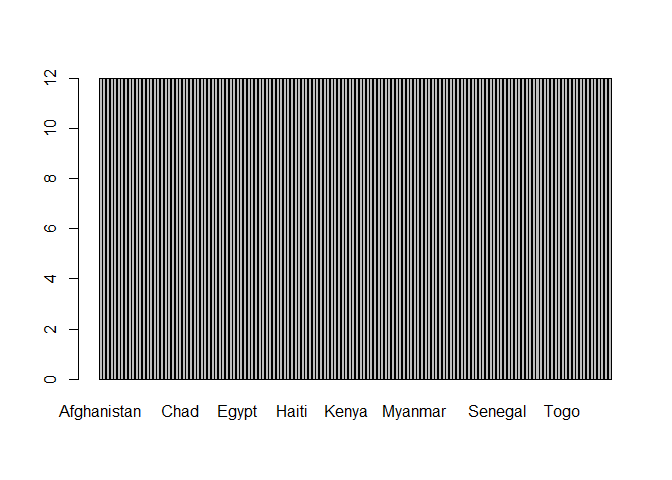
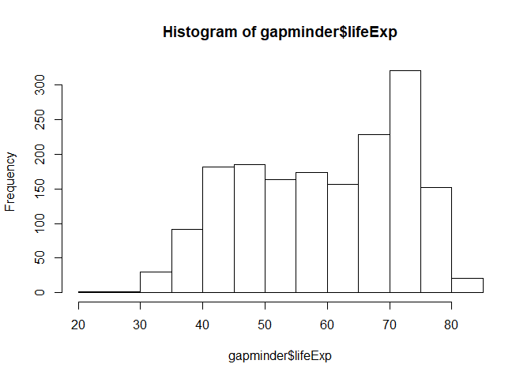
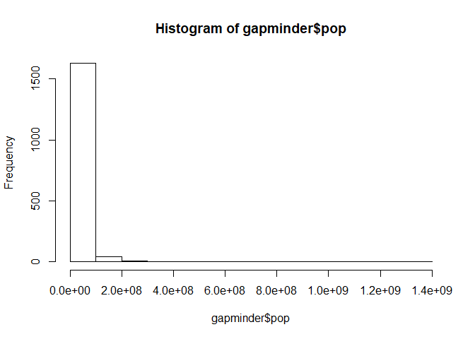
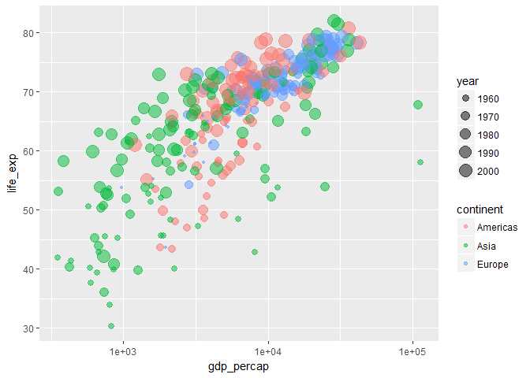
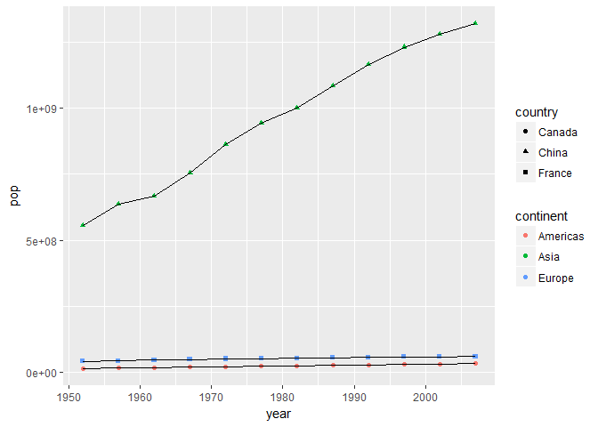
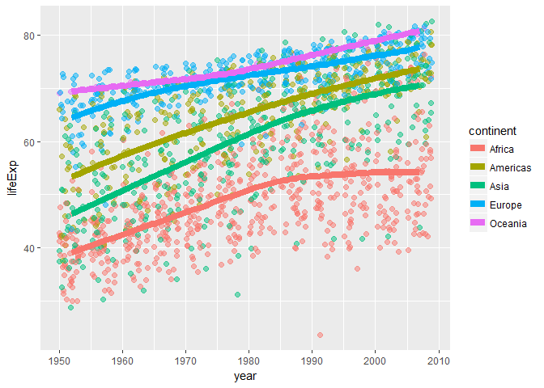
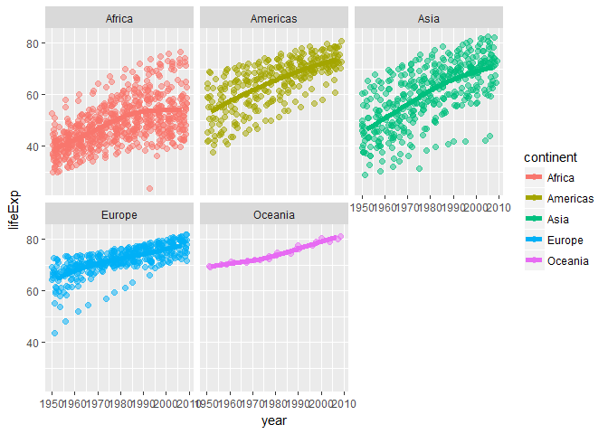

Expolre gapminder
================

Bring rectangular data in
-------------------------

### First time to install the data `gapminder` and `dplyr`

``` r
##install.packages("gapminder")

##install.packages("tidyverse")
```

### Load the data

``` r
library(gapminder)
library(tidyverse)
```

    ## Loading tidyverse: ggplot2
    ## Loading tidyverse: tibble
    ## Loading tidyverse: tidyr
    ## Loading tidyverse: readr
    ## Loading tidyverse: purrr
    ## Loading tidyverse: dplyr

    ## Conflicts with tidy packages ----------------------------------------------

    ## filter(): dplyr, stats
    ## lag():    dplyr, stats

Smell test the data
-------------------

**Q1: Is it a data.frame, a matrix, a vector, a list?**

``` r
typeof(gapminder)
```

    ## [1] "list"

From the output, `gapminder` data is a list. **Q2: What’s its class?**

``` r
class(gapminder)
```

    ## [1] "tbl_df"     "tbl"        "data.frame"

From the R output above, it shows that gapminder should be a data.frame, but also a tibble.

**Q3: How many variables/columns?**

``` r
ncol(gapminder)
```

    ## [1] 6

``` r
length(gapminder)
```

    ## [1] 6

There are two ways to show how many variables using `ncol` and `length` functions. In addition, we can print `gapminder` dirctly by using `head` or `tail` function.

``` r
head(gapminder)
```

    ## # A tibble: 6 x 6
    ##       country continent  year lifeExp      pop gdpPercap
    ##        <fctr>    <fctr> <int>   <dbl>    <int>     <dbl>
    ## 1 Afghanistan      Asia  1952  28.801  8425333  779.4453
    ## 2 Afghanistan      Asia  1957  30.332  9240934  820.8530
    ## 3 Afghanistan      Asia  1962  31.997 10267083  853.1007
    ## 4 Afghanistan      Asia  1967  34.020 11537966  836.1971
    ## 5 Afghanistan      Asia  1972  36.088 13079460  739.9811
    ## 6 Afghanistan      Asia  1977  38.438 14880372  786.1134

``` r
tail(gapminder)
```

    ## # A tibble: 6 x 6
    ##    country continent  year lifeExp      pop gdpPercap
    ##     <fctr>    <fctr> <int>   <dbl>    <int>     <dbl>
    ## 1 Zimbabwe    Africa  1982  60.363  7636524  788.8550
    ## 2 Zimbabwe    Africa  1987  62.351  9216418  706.1573
    ## 3 Zimbabwe    Africa  1992  60.377 10704340  693.4208
    ## 4 Zimbabwe    Africa  1997  46.809 11404948  792.4500
    ## 5 Zimbabwe    Africa  2002  39.989 11926563  672.0386
    ## 6 Zimbabwe    Africa  2007  43.487 12311143  469.7093

**Q4: How many rows/observations?**

``` r
nrow(gapminder)
```

    ## [1] 1704

There are 1704 observations.

**Q5: Can you get these facts about “extent” or “size” in more than one way? Can you imagine different functions being useful in different contexts?**

``` r
dim(gapminder)
```

    ## [1] 1704    6

One way to shows how many rows and variables is using `dim()`. From the output, `gapminder` has 1704 rows and 6 columns If we need to deal with the vector, at that time we can not use `dim()` function, because if different columns are linear dependent, the number of columns not equal to the dimension of columns. More methods about `gapminder` size.

``` r
summary(gapminder)
```

    ##         country        continent        year         lifeExp     
    ##  Afghanistan:  12   Africa  :624   Min.   :1952   Min.   :23.60  
    ##  Albania    :  12   Americas:300   1st Qu.:1966   1st Qu.:48.20  
    ##  Algeria    :  12   Asia    :396   Median :1980   Median :60.71  
    ##  Angola     :  12   Europe  :360   Mean   :1980   Mean   :59.47  
    ##  Argentina  :  12   Oceania : 24   3rd Qu.:1993   3rd Qu.:70.85  
    ##  Australia  :  12                  Max.   :2007   Max.   :82.60  
    ##  (Other)    :1632                                                
    ##       pop              gdpPercap       
    ##  Min.   :6.001e+04   Min.   :   241.2  
    ##  1st Qu.:2.794e+06   1st Qu.:  1202.1  
    ##  Median :7.024e+06   Median :  3531.8  
    ##  Mean   :2.960e+07   Mean   :  7215.3  
    ##  3rd Qu.:1.959e+07   3rd Qu.:  9325.5  
    ##  Max.   :1.319e+09   Max.   :113523.1  
    ## 

``` r
str(gapminder)
```

    ## Classes 'tbl_df', 'tbl' and 'data.frame':    1704 obs. of  6 variables:
    ##  $ country  : Factor w/ 142 levels "Afghanistan",..: 1 1 1 1 1 1 1 1 1 1 ...
    ##  $ continent: Factor w/ 5 levels "Africa","Americas",..: 3 3 3 3 3 3 3 3 3 3 ...
    ##  $ year     : int  1952 1957 1962 1967 1972 1977 1982 1987 1992 1997 ...
    ##  $ lifeExp  : num  28.8 30.3 32 34 36.1 ...
    ##  $ pop      : int  8425333 9240934 10267083 11537966 13079460 14880372 12881816 13867957 16317921 22227415 ...
    ##  $ gdpPercap: num  779 821 853 836 740 ...

From `summary` function, we can find the mean, median, minimum, maximum about each variable. And using `str`, we could find name, class, type of data.

**Q6: What data type is each variable?**

``` r
class(gapminder$country)
```

    ## [1] "factor"

``` r
class(gapminder$continent)
```

    ## [1] "factor"

``` r
class(gapminder$year)
```

    ## [1] "integer"

``` r
class(gapminder$lifeExp)
```

    ## [1] "numeric"

``` r
class(gapminder$pop)
```

    ## [1] "integer"

``` r
class(gapminder$gdpPercap)
```

    ## [1] "numeric"

The second way

``` r
typeof(gapminder$country) 
```

    ## [1] "integer"

``` r
typeof(gapminder$continent) 
```

    ## [1] "integer"

``` r
typeof(gapminder$year)
```

    ## [1] "integer"

``` r
typeof(gapminder$lifeExp)
```

    ## [1] "double"

``` r
typeof(gapminder$pop)
```

    ## [1] "integer"

``` r
typeof(gapminder$gdpPercap)
```

    ## [1] "double"

The third way

``` r
str(gapminder)
```

    ## Classes 'tbl_df', 'tbl' and 'data.frame':    1704 obs. of  6 variables:
    ##  $ country  : Factor w/ 142 levels "Afghanistan",..: 1 1 1 1 1 1 1 1 1 1 ...
    ##  $ continent: Factor w/ 5 levels "Africa","Americas",..: 3 3 3 3 3 3 3 3 3 3 ...
    ##  $ year     : int  1952 1957 1962 1967 1972 1977 1982 1987 1992 1997 ...
    ##  $ lifeExp  : num  28.8 30.3 32 34 36.1 ...
    ##  $ pop      : int  8425333 9240934 10267083 11537966 13079460 14880372 12881816 13867957 16317921 22227415 ...
    ##  $ gdpPercap: num  779 821 853 836 740 ...

Explore individual variables
----------------------------

There are 6 variables for gapminder, 3 quantitative variables: `year`, `lifeExp`, `gdpPercap` and `pop`; 2 categorical variable: `conti nent` and `country`.

**Q1: What are possible values (or range, whichever is appropriate) of each variable?**

##### Categorical variables

The categorial variable `continent`.

``` r
##The first method
summary(gapminder$continent)
```

    ##   Africa Americas     Asia   Europe  Oceania 
    ##      624      300      396      360       24

``` r
##The secound method
gapminder %>% 
  distinct(continent)
```

    ## # A tibble: 5 x 1
    ##   continent
    ##      <fctr>
    ## 1      Asia
    ## 2    Europe
    ## 3    Africa
    ## 4  Americas
    ## 5   Oceania

``` r
##the third method
  unique(gapminder$continent)
```

    ## [1] Asia     Europe   Africa   Americas Oceania 
    ## Levels: Africa Americas Asia Europe Oceania

There are 5 value for `continent` : Africa, Americas, Asia, Europe and Oceania. the Categorial variable `country`.

``` r
##The first method
summary(gapminder$country)
```

    ##              Afghanistan                  Albania                  Algeria 
    ##                       12                       12                       12 
    ##                   Angola                Argentina                Australia 
    ##                       12                       12                       12 
    ##                  Austria                  Bahrain               Bangladesh 
    ##                       12                       12                       12 
    ##                  Belgium                    Benin                  Bolivia 
    ##                       12                       12                       12 
    ##   Bosnia and Herzegovina                 Botswana                   Brazil 
    ##                       12                       12                       12 
    ##                 Bulgaria             Burkina Faso                  Burundi 
    ##                       12                       12                       12 
    ##                 Cambodia                 Cameroon                   Canada 
    ##                       12                       12                       12 
    ## Central African Republic                     Chad                    Chile 
    ##                       12                       12                       12 
    ##                    China                 Colombia                  Comoros 
    ##                       12                       12                       12 
    ##         Congo, Dem. Rep.              Congo, Rep.               Costa Rica 
    ##                       12                       12                       12 
    ##            Cote d'Ivoire                  Croatia                     Cuba 
    ##                       12                       12                       12 
    ##           Czech Republic                  Denmark                 Djibouti 
    ##                       12                       12                       12 
    ##       Dominican Republic                  Ecuador                    Egypt 
    ##                       12                       12                       12 
    ##              El Salvador        Equatorial Guinea                  Eritrea 
    ##                       12                       12                       12 
    ##                 Ethiopia                  Finland                   France 
    ##                       12                       12                       12 
    ##                    Gabon                   Gambia                  Germany 
    ##                       12                       12                       12 
    ##                    Ghana                   Greece                Guatemala 
    ##                       12                       12                       12 
    ##                   Guinea            Guinea-Bissau                    Haiti 
    ##                       12                       12                       12 
    ##                 Honduras         Hong Kong, China                  Hungary 
    ##                       12                       12                       12 
    ##                  Iceland                    India                Indonesia 
    ##                       12                       12                       12 
    ##                     Iran                     Iraq                  Ireland 
    ##                       12                       12                       12 
    ##                   Israel                    Italy                  Jamaica 
    ##                       12                       12                       12 
    ##                    Japan                   Jordan                    Kenya 
    ##                       12                       12                       12 
    ##         Korea, Dem. Rep.              Korea, Rep.                   Kuwait 
    ##                       12                       12                       12 
    ##                  Lebanon                  Lesotho                  Liberia 
    ##                       12                       12                       12 
    ##                    Libya               Madagascar                   Malawi 
    ##                       12                       12                       12 
    ##                 Malaysia                     Mali               Mauritania 
    ##                       12                       12                       12 
    ##                Mauritius                   Mexico                 Mongolia 
    ##                       12                       12                       12 
    ##               Montenegro                  Morocco               Mozambique 
    ##                       12                       12                       12 
    ##                  Myanmar                  Namibia                    Nepal 
    ##                       12                       12                       12 
    ##              Netherlands              New Zealand                Nicaragua 
    ##                       12                       12                       12 
    ##                    Niger                  Nigeria                   Norway 
    ##                       12                       12                       12 
    ##                     Oman                 Pakistan                   Panama 
    ##                       12                       12                       12 
    ##                  (Other) 
    ##                      516

``` r
##The secound method
gapminder %>% 
  distinct(country)
```

    ## # A tibble: 142 x 1
    ##        country
    ##         <fctr>
    ##  1 Afghanistan
    ##  2     Albania
    ##  3     Algeria
    ##  4      Angola
    ##  5   Argentina
    ##  6   Australia
    ##  7     Austria
    ##  8     Bahrain
    ##  9  Bangladesh
    ## 10     Belgium
    ## # ... with 132 more rows

``` r
##the third method
  unique(gapminder$country)
```

    ##   [1] Afghanistan              Albania                 
    ##   [3] Algeria                  Angola                  
    ##   [5] Argentina                Australia               
    ##   [7] Austria                  Bahrain                 
    ##   [9] Bangladesh               Belgium                 
    ##  [11] Benin                    Bolivia                 
    ##  [13] Bosnia and Herzegovina   Botswana                
    ##  [15] Brazil                   Bulgaria                
    ##  [17] Burkina Faso             Burundi                 
    ##  [19] Cambodia                 Cameroon                
    ##  [21] Canada                   Central African Republic
    ##  [23] Chad                     Chile                   
    ##  [25] China                    Colombia                
    ##  [27] Comoros                  Congo, Dem. Rep.        
    ##  [29] Congo, Rep.              Costa Rica              
    ##  [31] Cote d'Ivoire            Croatia                 
    ##  [33] Cuba                     Czech Republic          
    ##  [35] Denmark                  Djibouti                
    ##  [37] Dominican Republic       Ecuador                 
    ##  [39] Egypt                    El Salvador             
    ##  [41] Equatorial Guinea        Eritrea                 
    ##  [43] Ethiopia                 Finland                 
    ##  [45] France                   Gabon                   
    ##  [47] Gambia                   Germany                 
    ##  [49] Ghana                    Greece                  
    ##  [51] Guatemala                Guinea                  
    ##  [53] Guinea-Bissau            Haiti                   
    ##  [55] Honduras                 Hong Kong, China        
    ##  [57] Hungary                  Iceland                 
    ##  [59] India                    Indonesia               
    ##  [61] Iran                     Iraq                    
    ##  [63] Ireland                  Israel                  
    ##  [65] Italy                    Jamaica                 
    ##  [67] Japan                    Jordan                  
    ##  [69] Kenya                    Korea, Dem. Rep.        
    ##  [71] Korea, Rep.              Kuwait                  
    ##  [73] Lebanon                  Lesotho                 
    ##  [75] Liberia                  Libya                   
    ##  [77] Madagascar               Malawi                  
    ##  [79] Malaysia                 Mali                    
    ##  [81] Mauritania               Mauritius               
    ##  [83] Mexico                   Mongolia                
    ##  [85] Montenegro               Morocco                 
    ##  [87] Mozambique               Myanmar                 
    ##  [89] Namibia                  Nepal                   
    ##  [91] Netherlands              New Zealand             
    ##  [93] Nicaragua                Niger                   
    ##  [95] Nigeria                  Norway                  
    ##  [97] Oman                     Pakistan                
    ##  [99] Panama                   Paraguay                
    ## [101] Peru                     Philippines             
    ## [103] Poland                   Portugal                
    ## [105] Puerto Rico              Reunion                 
    ## [107] Romania                  Rwanda                  
    ## [109] Sao Tome and Principe    Saudi Arabia            
    ## [111] Senegal                  Serbia                  
    ## [113] Sierra Leone             Singapore               
    ## [115] Slovak Republic          Slovenia                
    ## [117] Somalia                  South Africa            
    ## [119] Spain                    Sri Lanka               
    ## [121] Sudan                    Swaziland               
    ## [123] Sweden                   Switzerland             
    ## [125] Syria                    Taiwan                  
    ## [127] Tanzania                 Thailand                
    ## [129] Togo                     Trinidad and Tobago     
    ## [131] Tunisia                  Turkey                  
    ## [133] Uganda                   United Kingdom          
    ## [135] United States            Uruguay                 
    ## [137] Venezuela                Vietnam                 
    ## [139] West Bank and Gaza       Yemen, Rep.             
    ## [141] Zambia                   Zimbabwe                
    ## 142 Levels: Afghanistan Albania Algeria Angola Argentina ... Zimbabwe

##### Quantitative variable

The Quantitative variable `lifeExp`.

``` r
summary(gapminder$lifeExp)
```

    ##    Min. 1st Qu.  Median    Mean 3rd Qu.    Max. 
    ##   23.60   48.20   60.71   59.47   70.85   82.60

``` r
## Another way using %>%
gapminder %>% 
  summarize(mean_lifeExp=mean(lifeExp), min_lifeExp=min(lifeExp), max_lifeExp=max(lifeExp), median_lifeExp=median(lifeExp))
```

    ## # A tibble: 1 x 4
    ##   mean_lifeExp min_lifeExp max_lifeExp median_lifeExp
    ##          <dbl>       <dbl>       <dbl>          <dbl>
    ## 1     59.47444      23.599      82.603        60.7125

The range for life expectancy between 23.6 and 83.6, the mean is 59.47, median is 60.71.

The Quantitative variable `pop`.

``` r
summary(gapminder$pop)
```

    ##      Min.   1st Qu.    Median      Mean   3rd Qu.      Max. 
    ## 6.001e+04 2.794e+06 7.024e+06 2.960e+07 1.959e+07 1.319e+09

``` r
## Another way using %>%
gapminder %>% 
  summarize(mean_lifeExp=mean(pop), min_lifeExp=min(pop), max_lifeExp=max(pop), median_lifeExp=median(pop))
```

    ## # A tibble: 1 x 4
    ##   mean_lifeExp min_lifeExp max_lifeExp median_lifeExp
    ##          <dbl>       <dbl>       <dbl>          <dbl>
    ## 1     29601212       60011  1318683096        7023596

The range for population from 60011 and 1318683096, the mean is 29601212, median is 7023596.

\*\* Q2: What values are typical? What’s the spread? What’s the distribution? Etc., tailored to the variable at hand.\*\* We usually use mean to represent typical value, and we can estimate spread using variance or IQR. Moreover, we can plot the graph to find the distribution.

##### Categorical variables

The categorial variable `continent`.

``` r
summary(gapminder$continent)
```

    ##   Africa Americas     Asia   Europe  Oceania 
    ##      624      300      396      360       24

``` r
table(gapminder$continent)
```

    ## 
    ##   Africa Americas     Asia   Europe  Oceania 
    ##      624      300      396      360       24

``` r
barplot(table(gapminder$continent))
```

 From above, we can find how many data in different continent. Asia should be a typical value, because Asia has the largest data in `gapminder`. From the plot, it shows how spread of the `continent`. the Categorial variable `country`.

``` r
table(gapminder$country)
```

    ## 
    ##              Afghanistan                  Albania                  Algeria 
    ##                       12                       12                       12 
    ##                   Angola                Argentina                Australia 
    ##                       12                       12                       12 
    ##                  Austria                  Bahrain               Bangladesh 
    ##                       12                       12                       12 
    ##                  Belgium                    Benin                  Bolivia 
    ##                       12                       12                       12 
    ##   Bosnia and Herzegovina                 Botswana                   Brazil 
    ##                       12                       12                       12 
    ##                 Bulgaria             Burkina Faso                  Burundi 
    ##                       12                       12                       12 
    ##                 Cambodia                 Cameroon                   Canada 
    ##                       12                       12                       12 
    ## Central African Republic                     Chad                    Chile 
    ##                       12                       12                       12 
    ##                    China                 Colombia                  Comoros 
    ##                       12                       12                       12 
    ##         Congo, Dem. Rep.              Congo, Rep.               Costa Rica 
    ##                       12                       12                       12 
    ##            Cote d'Ivoire                  Croatia                     Cuba 
    ##                       12                       12                       12 
    ##           Czech Republic                  Denmark                 Djibouti 
    ##                       12                       12                       12 
    ##       Dominican Republic                  Ecuador                    Egypt 
    ##                       12                       12                       12 
    ##              El Salvador        Equatorial Guinea                  Eritrea 
    ##                       12                       12                       12 
    ##                 Ethiopia                  Finland                   France 
    ##                       12                       12                       12 
    ##                    Gabon                   Gambia                  Germany 
    ##                       12                       12                       12 
    ##                    Ghana                   Greece                Guatemala 
    ##                       12                       12                       12 
    ##                   Guinea            Guinea-Bissau                    Haiti 
    ##                       12                       12                       12 
    ##                 Honduras         Hong Kong, China                  Hungary 
    ##                       12                       12                       12 
    ##                  Iceland                    India                Indonesia 
    ##                       12                       12                       12 
    ##                     Iran                     Iraq                  Ireland 
    ##                       12                       12                       12 
    ##                   Israel                    Italy                  Jamaica 
    ##                       12                       12                       12 
    ##                    Japan                   Jordan                    Kenya 
    ##                       12                       12                       12 
    ##         Korea, Dem. Rep.              Korea, Rep.                   Kuwait 
    ##                       12                       12                       12 
    ##                  Lebanon                  Lesotho                  Liberia 
    ##                       12                       12                       12 
    ##                    Libya               Madagascar                   Malawi 
    ##                       12                       12                       12 
    ##                 Malaysia                     Mali               Mauritania 
    ##                       12                       12                       12 
    ##                Mauritius                   Mexico                 Mongolia 
    ##                       12                       12                       12 
    ##               Montenegro                  Morocco               Mozambique 
    ##                       12                       12                       12 
    ##                  Myanmar                  Namibia                    Nepal 
    ##                       12                       12                       12 
    ##              Netherlands              New Zealand                Nicaragua 
    ##                       12                       12                       12 
    ##                    Niger                  Nigeria                   Norway 
    ##                       12                       12                       12 
    ##                     Oman                 Pakistan                   Panama 
    ##                       12                       12                       12 
    ##                 Paraguay                     Peru              Philippines 
    ##                       12                       12                       12 
    ##                   Poland                 Portugal              Puerto Rico 
    ##                       12                       12                       12 
    ##                  Reunion                  Romania                   Rwanda 
    ##                       12                       12                       12 
    ##    Sao Tome and Principe             Saudi Arabia                  Senegal 
    ##                       12                       12                       12 
    ##                   Serbia             Sierra Leone                Singapore 
    ##                       12                       12                       12 
    ##          Slovak Republic                 Slovenia                  Somalia 
    ##                       12                       12                       12 
    ##             South Africa                    Spain                Sri Lanka 
    ##                       12                       12                       12 
    ##                    Sudan                Swaziland                   Sweden 
    ##                       12                       12                       12 
    ##              Switzerland                    Syria                   Taiwan 
    ##                       12                       12                       12 
    ##                 Tanzania                 Thailand                     Togo 
    ##                       12                       12                       12 
    ##      Trinidad and Tobago                  Tunisia                   Turkey 
    ##                       12                       12                       12 
    ##                   Uganda           United Kingdom            United States 
    ##                       12                       12                       12 
    ##                  Uruguay                Venezuela                  Vietnam 
    ##                       12                       12                       12 
    ##       West Bank and Gaza              Yemen, Rep.                   Zambia 
    ##                       12                       12                       12 
    ##                 Zimbabwe 
    ##                       12

``` r
barplot(table(gapminder$country))
```

 From above, we can find 12 data for each country. And from the barplot, the `country` variable should have uniform distribution.

##### Quantitative variable

The Quantitative variable `lifeExp`.

``` r
summary(gapminder$lifeExp)
```

    ##    Min. 1st Qu.  Median    Mean 3rd Qu.    Max. 
    ##   23.60   48.20   60.71   59.47   70.85   82.60

``` r
##another way
gapminder %>% 
  summarize(mean_lifeExp=mean(lifeExp), sd_lifeExp=sd(lifeExp), min_lifeExp=min(lifeExp), max_lifeExp=max(lifeExp), median_lifeExp=median(lifeExp))
```

    ## # A tibble: 1 x 5
    ##   mean_lifeExp sd_lifeExp min_lifeExp max_lifeExp median_lifeExp
    ##          <dbl>      <dbl>       <dbl>       <dbl>          <dbl>
    ## 1     59.47444   12.91711      23.599      82.603        60.7125

``` r
hist(gapminder$lifeExp)
```

 The mean for lifeExp is 59.47. Consider about spread, if we use standard diviation: sd =12.9. From the plot above, it can clearly see that the distribution skewed to the right. Most of the data fall in the interval(65,80).

The Quantitative variable `pop`.

``` r
summary(gapminder$pop)
```

    ##      Min.   1st Qu.    Median      Mean   3rd Qu.      Max. 
    ## 6.001e+04 2.794e+06 7.024e+06 2.960e+07 1.959e+07 1.319e+09

``` r
##another way
gapminder %>% 
  summarize(mean_lifeExp=mean(pop), sd_lifeExp=sd(pop), min_lifeExp=min(pop), max_lifeExp=max(pop), median_lifeExp=median(pop))
```

    ## # A tibble: 1 x 5
    ##   mean_lifeExp sd_lifeExp min_lifeExp max_lifeExp median_lifeExp
    ##          <dbl>      <dbl>       <dbl>       <dbl>          <dbl>
    ## 1     29601212  106157897       60011  1318683096        7023596

``` r
hist(gapminder$pop)
```

 The mean for lifeExp is 29601212. Consider about spread, if we use standard diviation: sd =106157897. From the plot above, it can clearly see that the distribution skewed to the left. Most of the data fall in the interval(0, 10^8).

Explore various plot types
--------------------------

-   **A scatterplot of two quantitative variables.**

#### Scatterplot 1: scatterplot of `lifeExp` and `gdpPercap`, only consider the continent: Asia, Europe and Americas

Using `filter`, `select`, and `rename` dplyr.

``` r
new<- gapminder %>% 
  filter(continent==c("Europe", "Asia", "Americas")) %>% 
  select(continent,year,lifeExp,gdpPercap) %>% 
  rename(life_exp = lifeExp,
         gdp_percap = gdpPercap)
```

Ggplot based on new dataset, add the color for continent, size for year. this plot changes transparency to 0.5, and make a log transformation.

``` r
p1<- ggplot(new, aes(x = gdp_percap, y = life_exp))
p1 + geom_point(aes(color=continent,size=year), alpha = 0.5)+scale_x_log10()
```



#### Scatterplot 2: Scatterplot of 'year' and 'pop', only consider three countries: United states, Canada, China

``` r
new2<- gapminder %>% 
  filter(country==c("France", "Canada", "China")) %>% 
  select(country,continent,year,pop)  
```

Adding shape for country, color for continent, also using `geom_line`

``` r
p2 <- ggplot(new2, aes(year, pop))
p2 + geom_point(aes(shape=country, color= continent))+
geom_line(aes(group = country))
```

 \#\#\#\# Scatterplot 3: Scatterplot of 'year' and 'lifeExp' Using `geom_jitter` and `geom_smooth`

``` r
ggplot(gapminder, aes(x = year, y = lifeExp,
                      color = continent)) +
  geom_jitter(alpha = 0.5, size = 2)+
    geom_smooth(lwd = 3, se = FALSE)
```

    ## `geom_smooth()` using method = 'loess'

 Seperate different continent by using `facet_wrap()`

``` r
ggplot(gapminder, aes(x = year, y = lifeExp,
                      color = continent)) +
  facet_wrap(~ continent) +
geom_jitter(alpha = 0.5, size = 2)+
 geom_smooth(lwd = 2, se = F)
```

    ## `geom_smooth()` using method = 'loess'



-   **A plot of one quantitative variable. Maybe a histogram or densityplot or frequency polygon.**
