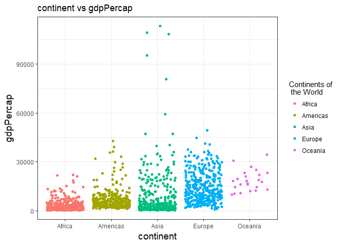

hm3
================
yanchao

Load the package:
-----------------

``` r
suppressPackageStartupMessages(library(tidyverse))
suppressPackageStartupMessages(library(gapminder))
```

Task Menu
---------

### **Get the maximum and minimum of GDP per capita for all continents.**

``` r
p1<- gapminder %>%
  group_by(continent) %>% 
  summarise(min_gdppercap=min(gdpPercap), max_gdppercap=max(gdpPercap))
knitr::kable(p1)
```

| continent |  min\_gdppercap|  max\_gdppercap|
|:----------|---------------:|---------------:|
| Africa    |        241.1659|        21951.21|
| Americas  |       1201.6372|        42951.65|
| Asia      |        331.0000|       113523.13|
| Europe    |        973.5332|        49357.19|
| Oceania   |      10039.5956|        34435.37|
| **Plot**  |                |                |

``` r
ggplot(gapminder,  aes(x = continent, y = gdpPercap))+
geom_jitter(aes(color=continent))+ 
    theme_bw() +
  theme(axis.title = element_text(size=14))+
  labs(title="continent vs gdpPercap")+ 
  scale_colour_discrete("Continents of\n the World")
```

 From the graph above, we could find the highst and smallest gdpPercap for each continent.

I want to get one graph for each continent

``` r
ggplot(gapminder, aes(year, gdpPercap)) +
    facet_wrap(~ continent) +
    geom_point()+ geom_smooth(se=FALSE,span=0.9)+
  theme_bw()+
  theme(strip.background = element_rect(fill="yellow"),
    axis.title = element_text(size=14),
    strip.text = element_text(size=14, face="bold"))+
  labs(title="For each continent")
```

    ## `geom_smooth()` using method = 'loess'

 From the graphs above, we could find that except Asia and Africa, the maximum GDP per capita for continents occur in 2007. In addition, there is a increasing trend for Oceania.

``` r
p2<-gapminder %>%
  group_by(continent) %>%
  mutate(max_gdpPercap = (max(gdpPercap))==gdpPercap) %>% 
  mutate(min_gapPercap = (min(gdpPercap)==gdpPercap))

ggplot(p2,aes(x=year,y=gdpPercap))+
  facet_wrap(~continent, scales="free_y")+
  geom_point(aes(color=max_gdpPercap, size= min_gapPercap, shape=min_gapPercap),alpha=0.5)  +
  theme_bw()+
  theme(strip.background = element_rect(fill="green"),
    axis.title = element_text(size=14),
    strip.text = element_text(size=14, face="bold"))+
  labs(title="For each continent")
```

    ## Warning: Using size for a discrete variable is not advised.


