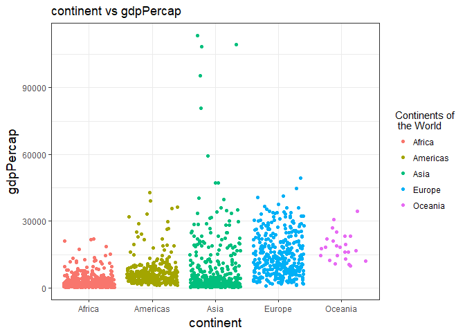

hm3
================
yanchao

Load the package:
-----------------

``` r
suppressPackageStartupMessages(library(tidyverse))
suppressPackageStartupMessages(library(gapminder))
```

Task Menu
---------

### **Task 1: Get the maximum and minimum of GDP per capita for all continents.**

``` r
p1<- gapminder %>%
  group_by(continent) %>% 
  summarise(min_gdppercap=min(gdpPercap), max_gdppercap=max(gdpPercap))
knitr::kable(p1)
```

| continent |  min\_gdppercap|  max\_gdppercap|
|:----------|---------------:|---------------:|
| Africa    |        241.1659|        21951.21|
| Americas  |       1201.6372|        42951.65|
| Asia      |        331.0000|       113523.13|
| Europe    |        973.5332|        49357.19|
| Oceania   |      10039.5956|        34435.37|

**Plot**

``` r
ggplot(gapminder,  aes(x = continent, y = gdpPercap))+
geom_jitter(aes(color=continent))+ 
    theme_bw() +
  theme(axis.title = element_text(size=14))+
  labs(title="continent vs gdpPercap")+ 
  scale_colour_discrete("Continents of\n the World")
```



We could find the highst gdpPercap for each continent. However the lowest gdpPercap is hard to find in the graph above.

I want to get graph for each continent

``` r
ggplot(gapminder, aes(year, gdpPercap)) +
    facet_wrap(~ continent) +
    geom_point()+ geom_smooth(se=FALSE,span=0.9)+
  theme_bw()+
  theme(strip.background = element_rect(fill="yellow"),
    axis.title = element_text(size=14),
    strip.text = element_text(size=14, face="bold"))+
  labs(title="For each continent")
```

    ## `geom_smooth()` using method = 'loess'


From the graphs above, we could find that the maximum GDP per capita for all continents occur in 2007, except Asia and Africa. In addition, there is an increasing trend for GDP per capita of Oceania.

``` r
p2<-gapminder %>%
  group_by(continent) %>%
  mutate(max_gdpPercap = (max(gdpPercap))==gdpPercap) %>% 
  mutate(min_gapPercap = (min(gdpPercap)==gdpPercap))

ggplot(p2,aes(x=year,y=gdpPercap))+
  facet_wrap(~continent, scales="free_y")+
  geom_point(aes(color=max_gdpPercap, size= min_gapPercap, shape=min_gapPercap),alpha=0.5)  +
  theme_bw()+
  theme(strip.background = element_rect(fill="green"),
    axis.title = element_text(size=14),
    strip.text = element_text(size=14, face="bold"))+
  labs(title="For each continent")
```

    ## Warning: Using size for a discrete variable is not advised.


From graph above, it shows that "blue" point is the maximum GDP per capita for each continent, and triangle is the minimum GDP per capita for each continent.

### **Task2: Look at the spread of GDP per capita within the continents.**

``` r
p3<- gapminder %>% 
  group_by(continent) %>%
    summarise(sd_gdppercap = sd(gdpPercap), IQR_gdppercap = IQR(gdpPercap))
knitr::kable(p3)
```

| continent |  sd\_gdppercap|  IQR\_gdppercap|
|:----------|--------------:|---------------:|
| Africa    |       2827.930|        1616.170|
| Americas  |       6396.764|        4402.431|
| Asia      |      14045.373|        7492.262|
| Europe    |       9355.213|       13248.301|
| Oceania   |       6358.983|        8072.258|

The standard deviation of Asia is the biggest, and Europe IQR is the largest. On the other hand, Afica has the smallest standard deviation and IQR.

**Plot**

``` r
gapminder %>%
  select(gdpPercap, continent) %>% 
  ggplot(aes(x=continent, y=gdpPercap)) + 
              geom_point(alpha=0.1) + 
              geom_boxplot(outlier.colour = "red") +
              labs(title="Compared GDP per capitla for different continents")+
             theme(axis.title = element_text(size=14))
```


We can see from the boxplots giving us the same reslut as to the previous piping. Moreover, Ggplot gives us a easy way to find the outliers.

### **Task3: How is life expectancy changing over time on different continents?**

``` r
p4<- gapminder %>% 
  group_by(continent, year) %>% 
  summarise(mean_lifeExp=mean(lifeExp)) %>% 
  mutate(Change_lifeExp = c(0, diff(mean_lifeExp)))
knitr::kable(p4)
```

| continent |  year|  mean\_lifeExp|  Change\_lifeExp|
|:----------|-----:|--------------:|----------------:|
| Africa    |  1952|       39.13550|        0.0000000|
| Africa    |  1957|       41.26635|        2.1308462|
| Africa    |  1962|       43.31944|        2.0530962|
| Africa    |  1967|       45.33454|        2.0150962|
| Africa    |  1972|       47.45094|        2.1164038|
| Africa    |  1977|       49.58042|        2.1294808|
| Africa    |  1982|       51.59287|        2.0124423|
| Africa    |  1987|       53.34479|        1.7519231|
| Africa    |  1992|       53.62958|        0.2847885|
| Africa    |  1997|       53.59827|       -0.0313077|
| Africa    |  2002|       53.32523|       -0.2730385|
| Africa    |  2007|       54.80604|        1.4808077|
| Americas  |  1952|       53.27984|        0.0000000|
| Americas  |  1957|       55.96028|        2.6804400|
| Americas  |  1962|       58.39876|        2.4384800|
| Americas  |  1967|       60.41092|        2.0121600|
| Americas  |  1972|       62.39492|        1.9840000|
| Americas  |  1977|       64.39156|        1.9966400|
| Americas  |  1982|       66.22884|        1.8372800|
| Americas  |  1987|       68.09072|        1.8618800|
| Americas  |  1992|       69.56836|        1.4776400|
| Americas  |  1997|       71.15048|        1.5821200|
| Americas  |  2002|       72.42204|        1.2715600|
| Americas  |  2007|       73.60812|        1.1860800|
| Asia      |  1952|       46.31439|        0.0000000|
| Asia      |  1957|       49.31854|        3.0041503|
| Asia      |  1962|       51.56322|        2.2446788|
| Asia      |  1967|       54.66364|        3.1004170|
| Asia      |  1972|       57.31927|        2.6556291|
| Asia      |  1977|       59.61056|        2.2912873|
| Asia      |  1982|       62.61794|        3.0073830|
| Asia      |  1987|       64.85118|        2.2332424|
| Asia      |  1992|       66.53721|        1.6860303|
| Asia      |  1997|       68.02052|        1.4833030|
| Asia      |  2002|       69.23388|        1.2133636|
| Asia      |  2007|       70.72848|        1.4946061|
| Europe    |  1952|       64.40850|        0.0000000|
| Europe    |  1957|       66.70307|        2.2945667|
| Europe    |  1962|       68.53923|        1.8361667|
| Europe    |  1967|       69.73760|        1.1983667|
| Europe    |  1972|       70.77503|        1.0374333|
| Europe    |  1977|       71.93777|        1.1627333|
| Europe    |  1982|       72.80640|        0.8686333|
| Europe    |  1987|       73.64217|        0.8357667|
| Europe    |  1992|       74.44010|        0.7979333|
| Europe    |  1997|       75.50517|        1.0650667|
| Europe    |  2002|       76.70060|        1.1954333|
| Europe    |  2007|       77.64860|        0.9480000|
| Oceania   |  1952|       69.25500|        0.0000000|
| Oceania   |  1957|       70.29500|        1.0400000|
| Oceania   |  1962|       71.08500|        0.7900000|
| Oceania   |  1967|       71.31000|        0.2250000|
| Oceania   |  1972|       71.91000|        0.6000000|
| Oceania   |  1977|       72.85500|        0.9450000|
| Oceania   |  1982|       74.29000|        1.4350000|
| Oceania   |  1987|       75.32000|        1.0300000|
| Oceania   |  1992|       76.94500|        1.6250000|
| Oceania   |  1997|       78.19000|        1.2450000|
| Oceania   |  2002|       79.74000|        1.5500000|
| Oceania   |  2007|       80.71950|        0.9795000|

Firstly, I calculate the mean of the lifeExp for certain years of different continents, then I take their difference to represent how is life expectancy changing over time on different continents.

**Plot**

``` r
ggplot(gapminder, aes(x=year, y=lifeExp,color=continent))+
  geom_point(alpha=0.3) + 
  geom_smooth(method="lm", se= FALSE)+
  theme_bw() +
  labs(title=" LifeExp vs Year")+
    theme(axis.title = element_text(size=14))+
    scale_colour_discrete("Continents of\n the World")
```


In general, lifeExp for different continents was increasing from 1950 to 2007. Asia life expectancy rise sharply and Africa life expectancy rise smoothly.

``` r
ggplot(gapminder, aes(x=year, y=lifeExp,color = continent)) +
  geom_jitter(alpha = 1/3, size = 3) +
  facet_wrap(~ continent) +
  geom_smooth(method="lm", span =0.1, color= "red")+
  theme_bw() +
   theme(strip.background = element_rect(fill="orange"),
          axis.title = element_text(size=12),
          strip.text = element_text(size=12, face="bold"))
```


### **Task4: Compute a weighted mean, weighting by population of life expectancy for different years**

``` r
p5<- gapminder %>% 
  group_by(year) %>% 
  summarize(life_mean= mean(lifeExp), weight_mean=weighted.mean(lifeExp, pop))
  knitr::kable(p5)
```

|  year|  life\_mean|  weight\_mean|
|-----:|-----------:|-------------:|
|  1952|    49.05762|      48.94424|
|  1957|    51.50740|      52.12189|
|  1962|    53.60925|      52.32438|
|  1967|    55.67829|      56.98431|
|  1972|    57.64739|      59.51478|
|  1977|    59.57016|      61.23726|
|  1982|    61.53320|      62.88176|
|  1987|    63.21261|      64.41635|
|  1992|    64.16034|      65.64590|
|  1997|    65.01468|      66.84934|
|  2002|    65.69492|      67.83904|
|  2007|    67.00742|      68.91909|

**Plot**

``` r
ggplot(p5, aes(year, life_mean))+
 geom_point()+
 geom_line(color= "red")+
  theme_bw() +
   theme( axis.title = element_text(size=15))
```


``` r
ggplot(p5, aes(year, weight_mean))+
 geom_point()+
 geom_line(color= "red")+
  theme_bw() +
   theme( axis.title = element_text(size=15))
```


From two graphs above, we could find the mean and weighted mean are slightly different, especially in year 1960.

### **Task5: Compared the population and life expectancy changing over time for different Asia's countries**

``` r
p6<-gapminder %>% 
  filter(continent=="Asia") %>% 
  group_by(country) %>% 
  mutate(population=pop/(10^6), Change_lifeExp = c( 0, diff(lifeExp)))
knitr::kable(p6)
```

| country            | continent |  year|   lifeExp|         pop|    gdpPercap|   population|  Change\_lifeExp|
|:-------------------|:----------|-----:|---------:|-----------:|------------:|------------:|----------------:|
| Afghanistan        | Asia      |  1952|  28.80100|     8425333|     779.4453|     8.425333|          0.00000|
| Afghanistan        | Asia      |  1957|  30.33200|     9240934|     820.8530|     9.240934|          1.53100|
| Afghanistan        | Asia      |  1962|  31.99700|    10267083|     853.1007|    10.267083|          1.66500|
| Afghanistan        | Asia      |  1967|  34.02000|    11537966|     836.1971|    11.537966|          2.02300|
| Afghanistan        | Asia      |  1972|  36.08800|    13079460|     739.9811|    13.079460|          2.06800|
| Afghanistan        | Asia      |  1977|  38.43800|    14880372|     786.1134|    14.880372|          2.35000|
| Afghanistan        | Asia      |  1982|  39.85400|    12881816|     978.0114|    12.881816|          1.41600|
| Afghanistan        | Asia      |  1987|  40.82200|    13867957|     852.3959|    13.867957|          0.96800|
| Afghanistan        | Asia      |  1992|  41.67400|    16317921|     649.3414|    16.317921|          0.85200|
| Afghanistan        | Asia      |  1997|  41.76300|    22227415|     635.3414|    22.227415|          0.08900|
| Afghanistan        | Asia      |  2002|  42.12900|    25268405|     726.7341|    25.268405|          0.36600|
| Afghanistan        | Asia      |  2007|  43.82800|    31889923|     974.5803|    31.889923|          1.69900|
| Bahrain            | Asia      |  1952|  50.93900|      120447|    9867.0848|     0.120447|          0.00000|
| Bahrain            | Asia      |  1957|  53.83200|      138655|   11635.7995|     0.138655|          2.89300|
| Bahrain            | Asia      |  1962|  56.92300|      171863|   12753.2751|     0.171863|          3.09100|
| Bahrain            | Asia      |  1967|  59.92300|      202182|   14804.6727|     0.202182|          3.00000|
| Bahrain            | Asia      |  1972|  63.30000|      230800|   18268.6584|     0.230800|          3.37700|
| Bahrain            | Asia      |  1977|  65.59300|      297410|   19340.1020|     0.297410|          2.29300|
| Bahrain            | Asia      |  1982|  69.05200|      377967|   19211.1473|     0.377967|          3.45900|
| Bahrain            | Asia      |  1987|  70.75000|      454612|   18524.0241|     0.454612|          1.69800|
| Bahrain            | Asia      |  1992|  72.60100|      529491|   19035.5792|     0.529491|          1.85100|
| Bahrain            | Asia      |  1997|  73.92500|      598561|   20292.0168|     0.598561|          1.32400|
| Bahrain            | Asia      |  2002|  74.79500|      656397|   23403.5593|     0.656397|          0.87000|
| Bahrain            | Asia      |  2007|  75.63500|      708573|   29796.0483|     0.708573|          0.84000|
| Bangladesh         | Asia      |  1952|  37.48400|    46886859|     684.2442|    46.886859|          0.00000|
| Bangladesh         | Asia      |  1957|  39.34800|    51365468|     661.6375|    51.365468|          1.86400|
| Bangladesh         | Asia      |  1962|  41.21600|    56839289|     686.3416|    56.839289|          1.86800|
| Bangladesh         | Asia      |  1967|  43.45300|    62821884|     721.1861|    62.821884|          2.23700|
| Bangladesh         | Asia      |  1972|  45.25200|    70759295|     630.2336|    70.759295|          1.79900|
| Bangladesh         | Asia      |  1977|  46.92300|    80428306|     659.8772|    80.428306|          1.67100|
| Bangladesh         | Asia      |  1982|  50.00900|    93074406|     676.9819|    93.074406|          3.08600|
| Bangladesh         | Asia      |  1987|  52.81900|   103764241|     751.9794|   103.764241|          2.81000|
| Bangladesh         | Asia      |  1992|  56.01800|   113704579|     837.8102|   113.704579|          3.19900|
| Bangladesh         | Asia      |  1997|  59.41200|   123315288|     972.7700|   123.315288|          3.39400|
| Bangladesh         | Asia      |  2002|  62.01300|   135656790|    1136.3904|   135.656790|          2.60100|
| Bangladesh         | Asia      |  2007|  64.06200|   150448339|    1391.2538|   150.448339|          2.04900|
| Cambodia           | Asia      |  1952|  39.41700|     4693836|     368.4693|     4.693836|          0.00000|
| Cambodia           | Asia      |  1957|  41.36600|     5322536|     434.0383|     5.322536|          1.94900|
| Cambodia           | Asia      |  1962|  43.41500|     6083619|     496.9136|     6.083619|          2.04900|
| Cambodia           | Asia      |  1967|  45.41500|     6960067|     523.4323|     6.960067|          2.00000|
| Cambodia           | Asia      |  1972|  40.31700|     7450606|     421.6240|     7.450606|         -5.09800|
| Cambodia           | Asia      |  1977|  31.22000|     6978607|     524.9722|     6.978607|         -9.09700|
| Cambodia           | Asia      |  1982|  50.95700|     7272485|     624.4755|     7.272485|         19.73700|
| Cambodia           | Asia      |  1987|  53.91400|     8371791|     683.8956|     8.371791|          2.95700|
| Cambodia           | Asia      |  1992|  55.80300|    10150094|     682.3032|    10.150094|          1.88900|
| Cambodia           | Asia      |  1997|  56.53400|    11782962|     734.2852|    11.782962|          0.73100|
| Cambodia           | Asia      |  2002|  56.75200|    12926707|     896.2260|    12.926707|          0.21800|
| Cambodia           | Asia      |  2007|  59.72300|    14131858|    1713.7787|    14.131858|          2.97100|
| China              | Asia      |  1952|  44.00000|   556263527|     400.4486|   556.263527|          0.00000|
| China              | Asia      |  1957|  50.54896|   637408000|     575.9870|   637.408000|          6.54896|
| China              | Asia      |  1962|  44.50136|   665770000|     487.6740|   665.770000|         -6.04760|
| China              | Asia      |  1967|  58.38112|   754550000|     612.7057|   754.550000|         13.87976|
| China              | Asia      |  1972|  63.11888|   862030000|     676.9001|   862.030000|          4.73776|
| China              | Asia      |  1977|  63.96736|   943455000|     741.2375|   943.455000|          0.84848|
| China              | Asia      |  1982|  65.52500|  1000281000|     962.4214|  1000.281000|          1.55764|
| China              | Asia      |  1987|  67.27400|  1084035000|    1378.9040|  1084.035000|          1.74900|
| China              | Asia      |  1992|  68.69000|  1164970000|    1655.7842|  1164.970000|          1.41600|
| China              | Asia      |  1997|  70.42600|  1230075000|    2289.2341|  1230.075000|          1.73600|
| China              | Asia      |  2002|  72.02800|  1280400000|    3119.2809|  1280.400000|          1.60200|
| China              | Asia      |  2007|  72.96100|  1318683096|    4959.1149|  1318.683096|          0.93300|
| Hong Kong, China   | Asia      |  1952|  60.96000|     2125900|    3054.4212|     2.125900|          0.00000|
| Hong Kong, China   | Asia      |  1957|  64.75000|     2736300|    3629.0765|     2.736300|          3.79000|
| Hong Kong, China   | Asia      |  1962|  67.65000|     3305200|    4692.6483|     3.305200|          2.90000|
| Hong Kong, China   | Asia      |  1967|  70.00000|     3722800|    6197.9628|     3.722800|          2.35000|
| Hong Kong, China   | Asia      |  1972|  72.00000|     4115700|    8315.9281|     4.115700|          2.00000|
| Hong Kong, China   | Asia      |  1977|  73.60000|     4583700|   11186.1413|     4.583700|          1.60000|
| Hong Kong, China   | Asia      |  1982|  75.45000|     5264500|   14560.5305|     5.264500|          1.85000|
| Hong Kong, China   | Asia      |  1987|  76.20000|     5584510|   20038.4727|     5.584510|          0.75000|
| Hong Kong, China   | Asia      |  1992|  77.60100|     5829696|   24757.6030|     5.829696|          1.40100|
| Hong Kong, China   | Asia      |  1997|  80.00000|     6495918|   28377.6322|     6.495918|          2.39900|
| Hong Kong, China   | Asia      |  2002|  81.49500|     6762476|   30209.0152|     6.762476|          1.49500|
| Hong Kong, China   | Asia      |  2007|  82.20800|     6980412|   39724.9787|     6.980412|          0.71300|
| India              | Asia      |  1952|  37.37300|   372000000|     546.5657|   372.000000|          0.00000|
| India              | Asia      |  1957|  40.24900|   409000000|     590.0620|   409.000000|          2.87600|
| India              | Asia      |  1962|  43.60500|   454000000|     658.3472|   454.000000|          3.35600|
| India              | Asia      |  1967|  47.19300|   506000000|     700.7706|   506.000000|          3.58800|
| India              | Asia      |  1972|  50.65100|   567000000|     724.0325|   567.000000|          3.45800|
| India              | Asia      |  1977|  54.20800|   634000000|     813.3373|   634.000000|          3.55700|
| India              | Asia      |  1982|  56.59600|   708000000|     855.7235|   708.000000|          2.38800|
| India              | Asia      |  1987|  58.55300|   788000000|     976.5127|   788.000000|          1.95700|
| India              | Asia      |  1992|  60.22300|   872000000|    1164.4068|   872.000000|          1.67000|
| India              | Asia      |  1997|  61.76500|   959000000|    1458.8174|   959.000000|          1.54200|
| India              | Asia      |  2002|  62.87900|  1034172547|    1746.7695|  1034.172547|          1.11400|
| India              | Asia      |  2007|  64.69800|  1110396331|    2452.2104|  1110.396331|          1.81900|
| Indonesia          | Asia      |  1952|  37.46800|    82052000|     749.6817|    82.052000|          0.00000|
| Indonesia          | Asia      |  1957|  39.91800|    90124000|     858.9003|    90.124000|          2.45000|
| Indonesia          | Asia      |  1962|  42.51800|    99028000|     849.2898|    99.028000|          2.60000|
| Indonesia          | Asia      |  1967|  45.96400|   109343000|     762.4318|   109.343000|          3.44600|
| Indonesia          | Asia      |  1972|  49.20300|   121282000|    1111.1079|   121.282000|          3.23900|
| Indonesia          | Asia      |  1977|  52.70200|   136725000|    1382.7021|   136.725000|          3.49900|
| Indonesia          | Asia      |  1982|  56.15900|   153343000|    1516.8730|   153.343000|          3.45700|
| Indonesia          | Asia      |  1987|  60.13700|   169276000|    1748.3570|   169.276000|          3.97800|
| Indonesia          | Asia      |  1992|  62.68100|   184816000|    2383.1409|   184.816000|          2.54400|
| Indonesia          | Asia      |  1997|  66.04100|   199278000|    3119.3356|   199.278000|          3.36000|
| Indonesia          | Asia      |  2002|  68.58800|   211060000|    2873.9129|   211.060000|          2.54700|
| Indonesia          | Asia      |  2007|  70.65000|   223547000|    3540.6516|   223.547000|          2.06200|
| Iran               | Asia      |  1952|  44.86900|    17272000|    3035.3260|    17.272000|          0.00000|
| Iran               | Asia      |  1957|  47.18100|    19792000|    3290.2576|    19.792000|          2.31200|
| Iran               | Asia      |  1962|  49.32500|    22874000|    4187.3298|    22.874000|          2.14400|
| Iran               | Asia      |  1967|  52.46900|    26538000|    5906.7318|    26.538000|          3.14400|
| Iran               | Asia      |  1972|  55.23400|    30614000|    9613.8186|    30.614000|          2.76500|
| Iran               | Asia      |  1977|  57.70200|    35480679|   11888.5951|    35.480679|          2.46800|
| Iran               | Asia      |  1982|  59.62000|    43072751|    7608.3346|    43.072751|          1.91800|
| Iran               | Asia      |  1987|  63.04000|    51889696|    6642.8814|    51.889696|          3.42000|
| Iran               | Asia      |  1992|  65.74200|    60397973|    7235.6532|    60.397973|          2.70200|
| Iran               | Asia      |  1997|  68.04200|    63327987|    8263.5903|    63.327987|          2.30000|
| Iran               | Asia      |  2002|  69.45100|    66907826|    9240.7620|    66.907826|          1.40900|
| Iran               | Asia      |  2007|  70.96400|    69453570|   11605.7145|    69.453570|          1.51300|
| Iraq               | Asia      |  1952|  45.32000|     5441766|    4129.7661|     5.441766|          0.00000|
| Iraq               | Asia      |  1957|  48.43700|     6248643|    6229.3336|     6.248643|          3.11700|
| Iraq               | Asia      |  1962|  51.45700|     7240260|    8341.7378|     7.240260|          3.02000|
| Iraq               | Asia      |  1967|  54.45900|     8519282|    8931.4598|     8.519282|          3.00200|
| Iraq               | Asia      |  1972|  56.95000|    10061506|    9576.0376|    10.061506|          2.49100|
| Iraq               | Asia      |  1977|  60.41300|    11882916|   14688.2351|    11.882916|          3.46300|
| Iraq               | Asia      |  1982|  62.03800|    14173318|   14517.9071|    14.173318|          1.62500|
| Iraq               | Asia      |  1987|  65.04400|    16543189|   11643.5727|    16.543189|          3.00600|
| Iraq               | Asia      |  1992|  59.46100|    17861905|    3745.6407|    17.861905|         -5.58300|
| Iraq               | Asia      |  1997|  58.81100|    20775703|    3076.2398|    20.775703|         -0.65000|
| Iraq               | Asia      |  2002|  57.04600|    24001816|    4390.7173|    24.001816|         -1.76500|
| Iraq               | Asia      |  2007|  59.54500|    27499638|    4471.0619|    27.499638|          2.49900|
| Israel             | Asia      |  1952|  65.39000|     1620914|    4086.5221|     1.620914|          0.00000|
| Israel             | Asia      |  1957|  67.84000|     1944401|    5385.2785|     1.944401|          2.45000|
| Israel             | Asia      |  1962|  69.39000|     2310904|    7105.6307|     2.310904|          1.55000|
| Israel             | Asia      |  1967|  70.75000|     2693585|    8393.7414|     2.693585|          1.36000|
| Israel             | Asia      |  1972|  71.63000|     3095893|   12786.9322|     3.095893|          0.88000|
| Israel             | Asia      |  1977|  73.06000|     3495918|   13306.6192|     3.495918|          1.43000|
| Israel             | Asia      |  1982|  74.45000|     3858421|   15367.0292|     3.858421|          1.39000|
| Israel             | Asia      |  1987|  75.60000|     4203148|   17122.4799|     4.203148|          1.15000|
| Israel             | Asia      |  1992|  76.93000|     4936550|   18051.5225|     4.936550|          1.33000|
| Israel             | Asia      |  1997|  78.26900|     5531387|   20896.6092|     5.531387|          1.33900|
| Israel             | Asia      |  2002|  79.69600|     6029529|   21905.5951|     6.029529|          1.42700|
| Israel             | Asia      |  2007|  80.74500|     6426679|   25523.2771|     6.426679|          1.04900|
| Japan              | Asia      |  1952|  63.03000|    86459025|    3216.9563|    86.459025|          0.00000|
| Japan              | Asia      |  1957|  65.50000|    91563009|    4317.6944|    91.563009|          2.47000|
| Japan              | Asia      |  1962|  68.73000|    95831757|    6576.6495|    95.831757|          3.23000|
| Japan              | Asia      |  1967|  71.43000|   100825279|    9847.7886|   100.825279|          2.70000|
| Japan              | Asia      |  1972|  73.42000|   107188273|   14778.7864|   107.188273|          1.99000|
| Japan              | Asia      |  1977|  75.38000|   113872473|   16610.3770|   113.872473|          1.96000|
| Japan              | Asia      |  1982|  77.11000|   118454974|   19384.1057|   118.454974|          1.73000|
| Japan              | Asia      |  1987|  78.67000|   122091325|   22375.9419|   122.091325|          1.56000|
| Japan              | Asia      |  1992|  79.36000|   124329269|   26824.8951|   124.329269|          0.69000|
| Japan              | Asia      |  1997|  80.69000|   125956499|   28816.5850|   125.956499|          1.33000|
| Japan              | Asia      |  2002|  82.00000|   127065841|   28604.5919|   127.065841|          1.31000|
| Japan              | Asia      |  2007|  82.60300|   127467972|   31656.0681|   127.467972|          0.60300|
| Jordan             | Asia      |  1952|  43.15800|      607914|    1546.9078|     0.607914|          0.00000|
| Jordan             | Asia      |  1957|  45.66900|      746559|    1886.0806|     0.746559|          2.51100|
| Jordan             | Asia      |  1962|  48.12600|      933559|    2348.0092|     0.933559|          2.45700|
| Jordan             | Asia      |  1967|  51.62900|     1255058|    2741.7963|     1.255058|          3.50300|
| Jordan             | Asia      |  1972|  56.52800|     1613551|    2110.8563|     1.613551|          4.89900|
| Jordan             | Asia      |  1977|  61.13400|     1937652|    2852.3516|     1.937652|          4.60600|
| Jordan             | Asia      |  1982|  63.73900|     2347031|    4161.4160|     2.347031|          2.60500|
| Jordan             | Asia      |  1987|  65.86900|     2820042|    4448.6799|     2.820042|          2.13000|
| Jordan             | Asia      |  1992|  68.01500|     3867409|    3431.5936|     3.867409|          2.14600|
| Jordan             | Asia      |  1997|  69.77200|     4526235|    3645.3796|     4.526235|          1.75700|
| Jordan             | Asia      |  2002|  71.26300|     5307470|    3844.9172|     5.307470|          1.49100|
| Jordan             | Asia      |  2007|  72.53500|     6053193|    4519.4612|     6.053193|          1.27200|
| Korea, Dem. Rep.   | Asia      |  1952|  50.05600|     8865488|    1088.2778|     8.865488|          0.00000|
| Korea, Dem. Rep.   | Asia      |  1957|  54.08100|     9411381|    1571.1347|     9.411381|          4.02500|
| Korea, Dem. Rep.   | Asia      |  1962|  56.65600|    10917494|    1621.6936|    10.917494|          2.57500|
| Korea, Dem. Rep.   | Asia      |  1967|  59.94200|    12617009|    2143.5406|    12.617009|          3.28600|
| Korea, Dem. Rep.   | Asia      |  1972|  63.98300|    14781241|    3701.6215|    14.781241|          4.04100|
| Korea, Dem. Rep.   | Asia      |  1977|  67.15900|    16325320|    4106.3012|    16.325320|          3.17600|
| Korea, Dem. Rep.   | Asia      |  1982|  69.10000|    17647518|    4106.5253|    17.647518|          1.94100|
| Korea, Dem. Rep.   | Asia      |  1987|  70.64700|    19067554|    4106.4923|    19.067554|          1.54700|
| Korea, Dem. Rep.   | Asia      |  1992|  69.97800|    20711375|    3726.0635|    20.711375|         -0.66900|
| Korea, Dem. Rep.   | Asia      |  1997|  67.72700|    21585105|    1690.7568|    21.585105|         -2.25100|
| Korea, Dem. Rep.   | Asia      |  2002|  66.66200|    22215365|    1646.7582|    22.215365|         -1.06500|
| Korea, Dem. Rep.   | Asia      |  2007|  67.29700|    23301725|    1593.0655|    23.301725|          0.63500|
| Korea, Rep.        | Asia      |  1952|  47.45300|    20947571|    1030.5922|    20.947571|          0.00000|
| Korea, Rep.        | Asia      |  1957|  52.68100|    22611552|    1487.5935|    22.611552|          5.22800|
| Korea, Rep.        | Asia      |  1962|  55.29200|    26420307|    1536.3444|    26.420307|          2.61100|
| Korea, Rep.        | Asia      |  1967|  57.71600|    30131000|    2029.2281|    30.131000|          2.42400|
| Korea, Rep.        | Asia      |  1972|  62.61200|    33505000|    3030.8767|    33.505000|          4.89600|
| Korea, Rep.        | Asia      |  1977|  64.76600|    36436000|    4657.2210|    36.436000|          2.15400|
| Korea, Rep.        | Asia      |  1982|  67.12300|    39326000|    5622.9425|    39.326000|          2.35700|
| Korea, Rep.        | Asia      |  1987|  69.81000|    41622000|    8533.0888|    41.622000|          2.68700|
| Korea, Rep.        | Asia      |  1992|  72.24400|    43805450|   12104.2787|    43.805450|          2.43400|
| Korea, Rep.        | Asia      |  1997|  74.64700|    46173816|   15993.5280|    46.173816|          2.40300|
| Korea, Rep.        | Asia      |  2002|  77.04500|    47969150|   19233.9882|    47.969150|          2.39800|
| Korea, Rep.        | Asia      |  2007|  78.62300|    49044790|   23348.1397|    49.044790|          1.57800|
| Kuwait             | Asia      |  1952|  55.56500|      160000|  108382.3529|     0.160000|          0.00000|
| Kuwait             | Asia      |  1957|  58.03300|      212846|  113523.1329|     0.212846|          2.46800|
| Kuwait             | Asia      |  1962|  60.47000|      358266|   95458.1118|     0.358266|          2.43700|
| Kuwait             | Asia      |  1967|  64.62400|      575003|   80894.8833|     0.575003|          4.15400|
| Kuwait             | Asia      |  1972|  67.71200|      841934|  109347.8670|     0.841934|          3.08800|
| Kuwait             | Asia      |  1977|  69.34300|     1140357|   59265.4771|     1.140357|          1.63100|
| Kuwait             | Asia      |  1982|  71.30900|     1497494|   31354.0357|     1.497494|          1.96600|
| Kuwait             | Asia      |  1987|  74.17400|     1891487|   28118.4300|     1.891487|          2.86500|
| Kuwait             | Asia      |  1992|  75.19000|     1418095|   34932.9196|     1.418095|          1.01600|
| Kuwait             | Asia      |  1997|  76.15600|     1765345|   40300.6200|     1.765345|          0.96600|
| Kuwait             | Asia      |  2002|  76.90400|     2111561|   35110.1057|     2.111561|          0.74800|
| Kuwait             | Asia      |  2007|  77.58800|     2505559|   47306.9898|     2.505559|          0.68400|
| Lebanon            | Asia      |  1952|  55.92800|     1439529|    4834.8041|     1.439529|          0.00000|
| Lebanon            | Asia      |  1957|  59.48900|     1647412|    6089.7869|     1.647412|          3.56100|
| Lebanon            | Asia      |  1962|  62.09400|     1886848|    5714.5606|     1.886848|          2.60500|
| Lebanon            | Asia      |  1967|  63.87000|     2186894|    6006.9830|     2.186894|          1.77600|
| Lebanon            | Asia      |  1972|  65.42100|     2680018|    7486.3843|     2.680018|          1.55100|
| Lebanon            | Asia      |  1977|  66.09900|     3115787|    8659.6968|     3.115787|          0.67800|
| Lebanon            | Asia      |  1982|  66.98300|     3086876|    7640.5195|     3.086876|          0.88400|
| Lebanon            | Asia      |  1987|  67.92600|     3089353|    5377.0913|     3.089353|          0.94300|
| Lebanon            | Asia      |  1992|  69.29200|     3219994|    6890.8069|     3.219994|          1.36600|
| Lebanon            | Asia      |  1997|  70.26500|     3430388|    8754.9639|     3.430388|          0.97300|
| Lebanon            | Asia      |  2002|  71.02800|     3677780|    9313.9388|     3.677780|          0.76300|
| Lebanon            | Asia      |  2007|  71.99300|     3921278|   10461.0587|     3.921278|          0.96500|
| Malaysia           | Asia      |  1952|  48.46300|     6748378|    1831.1329|     6.748378|          0.00000|
| Malaysia           | Asia      |  1957|  52.10200|     7739235|    1810.0670|     7.739235|          3.63900|
| Malaysia           | Asia      |  1962|  55.73700|     8906385|    2036.8849|     8.906385|          3.63500|
| Malaysia           | Asia      |  1967|  59.37100|    10154878|    2277.7424|    10.154878|          3.63400|
| Malaysia           | Asia      |  1972|  63.01000|    11441462|    2849.0948|    11.441462|          3.63900|
| Malaysia           | Asia      |  1977|  65.25600|    12845381|    3827.9216|    12.845381|          2.24600|
| Malaysia           | Asia      |  1982|  68.00000|    14441916|    4920.3560|    14.441916|          2.74400|
| Malaysia           | Asia      |  1987|  69.50000|    16331785|    5249.8027|    16.331785|          1.50000|
| Malaysia           | Asia      |  1992|  70.69300|    18319502|    7277.9128|    18.319502|          1.19300|
| Malaysia           | Asia      |  1997|  71.93800|    20476091|   10132.9096|    20.476091|          1.24500|
| Malaysia           | Asia      |  2002|  73.04400|    22662365|   10206.9779|    22.662365|          1.10600|
| Malaysia           | Asia      |  2007|  74.24100|    24821286|   12451.6558|    24.821286|          1.19700|
| Mongolia           | Asia      |  1952|  42.24400|      800663|     786.5669|     0.800663|          0.00000|
| Mongolia           | Asia      |  1957|  45.24800|      882134|     912.6626|     0.882134|          3.00400|
| Mongolia           | Asia      |  1962|  48.25100|     1010280|    1056.3540|     1.010280|          3.00300|
| Mongolia           | Asia      |  1967|  51.25300|     1149500|    1226.0411|     1.149500|          3.00200|
| Mongolia           | Asia      |  1972|  53.75400|     1320500|    1421.7420|     1.320500|          2.50100|
| Mongolia           | Asia      |  1977|  55.49100|     1528000|    1647.5117|     1.528000|          1.73700|
| Mongolia           | Asia      |  1982|  57.48900|     1756032|    2000.6031|     1.756032|          1.99800|
| Mongolia           | Asia      |  1987|  60.22200|     2015133|    2338.0083|     2.015133|          2.73300|
| Mongolia           | Asia      |  1992|  61.27100|     2312802|    1785.4020|     2.312802|          1.04900|
| Mongolia           | Asia      |  1997|  63.62500|     2494803|    1902.2521|     2.494803|          2.35400|
| Mongolia           | Asia      |  2002|  65.03300|     2674234|    2140.7393|     2.674234|          1.40800|
| Mongolia           | Asia      |  2007|  66.80300|     2874127|    3095.7723|     2.874127|          1.77000|
| Myanmar            | Asia      |  1952|  36.31900|    20092996|     331.0000|    20.092996|          0.00000|
| Myanmar            | Asia      |  1957|  41.90500|    21731844|     350.0000|    21.731844|          5.58600|
| Myanmar            | Asia      |  1962|  45.10800|    23634436|     388.0000|    23.634436|          3.20300|
| Myanmar            | Asia      |  1967|  49.37900|    25870271|     349.0000|    25.870271|          4.27100|
| Myanmar            | Asia      |  1972|  53.07000|    28466390|     357.0000|    28.466390|          3.69100|
| Myanmar            | Asia      |  1977|  56.05900|    31528087|     371.0000|    31.528087|          2.98900|
| Myanmar            | Asia      |  1982|  58.05600|    34680442|     424.0000|    34.680442|          1.99700|
| Myanmar            | Asia      |  1987|  58.33900|    38028578|     385.0000|    38.028578|          0.28300|
| Myanmar            | Asia      |  1992|  59.32000|    40546538|     347.0000|    40.546538|          0.98100|
| Myanmar            | Asia      |  1997|  60.32800|    43247867|     415.0000|    43.247867|          1.00800|
| Myanmar            | Asia      |  2002|  59.90800|    45598081|     611.0000|    45.598081|         -0.42000|
| Myanmar            | Asia      |  2007|  62.06900|    47761980|     944.0000|    47.761980|          2.16100|
| Nepal              | Asia      |  1952|  36.15700|     9182536|     545.8657|     9.182536|          0.00000|
| Nepal              | Asia      |  1957|  37.68600|     9682338|     597.9364|     9.682338|          1.52900|
| Nepal              | Asia      |  1962|  39.39300|    10332057|     652.3969|    10.332057|          1.70700|
| Nepal              | Asia      |  1967|  41.47200|    11261690|     676.4422|    11.261690|          2.07900|
| Nepal              | Asia      |  1972|  43.97100|    12412593|     674.7881|    12.412593|          2.49900|
| Nepal              | Asia      |  1977|  46.74800|    13933198|     694.1124|    13.933198|          2.77700|
| Nepal              | Asia      |  1982|  49.59400|    15796314|     718.3731|    15.796314|          2.84600|
| Nepal              | Asia      |  1987|  52.53700|    17917180|     775.6325|    17.917180|          2.94300|
| Nepal              | Asia      |  1992|  55.72700|    20326209|     897.7404|    20.326209|          3.19000|
| Nepal              | Asia      |  1997|  59.42600|    23001113|    1010.8921|    23.001113|          3.69900|
| Nepal              | Asia      |  2002|  61.34000|    25873917|    1057.2063|    25.873917|          1.91400|
| Nepal              | Asia      |  2007|  63.78500|    28901790|    1091.3598|    28.901790|          2.44500|
| Oman               | Asia      |  1952|  37.57800|      507833|    1828.2303|     0.507833|          0.00000|
| Oman               | Asia      |  1957|  40.08000|      561977|    2242.7466|     0.561977|          2.50200|
| Oman               | Asia      |  1962|  43.16500|      628164|    2924.6381|     0.628164|          3.08500|
| Oman               | Asia      |  1967|  46.98800|      714775|    4720.9427|     0.714775|          3.82300|
| Oman               | Asia      |  1972|  52.14300|      829050|   10618.0385|     0.829050|          5.15500|
| Oman               | Asia      |  1977|  57.36700|     1004533|   11848.3439|     1.004533|          5.22400|
| Oman               | Asia      |  1982|  62.72800|     1301048|   12954.7910|     1.301048|          5.36100|
| Oman               | Asia      |  1987|  67.73400|     1593882|   18115.2231|     1.593882|          5.00600|
| Oman               | Asia      |  1992|  71.19700|     1915208|   18616.7069|     1.915208|          3.46300|
| Oman               | Asia      |  1997|  72.49900|     2283635|   19702.0558|     2.283635|          1.30200|
| Oman               | Asia      |  2002|  74.19300|     2713462|   19774.8369|     2.713462|          1.69400|
| Oman               | Asia      |  2007|  75.64000|     3204897|   22316.1929|     3.204897|          1.44700|
| Pakistan           | Asia      |  1952|  43.43600|    41346560|     684.5971|    41.346560|          0.00000|
| Pakistan           | Asia      |  1957|  45.55700|    46679944|     747.0835|    46.679944|          2.12100|
| Pakistan           | Asia      |  1962|  47.67000|    53100671|     803.3427|    53.100671|          2.11300|
| Pakistan           | Asia      |  1967|  49.80000|    60641899|     942.4083|    60.641899|          2.13000|
| Pakistan           | Asia      |  1972|  51.92900|    69325921|    1049.9390|    69.325921|          2.12900|
| Pakistan           | Asia      |  1977|  54.04300|    78152686|    1175.9212|    78.152686|          2.11400|
| Pakistan           | Asia      |  1982|  56.15800|    91462088|    1443.4298|    91.462088|          2.11500|
| Pakistan           | Asia      |  1987|  58.24500|   105186881|    1704.6866|   105.186881|          2.08700|
| Pakistan           | Asia      |  1992|  60.83800|   120065004|    1971.8295|   120.065004|          2.59300|
| Pakistan           | Asia      |  1997|  61.81800|   135564834|    2049.3505|   135.564834|          0.98000|
| Pakistan           | Asia      |  2002|  63.61000|   153403524|    2092.7124|   153.403524|          1.79200|
| Pakistan           | Asia      |  2007|  65.48300|   169270617|    2605.9476|   169.270617|          1.87300|
| Philippines        | Asia      |  1952|  47.75200|    22438691|    1272.8810|    22.438691|          0.00000|
| Philippines        | Asia      |  1957|  51.33400|    26072194|    1547.9448|    26.072194|          3.58200|
| Philippines        | Asia      |  1962|  54.75700|    30325264|    1649.5522|    30.325264|          3.42300|
| Philippines        | Asia      |  1967|  56.39300|    35356600|    1814.1274|    35.356600|          1.63600|
| Philippines        | Asia      |  1972|  58.06500|    40850141|    1989.3741|    40.850141|          1.67200|
| Philippines        | Asia      |  1977|  60.06000|    46850962|    2373.2043|    46.850962|          1.99500|
| Philippines        | Asia      |  1982|  62.08200|    53456774|    2603.2738|    53.456774|          2.02200|
| Philippines        | Asia      |  1987|  64.15100|    60017788|    2189.6350|    60.017788|          2.06900|
| Philippines        | Asia      |  1992|  66.45800|    67185766|    2279.3240|    67.185766|          2.30700|
| Philippines        | Asia      |  1997|  68.56400|    75012988|    2536.5349|    75.012988|          2.10600|
| Philippines        | Asia      |  2002|  70.30300|    82995088|    2650.9211|    82.995088|          1.73900|
| Philippines        | Asia      |  2007|  71.68800|    91077287|    3190.4810|    91.077287|          1.38500|
| Saudi Arabia       | Asia      |  1952|  39.87500|     4005677|    6459.5548|     4.005677|          0.00000|
| Saudi Arabia       | Asia      |  1957|  42.86800|     4419650|    8157.5912|     4.419650|          2.99300|
| Saudi Arabia       | Asia      |  1962|  45.91400|     4943029|   11626.4197|     4.943029|          3.04600|
| Saudi Arabia       | Asia      |  1967|  49.90100|     5618198|   16903.0489|     5.618198|          3.98700|
| Saudi Arabia       | Asia      |  1972|  53.88600|     6472756|   24837.4287|     6.472756|          3.98500|
| Saudi Arabia       | Asia      |  1977|  58.69000|     8128505|   34167.7626|     8.128505|          4.80400|
| Saudi Arabia       | Asia      |  1982|  63.01200|    11254672|   33693.1753|    11.254672|          4.32200|
| Saudi Arabia       | Asia      |  1987|  66.29500|    14619745|   21198.2614|    14.619745|          3.28300|
| Saudi Arabia       | Asia      |  1992|  68.76800|    16945857|   24841.6178|    16.945857|          2.47300|
| Saudi Arabia       | Asia      |  1997|  70.53300|    21229759|   20586.6902|    21.229759|          1.76500|
| Saudi Arabia       | Asia      |  2002|  71.62600|    24501530|   19014.5412|    24.501530|          1.09300|
| Saudi Arabia       | Asia      |  2007|  72.77700|    27601038|   21654.8319|    27.601038|          1.15100|
| Singapore          | Asia      |  1952|  60.39600|     1127000|    2315.1382|     1.127000|          0.00000|
| Singapore          | Asia      |  1957|  63.17900|     1445929|    2843.1044|     1.445929|          2.78300|
| Singapore          | Asia      |  1962|  65.79800|     1750200|    3674.7356|     1.750200|          2.61900|
| Singapore          | Asia      |  1967|  67.94600|     1977600|    4977.4185|     1.977600|          2.14800|
| Singapore          | Asia      |  1972|  69.52100|     2152400|    8597.7562|     2.152400|          1.57500|
| Singapore          | Asia      |  1977|  70.79500|     2325300|   11210.0895|     2.325300|          1.27400|
| Singapore          | Asia      |  1982|  71.76000|     2651869|   15169.1611|     2.651869|          0.96500|
| Singapore          | Asia      |  1987|  73.56000|     2794552|   18861.5308|     2.794552|          1.80000|
| Singapore          | Asia      |  1992|  75.78800|     3235865|   24769.8912|     3.235865|          2.22800|
| Singapore          | Asia      |  1997|  77.15800|     3802309|   33519.4766|     3.802309|          1.37000|
| Singapore          | Asia      |  2002|  78.77000|     4197776|   36023.1054|     4.197776|          1.61200|
| Singapore          | Asia      |  2007|  79.97200|     4553009|   47143.1796|     4.553009|          1.20200|
| Sri Lanka          | Asia      |  1952|  57.59300|     7982342|    1083.5320|     7.982342|          0.00000|
| Sri Lanka          | Asia      |  1957|  61.45600|     9128546|    1072.5466|     9.128546|          3.86300|
| Sri Lanka          | Asia      |  1962|  62.19200|    10421936|    1074.4720|    10.421936|          0.73600|
| Sri Lanka          | Asia      |  1967|  64.26600|    11737396|    1135.5143|    11.737396|          2.07400|
| Sri Lanka          | Asia      |  1972|  65.04200|    13016733|    1213.3955|    13.016733|          0.77600|
| Sri Lanka          | Asia      |  1977|  65.94900|    14116836|    1348.7757|    14.116836|          0.90700|
| Sri Lanka          | Asia      |  1982|  68.75700|    15410151|    1648.0798|    15.410151|          2.80800|
| Sri Lanka          | Asia      |  1987|  69.01100|    16495304|    1876.7668|    16.495304|          0.25400|
| Sri Lanka          | Asia      |  1992|  70.37900|    17587060|    2153.7392|    17.587060|          1.36800|
| Sri Lanka          | Asia      |  1997|  70.45700|    18698655|    2664.4773|    18.698655|          0.07800|
| Sri Lanka          | Asia      |  2002|  70.81500|    19576783|    3015.3788|    19.576783|          0.35800|
| Sri Lanka          | Asia      |  2007|  72.39600|    20378239|    3970.0954|    20.378239|          1.58100|
| Syria              | Asia      |  1952|  45.88300|     3661549|    1643.4854|     3.661549|          0.00000|
| Syria              | Asia      |  1957|  48.28400|     4149908|    2117.2349|     4.149908|          2.40100|
| Syria              | Asia      |  1962|  50.30500|     4834621|    2193.0371|     4.834621|          2.02100|
| Syria              | Asia      |  1967|  53.65500|     5680812|    1881.9236|     5.680812|          3.35000|
| Syria              | Asia      |  1972|  57.29600|     6701172|    2571.4230|     6.701172|          3.64100|
| Syria              | Asia      |  1977|  61.19500|     7932503|    3195.4846|     7.932503|          3.89900|
| Syria              | Asia      |  1982|  64.59000|     9410494|    3761.8377|     9.410494|          3.39500|
| Syria              | Asia      |  1987|  66.97400|    11242847|    3116.7743|    11.242847|          2.38400|
| Syria              | Asia      |  1992|  69.24900|    13219062|    3340.5428|    13.219062|          2.27500|
| Syria              | Asia      |  1997|  71.52700|    15081016|    4014.2390|    15.081016|          2.27800|
| Syria              | Asia      |  2002|  73.05300|    17155814|    4090.9253|    17.155814|          1.52600|
| Syria              | Asia      |  2007|  74.14300|    19314747|    4184.5481|    19.314747|          1.09000|
| Taiwan             | Asia      |  1952|  58.50000|     8550362|    1206.9479|     8.550362|          0.00000|
| Taiwan             | Asia      |  1957|  62.40000|    10164215|    1507.8613|    10.164215|          3.90000|
| Taiwan             | Asia      |  1962|  65.20000|    11918938|    1822.8790|    11.918938|          2.80000|
| Taiwan             | Asia      |  1967|  67.50000|    13648692|    2643.8587|    13.648692|          2.30000|
| Taiwan             | Asia      |  1972|  69.39000|    15226039|    4062.5239|    15.226039|          1.89000|
| Taiwan             | Asia      |  1977|  70.59000|    16785196|    5596.5198|    16.785196|          1.20000|
| Taiwan             | Asia      |  1982|  72.16000|    18501390|    7426.3548|    18.501390|          1.57000|
| Taiwan             | Asia      |  1987|  73.40000|    19757799|   11054.5618|    19.757799|          1.24000|
| Taiwan             | Asia      |  1992|  74.26000|    20686918|   15215.6579|    20.686918|          0.86000|
| Taiwan             | Asia      |  1997|  75.25000|    21628605|   20206.8210|    21.628605|          0.99000|
| Taiwan             | Asia      |  2002|  76.99000|    22454239|   23235.4233|    22.454239|          1.74000|
| Taiwan             | Asia      |  2007|  78.40000|    23174294|   28718.2768|    23.174294|          1.41000|
| Thailand           | Asia      |  1952|  50.84800|    21289402|     757.7974|    21.289402|          0.00000|
| Thailand           | Asia      |  1957|  53.63000|    25041917|     793.5774|    25.041917|          2.78200|
| Thailand           | Asia      |  1962|  56.06100|    29263397|    1002.1992|    29.263397|          2.43100|
| Thailand           | Asia      |  1967|  58.28500|    34024249|    1295.4607|    34.024249|          2.22400|
| Thailand           | Asia      |  1972|  60.40500|    39276153|    1524.3589|    39.276153|          2.12000|
| Thailand           | Asia      |  1977|  62.49400|    44148285|    1961.2246|    44.148285|          2.08900|
| Thailand           | Asia      |  1982|  64.59700|    48827160|    2393.2198|    48.827160|          2.10300|
| Thailand           | Asia      |  1987|  66.08400|    52910342|    2982.6538|    52.910342|          1.48700|
| Thailand           | Asia      |  1992|  67.29800|    56667095|    4616.8965|    56.667095|          1.21400|
| Thailand           | Asia      |  1997|  67.52100|    60216677|    5852.6255|    60.216677|          0.22300|
| Thailand           | Asia      |  2002|  68.56400|    62806748|    5913.1875|    62.806748|          1.04300|
| Thailand           | Asia      |  2007|  70.61600|    65068149|    7458.3963|    65.068149|          2.05200|
| Vietnam            | Asia      |  1952|  40.41200|    26246839|     605.0665|    26.246839|          0.00000|
| Vietnam            | Asia      |  1957|  42.88700|    28998543|     676.2854|    28.998543|          2.47500|
| Vietnam            | Asia      |  1962|  45.36300|    33796140|     772.0492|    33.796140|          2.47600|
| Vietnam            | Asia      |  1967|  47.83800|    39463910|     637.1233|    39.463910|          2.47500|
| Vietnam            | Asia      |  1972|  50.25400|    44655014|     699.5016|    44.655014|          2.41600|
| Vietnam            | Asia      |  1977|  55.76400|    50533506|     713.5371|    50.533506|          5.51000|
| Vietnam            | Asia      |  1982|  58.81600|    56142181|     707.2358|    56.142181|          3.05200|
| Vietnam            | Asia      |  1987|  62.82000|    62826491|     820.7994|    62.826491|          4.00400|
| Vietnam            | Asia      |  1992|  67.66200|    69940728|     989.0231|    69.940728|          4.84200|
| Vietnam            | Asia      |  1997|  70.67200|    76048996|    1385.8968|    76.048996|          3.01000|
| Vietnam            | Asia      |  2002|  73.01700|    80908147|    1764.4567|    80.908147|          2.34500|
| Vietnam            | Asia      |  2007|  74.24900|    85262356|    2441.5764|    85.262356|          1.23200|
| West Bank and Gaza | Asia      |  1952|  43.16000|     1030585|    1515.5923|     1.030585|          0.00000|
| West Bank and Gaza | Asia      |  1957|  45.67100|     1070439|    1827.0677|     1.070439|          2.51100|
| West Bank and Gaza | Asia      |  1962|  48.12700|     1133134|    2198.9563|     1.133134|          2.45600|
| West Bank and Gaza | Asia      |  1967|  51.63100|     1142636|    2649.7150|     1.142636|          3.50400|
| West Bank and Gaza | Asia      |  1972|  56.53200|     1089572|    3133.4093|     1.089572|          4.90100|
| West Bank and Gaza | Asia      |  1977|  60.76500|     1261091|    3682.8315|     1.261091|          4.23300|
| West Bank and Gaza | Asia      |  1982|  64.40600|     1425876|    4336.0321|     1.425876|          3.64100|
| West Bank and Gaza | Asia      |  1987|  67.04600|     1691210|    5107.1974|     1.691210|          2.64000|
| West Bank and Gaza | Asia      |  1992|  69.71800|     2104779|    6017.6548|     2.104779|          2.67200|
| West Bank and Gaza | Asia      |  1997|  71.09600|     2826046|    7110.6676|     2.826046|          1.37800|
| West Bank and Gaza | Asia      |  2002|  72.37000|     3389578|    4515.4876|     3.389578|          1.27400|
| West Bank and Gaza | Asia      |  2007|  73.42200|     4018332|    3025.3498|     4.018332|          1.05200|
| Yemen, Rep.        | Asia      |  1952|  32.54800|     4963829|     781.7176|     4.963829|          0.00000|
| Yemen, Rep.        | Asia      |  1957|  33.97000|     5498090|     804.8305|     5.498090|          1.42200|
| Yemen, Rep.        | Asia      |  1962|  35.18000|     6120081|     825.6232|     6.120081|          1.21000|
| Yemen, Rep.        | Asia      |  1967|  36.98400|     6740785|     862.4421|     6.740785|          1.80400|
| Yemen, Rep.        | Asia      |  1972|  39.84800|     7407075|    1265.0470|     7.407075|          2.86400|
| Yemen, Rep.        | Asia      |  1977|  44.17500|     8403990|    1829.7652|     8.403990|          4.32700|
| Yemen, Rep.        | Asia      |  1982|  49.11300|     9657618|    1977.5570|     9.657618|          4.93800|
| Yemen, Rep.        | Asia      |  1987|  52.92200|    11219340|    1971.7415|    11.219340|          3.80900|
| Yemen, Rep.        | Asia      |  1992|  55.59900|    13367997|    1879.4967|    13.367997|          2.67700|
| Yemen, Rep.        | Asia      |  1997|  58.02000|    15826497|    2117.4845|    15.826497|          2.42100|
| Yemen, Rep.        | Asia      |  2002|  60.30800|    18701257|    2234.8208|    18.701257|          2.28800|
| Yemen, Rep.        | Asia      |  2007|  62.69800|    22211743|    2280.7699|    22.211743|          2.39000|

**Plot**

``` r
ggplot(p6, aes(population, Change_lifeExp, color= country, group=country))+
  geom_jitter(alpha=0.2)+
  geom_path()
```


From the graph above, most Aisa countries' population remained the same or rise very slowly between 1952 and 2007. However, China and India 's population changed siginificantly from 1952 to 2007. Moreover, Cambodia has the largest change in life expectancy changing over time.

Only look at India and china data

| country |  population|  Change\_lifeExp|
|:--------|-----------:|----------------:|
| China   |    556.2635|          0.00000|
| China   |    637.4080|          6.54896|
| China   |    665.7700|         -6.04760|
| China   |    754.5500|         13.87976|
| China   |    862.0300|          4.73776|
| China   |    943.4550|          0.84848|
| China   |   1000.2810|          1.55764|
| China   |   1084.0350|          1.74900|
| China   |   1164.9700|          1.41600|
| China   |   1230.0750|          1.73600|
| China   |   1280.4000|          1.60200|
| China   |   1318.6831|          0.93300|
| India   |    372.0000|          0.00000|
| India   |    409.0000|          2.87600|
| India   |    454.0000|          3.35600|
| India   |    506.0000|          3.58800|
| India   |    567.0000|          3.45800|
| India   |    634.0000|          3.55700|
| India   |    708.0000|          2.38800|
| India   |    788.0000|          1.95700|
| India   |    872.0000|          1.67000|
| India   |    959.0000|          1.54200|
| India   |   1034.1725|          1.11400|
| India   |   1110.3963|          1.81900|


From above, these two countries' population growth rate was almost the same, but China's`Change_lifeExp` has changed a lot in certain periods. One possible reason is that there was a huge policy or government effect at that time.

But I want to do more!
----------------------

Report your process
-------------------

I found two problems in this assignment.

Firstly, for task 4 I tried many times to plot weighted mean and mean in one graph. But I got very strange output, `theme_bw` and `theme` do not work in here. Here is my wrong R code.

``` r
ggplot(p5, aes(year, weight_mean))+
 geom_point()+
 geom_line(color= "red")+
  geom_line(aes(life_mean))
```


Another issue is for task 5, I tried to use `ifese` when I want to find the difference of lifeExp, but the output shows incorrect. I do not know how to use `ifese` in the right way, could someone can explain to me? Here is my wrong `ifese` R code

``` r
p9<-gapminder %>% 
  filter(continent=="Asia") %>% 
  group_by(country) %>% 
  mutate(population=pop/(10^6), Change_lifeExp = ifelse(year==1952, 0,  diff(lifeExp)))
p9
```

    ## # A tibble: 396 x 8
    ## # Groups:   country [33]
    ##        country continent  year lifeExp      pop gdpPercap population
    ##         <fctr>    <fctr> <int>   <dbl>    <int>     <dbl>      <dbl>
    ##  1 Afghanistan      Asia  1952  28.801  8425333  779.4453   8.425333
    ##  2 Afghanistan      Asia  1957  30.332  9240934  820.8530   9.240934
    ##  3 Afghanistan      Asia  1962  31.997 10267083  853.1007  10.267083
    ##  4 Afghanistan      Asia  1967  34.020 11537966  836.1971  11.537966
    ##  5 Afghanistan      Asia  1972  36.088 13079460  739.9811  13.079460
    ##  6 Afghanistan      Asia  1977  38.438 14880372  786.1134  14.880372
    ##  7 Afghanistan      Asia  1982  39.854 12881816  978.0114  12.881816
    ##  8 Afghanistan      Asia  1987  40.822 13867957  852.3959  13.867957
    ##  9 Afghanistan      Asia  1992  41.674 16317921  649.3414  16.317921
    ## 10 Afghanistan      Asia  1997  41.763 22227415  635.3414  22.227415
    ## # ... with 386 more rows, and 1 more variables: Change_lifeExp <dbl>

Here is the right R code about difference of life expectancy by using `c()`

``` r
p10<-gapminder %>% 
  filter(continent=="Asia") %>% 
  group_by(country) %>% 
  mutate(population=pop/(10^6), Change_lifeExp = c( 0, diff(lifeExp)))
p10
```

    ## # A tibble: 396 x 8
    ## # Groups:   country [33]
    ##        country continent  year lifeExp      pop gdpPercap population
    ##         <fctr>    <fctr> <int>   <dbl>    <int>     <dbl>      <dbl>
    ##  1 Afghanistan      Asia  1952  28.801  8425333  779.4453   8.425333
    ##  2 Afghanistan      Asia  1957  30.332  9240934  820.8530   9.240934
    ##  3 Afghanistan      Asia  1962  31.997 10267083  853.1007  10.267083
    ##  4 Afghanistan      Asia  1967  34.020 11537966  836.1971  11.537966
    ##  5 Afghanistan      Asia  1972  36.088 13079460  739.9811  13.079460
    ##  6 Afghanistan      Asia  1977  38.438 14880372  786.1134  14.880372
    ##  7 Afghanistan      Asia  1982  39.854 12881816  978.0114  12.881816
    ##  8 Afghanistan      Asia  1987  40.822 13867957  852.3959  13.867957
    ##  9 Afghanistan      Asia  1992  41.674 16317921  649.3414  16.317921
    ## 10 Afghanistan      Asia  1997  41.763 22227415  635.3414  22.227415
    ## # ... with 386 more rows, and 1 more variables: Change_lifeExp <dbl>
