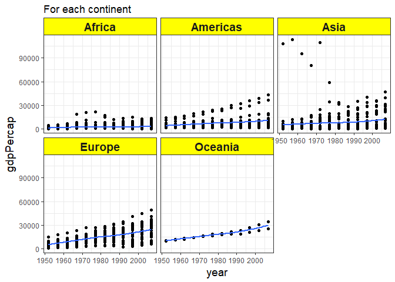

Homework 3
================

Load the package:
-----------------

``` r
suppressPackageStartupMessages(library(tidyverse))
suppressPackageStartupMessages(library(gapminder))
```

Task Menu
---------

### **Task 1: Get the maximum and minimum of GDP per capita for all continents.**

``` r
p1<- gapminder %>%
  group_by(continent) %>% 
  summarise(min_gdppercap=min(gdpPercap), max_gdppercap=max(gdpPercap))
knitr::kable(p1)
```

| continent |  min\_gdppercap|  max\_gdppercap|
|:----------|---------------:|---------------:|
| Africa    |        241.1659|        21951.21|
| Americas  |       1201.6372|        42951.65|
| Asia      |        331.0000|       113523.13|
| Europe    |        973.5332|        49357.19|
| Oceania   |      10039.5956|        34435.37|

Using `xtable` to show the result

``` r
library(xtable)
print(xtable(p1), type = "html")
```

<!-- html table generated in R 3.4.1 by xtable 1.8-2 package -->
<!-- Mon Oct 02 23:29:37 2017 -->
<table border="1">
<tr>
<th>
</th>
<th>
continent
</th>
<th>
min\_gdppercap
</th>
<th>
max\_gdppercap
</th>
</tr>
<tr>
<td align="right">
1
</td>
<td>
Africa
</td>
<td align="right">
241.17
</td>
<td align="right">
21951.21
</td>
</tr>
<tr>
<td align="right">
2
</td>
<td>
Americas
</td>
<td align="right">
1201.64
</td>
<td align="right">
42951.65
</td>
</tr>
<tr>
<td align="right">
3
</td>
<td>
Asia
</td>
<td align="right">
331.00
</td>
<td align="right">
113523.13
</td>
</tr>
<tr>
<td align="right">
4
</td>
<td>
Europe
</td>
<td align="right">
973.53
</td>
<td align="right">
49357.19
</td>
</tr>
<tr>
<td align="right">
5
</td>
<td>
Oceania
</td>
<td align="right">
10039.60
</td>
<td align="right">
34435.37
</td>
</tr>
</table>
We could find the largest and smallest gdpPercap **Plot**

``` r
ggplot(gapminder,  aes(x = continent, y = gdpPercap))+
geom_jitter(aes(color=continent))+ 
    theme_bw() +
  theme(axis.title = element_text(size=14))+
  labs(title="continent vs gdpPercap")+ 
  scale_colour_discrete("Continents of\n the World")
```


We could find the highst gdpPercap for each continent. However the lowest gdpPercap is hard to find in the graph above.

I want to get graph for each continent

``` r
ggplot(gapminder, aes(year, gdpPercap)) +
    facet_wrap(~ continent) +
    geom_point()+ geom_smooth(se=FALSE,span=0.9)+
  theme_bw()+
  theme(strip.background = element_rect(fill="yellow"),
    axis.title = element_text(size=14),
    strip.text = element_text(size=14, face="bold"))+
  labs(title="For each continent")
```

    ## `geom_smooth()` using method = 'loess'



From the graphs above, we could find that the maximum GDP per capita for all continents occur in 2007, except Asia and Africa. In addition, there is an increasing trend for GDP per capita of Oceania.

``` r
p2<-gapminder %>%
  group_by(continent) %>%
  mutate(max_gdpPercap = (max(gdpPercap))==gdpPercap) %>% 
  mutate(min_gapPercap = (min(gdpPercap)==gdpPercap))

ggplot(p2,aes(x=year,y=gdpPercap))+
  facet_wrap(~continent, scales="free_y")+
  geom_point(aes(color=max_gdpPercap, size= min_gapPercap, shape=min_gapPercap),alpha=0.5)  +
  theme_bw()+
  theme(strip.background = element_rect(fill="green"),
    axis.title = element_text(size=14),
    strip.text = element_text(size=14, face="bold"))+
  labs(title="For each continent")
```

    ## Warning: Using size for a discrete variable is not advised.


From graph above, it shows that "blue" point is the maximum GDP per capita for each continent, and triangle is the minimum GDP per capita for each continent.

### **Task2: Look at the spread of GDP per capita within the continents.**

``` r
p3<- gapminder %>% 
  group_by(continent) %>%
    summarise(sd_gdppercap = sd(gdpPercap), IQR_gdppercap = IQR(gdpPercap))
knitr::kable(p3)
```

| continent |  sd\_gdppercap|  IQR\_gdppercap|
|:----------|--------------:|---------------:|
| Africa    |       2827.930|        1616.170|
| Americas  |       6396.764|        4402.431|
| Asia      |      14045.373|        7492.262|
| Europe    |       9355.213|       13248.301|
| Oceania   |       6358.983|        8072.258|

The standard deviation of Asia is the biggest, and Europe IQR is the largest. On the other hand, Afica has the smallest standard deviation and IQR.

**Plot**

``` r
gapminder %>%
  select(gdpPercap, continent) %>% 
  ggplot(aes(x=continent, y=gdpPercap)) + 
              geom_point(alpha=0.1) + 
              geom_boxplot(outlier.colour = "red") +
              labs(title="Compared GDP per capitla for different continents")+
             theme(axis.title = element_text(size=14))
```


We can see from the boxplots giving us the same reslut as to the previous piping. Moreover, Ggplot gives us a easy way to find the outliers.

### **Task3: How is life expectancy changing over time on different continents?**

``` r
p4<- gapminder %>% 
  group_by(continent, year) %>% 
  summarise(mean_lifeExp=mean(lifeExp)) %>% 
  mutate(Change_lifeExp = c(0, diff(mean_lifeExp)))
knitr::kable(p4)
```

| continent |  year|  mean\_lifeExp|  Change\_lifeExp|
|:----------|-----:|--------------:|----------------:|
| Africa    |  1952|       39.13550|        0.0000000|
| Africa    |  1957|       41.26635|        2.1308462|
| Africa    |  1962|       43.31944|        2.0530962|
| Africa    |  1967|       45.33454|        2.0150962|
| Africa    |  1972|       47.45094|        2.1164038|
| Africa    |  1977|       49.58042|        2.1294808|
| Africa    |  1982|       51.59287|        2.0124423|
| Africa    |  1987|       53.34479|        1.7519231|
| Africa    |  1992|       53.62958|        0.2847885|
| Africa    |  1997|       53.59827|       -0.0313077|
| Africa    |  2002|       53.32523|       -0.2730385|
| Africa    |  2007|       54.80604|        1.4808077|
| Americas  |  1952|       53.27984|        0.0000000|
| Americas  |  1957|       55.96028|        2.6804400|
| Americas  |  1962|       58.39876|        2.4384800|
| Americas  |  1967|       60.41092|        2.0121600|
| Americas  |  1972|       62.39492|        1.9840000|
| Americas  |  1977|       64.39156|        1.9966400|
| Americas  |  1982|       66.22884|        1.8372800|
| Americas  |  1987|       68.09072|        1.8618800|
| Americas  |  1992|       69.56836|        1.4776400|
| Americas  |  1997|       71.15048|        1.5821200|
| Americas  |  2002|       72.42204|        1.2715600|
| Americas  |  2007|       73.60812|        1.1860800|
| Asia      |  1952|       46.31439|        0.0000000|
| Asia      |  1957|       49.31854|        3.0041503|
| Asia      |  1962|       51.56322|        2.2446788|
| Asia      |  1967|       54.66364|        3.1004170|
| Asia      |  1972|       57.31927|        2.6556291|
| Asia      |  1977|       59.61056|        2.2912873|
| Asia      |  1982|       62.61794|        3.0073830|
| Asia      |  1987|       64.85118|        2.2332424|
| Asia      |  1992|       66.53721|        1.6860303|
| Asia      |  1997|       68.02052|        1.4833030|
| Asia      |  2002|       69.23388|        1.2133636|
| Asia      |  2007|       70.72848|        1.4946061|
| Europe    |  1952|       64.40850|        0.0000000|
| Europe    |  1957|       66.70307|        2.2945667|
| Europe    |  1962|       68.53923|        1.8361667|
| Europe    |  1967|       69.73760|        1.1983667|
| Europe    |  1972|       70.77503|        1.0374333|
| Europe    |  1977|       71.93777|        1.1627333|
| Europe    |  1982|       72.80640|        0.8686333|
| Europe    |  1987|       73.64217|        0.8357667|
| Europe    |  1992|       74.44010|        0.7979333|
| Europe    |  1997|       75.50517|        1.0650667|
| Europe    |  2002|       76.70060|        1.1954333|
| Europe    |  2007|       77.64860|        0.9480000|
| Oceania   |  1952|       69.25500|        0.0000000|
| Oceania   |  1957|       70.29500|        1.0400000|
| Oceania   |  1962|       71.08500|        0.7900000|
| Oceania   |  1967|       71.31000|        0.2250000|
| Oceania   |  1972|       71.91000|        0.6000000|
| Oceania   |  1977|       72.85500|        0.9450000|
| Oceania   |  1982|       74.29000|        1.4350000|
| Oceania   |  1987|       75.32000|        1.0300000|
| Oceania   |  1992|       76.94500|        1.6250000|
| Oceania   |  1997|       78.19000|        1.2450000|
| Oceania   |  2002|       79.74000|        1.5500000|
| Oceania   |  2007|       80.71950|        0.9795000|

Firstly, I calculate the mean of the lifeExp for certain years of different continents, then I take their difference to represent how is life expectancy changing over time on different continents.

**Plot**

``` r
ggplot(gapminder, aes(x=year, y=lifeExp,color=continent))+
  geom_point(alpha=0.3) + 
  geom_smooth(method="lm", se= FALSE)+
  theme_bw() +
  labs(title=" LifeExp vs Year")+
    theme(axis.title = element_text(size=14))+
    scale_colour_discrete("Continents of\n the World")
```


In general, lifeExp for different continents was increasing from 1950 to 2007. Asia life expectancy rise sharply and Africa life expectancy rise smoothly.

``` r
ggplot(gapminder, aes(x=year, y=lifeExp,color = continent)) +
  geom_jitter(alpha = 1/3, size = 3) +
  facet_wrap(~ continent) +
  geom_smooth(method="lm", span =0.1, color= "red")+
  theme_bw() +
   theme(strip.background = element_rect(fill="orange"),
          axis.title = element_text(size=12),
          strip.text = element_text(size=12, face="bold"))
```


### **Task4: Compute a weighted mean, weighting by population of life expectancy for different years**

``` r
p5<- gapminder %>% 
  group_by(year) %>% 
  summarize(life_mean= mean(lifeExp), weight_mean=weighted.mean(lifeExp, pop))
  knitr::kable(p5)
```

|  year|  life\_mean|  weight\_mean|
|-----:|-----------:|-------------:|
|  1952|    49.05762|      48.94424|
|  1957|    51.50740|      52.12189|
|  1962|    53.60925|      52.32438|
|  1967|    55.67829|      56.98431|
|  1972|    57.64739|      59.51478|
|  1977|    59.57016|      61.23726|
|  1982|    61.53320|      62.88176|
|  1987|    63.21261|      64.41635|
|  1992|    64.16034|      65.64590|
|  1997|    65.01468|      66.84934|
|  2002|    65.69492|      67.83904|
|  2007|    67.00742|      68.91909|

**Plot**

``` r
ggplot(p5, aes(year, life_mean))+
 geom_point()+
 geom_line(color= "red")+
  theme_bw() +
   theme( axis.title = element_text(size=15))
```


``` r
ggplot(p5, aes(year, weight_mean))+
 geom_point()+
 geom_line(color= "red")+
  theme_bw() +
   theme( axis.title = element_text(size=15))
```


From two graphs above, we could find the mean and weighted mean are slightly different, especially in year 1960.

### **Task5: Compared the population and life expectancy changing over time for different Asia's countries**

``` r
p6<-gapminder %>% 
  filter(continent=="Asia") %>% 
  group_by(country) %>% 
  mutate(population=pop/(10^6), Change_lifeExp = c( 0, diff(lifeExp)))
knitr::kable(head(p6))
```

| country     | continent |  year|  lifeExp|       pop|  gdpPercap|  population|  Change\_lifeExp|
|:------------|:----------|-----:|--------:|---------:|----------:|-----------:|----------------:|
| Afghanistan | Asia      |  1952|   28.801|   8425333|   779.4453|    8.425333|            0.000|
| Afghanistan | Asia      |  1957|   30.332|   9240934|   820.8530|    9.240934|            1.531|
| Afghanistan | Asia      |  1962|   31.997|  10267083|   853.1007|   10.267083|            1.665|
| Afghanistan | Asia      |  1967|   34.020|  11537966|   836.1971|   11.537966|            2.023|
| Afghanistan | Asia      |  1972|   36.088|  13079460|   739.9811|   13.079460|            2.068|
| Afghanistan | Asia      |  1977|   38.438|  14880372|   786.1134|   14.880372|            2.350|

**Plot**

``` r
ggplot(p6, aes(population, Change_lifeExp, color= country, group=country))+
  geom_jitter(alpha=0.2)+
  geom_path()
```


From the graph above, most Aisa countries' population remained the same or rise very slowly between 1952 and 2007. However, China and India 's population changed siginificantly from 1952 to 2007. Moreover, Cambodia has the largest change in life expectancy changing over time.

Only look at India and china data

| country |  population|  Change\_lifeExp|
|:--------|-----------:|----------------:|
| China   |    556.2635|          0.00000|
| China   |    637.4080|          6.54896|
| China   |    665.7700|         -6.04760|
| China   |    754.5500|         13.87976|
| China   |    862.0300|          4.73776|
| China   |    943.4550|          0.84848|
| China   |   1000.2810|          1.55764|
| China   |   1084.0350|          1.74900|
| China   |   1164.9700|          1.41600|
| China   |   1230.0750|          1.73600|
| China   |   1280.4000|          1.60200|
| China   |   1318.6831|          0.93300|
| India   |    372.0000|          0.00000|
| India   |    409.0000|          2.87600|
| India   |    454.0000|          3.35600|
| India   |    506.0000|          3.58800|
| India   |    567.0000|          3.45800|
| India   |    634.0000|          3.55700|
| India   |    708.0000|          2.38800|
| India   |    788.0000|          1.95700|
| India   |    872.0000|          1.67000|
| India   |    959.0000|          1.54200|
| India   |   1034.1725|          1.11400|
| India   |   1110.3963|          1.81900|


From above, these two countries' population growth rate was almost the same, but China's`Change_lifeExp` has changed a lot in certain periods. One possible reason is that there was a huge policy or government effect at that time.

But I want do more！
--------------------

``` r
library(ggplot2)
suppressMessages(library(dplyr))
```

#### Layout stretch goal

Using Task 1 for example

``` r
library(ggplot2)
suppressMessages(library(dplyr))
```

| continent |  min\_gdppercap|  max\_gdppercap|
|:----------|---------------:|---------------:|
| Africa    |        241.1659|        21951.21|
| Americas  |       1201.6372|        42951.65|
| Asia      |        331.0000|       113523.13|
| Europe    |        973.5332|        49357.19|
| Oceania   |      10039.5956|        34435.37|


#### Table stretch goal

Using `xtable` to show the result

``` r
library(xtable)
print(xtable(p1), type = "html")
```

<!-- html table generated in R 3.4.1 by xtable 1.8-2 package -->
<!-- Mon Oct 02 23:29:47 2017 -->
<table border="1">
<tr>
<th>
</th>
<th>
continent
</th>
<th>
min\_gdppercap
</th>
<th>
max\_gdppercap
</th>
</tr>
<tr>
<td align="right">
1
</td>
<td>
Africa
</td>
<td align="right">
241.17
</td>
<td align="right">
21951.21
</td>
</tr>
<tr>
<td align="right">
2
</td>
<td>
Americas
</td>
<td align="right">
1201.64
</td>
<td align="right">
42951.65
</td>
</tr>
<tr>
<td align="right">
3
</td>
<td>
Asia
</td>
<td align="right">
331.00
</td>
<td align="right">
113523.13
</td>
</tr>
<tr>
<td align="right">
4
</td>
<td>
Europe
</td>
<td align="right">
973.53
</td>
<td align="right">
49357.19
</td>
</tr>
<tr>
<td align="right">
5
</td>
<td>
Oceania
</td>
<td align="right">
10039.60
</td>
<td align="right">
34435.37
</td>
</tr>
</table>
Report your process
-------------------

I found three problems in this assignment.

Firstly, for task 4 I tried many times to plot weighted mean and mean in one graph. But I got very strange output, `theme_bw` and `theme` do not work in here. Here is my wrong R code.

``` r
ggplot(p5, aes(year, weight_mean))+
 geom_point()+
 geom_line(color= "red")+
  geom_line(aes(life_mean))
```


Another issue is for task 5, I tried to use `ifese` when I want to find the difference of lifeExp, but the output shows incorrect. I do not know how to use `ifese` in the right way, could someone explain to me? Here is my wrong `ifese` R code

``` r
p9<-gapminder %>% 
  filter(continent=="Asia") %>% 
  group_by(country) %>% 
  mutate(population=pop/(10^6), Change_lifeExp = ifelse(year==1952, 0,  diff(lifeExp)))
knitr::kable(head(p9))
```

| country     | continent |  year|  lifeExp|       pop|  gdpPercap|  population|  Change\_lifeExp|
|:------------|:----------|-----:|--------:|---------:|----------:|-----------:|----------------:|
| Afghanistan | Asia      |  1952|   28.801|   8425333|   779.4453|    8.425333|            0.000|
| Afghanistan | Asia      |  1957|   30.332|   9240934|   820.8530|    9.240934|            1.665|
| Afghanistan | Asia      |  1962|   31.997|  10267083|   853.1007|   10.267083|            2.023|
| Afghanistan | Asia      |  1967|   34.020|  11537966|   836.1971|   11.537966|            2.068|
| Afghanistan | Asia      |  1972|   36.088|  13079460|   739.9811|   13.079460|            2.350|
| Afghanistan | Asia      |  1977|   38.438|  14880372|   786.1134|   14.880372|            1.416|

Here is the right R code about difference of life expectancy by using `c()`

``` r
p10<-gapminder %>% 
  filter(continent=="Asia") %>% 
  group_by(country) %>% 
  mutate(population=pop/(10^6), Change_lifeExp = c( 0, diff(lifeExp)))
knitr::kable(head(p10))
```

| country     | continent |  year|  lifeExp|       pop|  gdpPercap|  population|  Change\_lifeExp|
|:------------|:----------|-----:|--------:|---------:|----------:|-----------:|----------------:|
| Afghanistan | Asia      |  1952|   28.801|   8425333|   779.4453|    8.425333|            0.000|
| Afghanistan | Asia      |  1957|   30.332|   9240934|   820.8530|    9.240934|            1.531|
| Afghanistan | Asia      |  1962|   31.997|  10267083|   853.1007|   10.267083|            1.665|
| Afghanistan | Asia      |  1967|   34.020|  11537966|   836.1971|   11.537966|            2.023|
| Afghanistan | Asia      |  1972|   36.088|  13079460|   739.9811|   13.079460|            2.068|
| Afghanistan | Asia      |  1977|   38.438|  14880372|   786.1134|   14.880372|            2.350|

Moreover, for task 2, I try to use `stargazer` packages, and I find that there is no data showing up in the table. Here is my R below.

``` r
## First time need to install `stargazer`
## install.packages("stargazer")
library(stargazer)
```

    ## 
    ## Please cite as:

    ##  Hlavac, Marek (2015). stargazer: Well-Formatted Regression and Summary Statistics Tables.

    ##  R package version 5.2. http://CRAN.R-project.org/package=stargazer

``` r
pa<- gapminder %>% 
  group_by(continent)
stargazer(pa, type = "html",
 title = "Table with stargazer")
```

<table style="text-align:center">
<caption>
<strong>Table with stargazer</strong>
</caption>
<tr>
<td colspan="6" style="border-bottom: 1px solid black">
</td>
</tr>
<tr>
<td style="text-align:left">
Statistic
</td>
<td>
N
</td>
<td>
Mean
</td>
<td>
St. Dev.
</td>
<td>
Min
</td>
<td>
Max
</td>
</tr>
<tr>
<td colspan="6" style="border-bottom: 1px solid black">
</td>
</tr>
</table>
Task 1 and 2 are straight forward, however I spent many time on task 4 ploting. For this homework I find two useful website.

1.  [stargazer](https://cran.r-project.org/web/packages/stargazer/vignettes/stargazer.pdf)

2.  [R markdown cheat sheet](https://www.rstudio.com/wp-content/uploads/2016/03/rmarkdown-cheatsheet-2.0.pdf).
