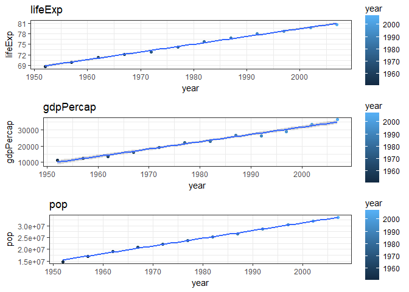

# homework06

## 1. Character data


```r
library(tidyverse)
```

```
## Loading tidyverse: ggplot2
## Loading tidyverse: tibble
## Loading tidyverse: tidyr
## Loading tidyverse: readr
## Loading tidyverse: purrr
## Loading tidyverse: dplyr
```

```
## Conflicts with tidy packages ----------------------------------------------
```

```
## filter(): dplyr, stats
## lag():    dplyr, stats
```

```r
library(stringr)
library(grid)
library(robustbase)
```

```
## Warning: package 'robustbase' was built under R version 3.4.2
```

```r
library(gapminder)
library(MASS)
```

```
## 
## Attaching package: 'MASS'
```

```
## The following object is masked from 'package:dplyr':
## 
##     select
```

```r
library(singer)
library(stringi )
```

#### 14.2.5 Exercises

**1.In code that doesn’t use stringr, you’ll often see paste() and paste0(). What’s the difference between the two functions? What stringr function are they equivalent to? How do the functions differ in their handling of NA?**


```r
paste("happy", "life")
```

```
## [1] "happy life"
```

```r
paste0("happy", "life")
```

```
## [1] "happylife"
```

The function `paste` seperates strings with spaces by default, while `paste0` does not seperate strings with spaces by default.
`str_c` function are similar to the `paste0()` function (`str_c` does not seperate strings with space by default)


```r
str_c("happy", "life")
```

```
## [1] "happylife"
```


```r
str_c("happy", NA)
```

```
## [1] NA
```

```r
paste("happy", NA)
```

```
## [1] "happy NA"
```

```r
paste0("happy", NA)
```

```
## [1] "happyNA"
```

From the code above, it shows different results when we handle "NA". For `str_c` function if there exists a missing value, it will return only missing value. On the other hand, `paste` function will convert "NA" to the string, and will return "NA" and "happy".

**2. In your own words, describe the difference between the `sep` and collapse arguments to `str_c()`.**


```r
x <- c("a", "b", "c", "d")
y <- c("e", "f", "g", "h")
paste(x, y, sep="&")
```

```
## [1] "a&e" "b&f" "c&g" "d&h"
```

```r
paste(x,y,collapse = "&")
```

```
## [1] "a e&b f&c g&d h"
```

`sep` defines what separates the entries in those tuple-wise concatenations, while `collapse` is the string used to separate elements of the character vector into a length one character vector.
From the result above, it shows that there are 4  "&" when we use `sep` function, and only 3 "&" when we use `collapse` function. 

**3. Use `str_length()` and `str_sub()` to extract the middle character from a string. What will you do if the string has an even number of characters?**


```r
x<- c("abbc", "deef", "ghij", "klmmno", "pqrrst")
length<- str_length(x)
middle<- str_length(x)/2
str_sub(x,middle,middle+1)
```

```
## [1] "bb" "ee" "hi" "mm" "rr"
```

from the code above, we could find middle character from a string when we have even number of characters

Another way is to use `ceiling` function.
ceiling takes a single numeric argument x and returns a numeric vector containing the smallest integers not less than the corresponding elements of x.


```r
x<- c("abbc", "deef", "ghij", "klmmno", "pqrrst")
length <- str_length(x)
middle <- ceiling(str_length(x) / 2)
str_sub(x, middle,middle)
```

```
## [1] "b" "e" "h" "m" "r"
```

**4.What does `str_wrap()` do? When might you want to use it?**

`strwrap()` function wrap character strings to format paragraphs. Each character string in the input is first split into paragraphs (or lines containing whitespace only). The paragraphs are then formatted by breaking lines at word boundaries. The target columns for wrapping lines and the indentation of the first and all subsequent lines of a paragraph can be controlled independently.`strwrap()` always formats blocks of text into nice-looking paragraphs and this is useful when we have long strings of text need to be layout.

**5.What does str_trim() do? What’s the opposite of str_trim()?**

`str_trim` function means trim whitespace from start and end of string. Note it also recognizes (\t) and newline (\n).

Usage:
str_trim(string, side = c("both", "left", "right"))

Arguments:
string: A character vector.
side: Side on which to remove whitespace (left, right or both).


```r
str_trim("                 abcdef                              ")
```

```
## [1] "abcdef"
```

```r
str_trim("                 abcdef                              ", side = "both")
```

```
## [1] "abcdef"
```

```r
str_trim("                 abcdef                              ", side = "left")
```

```
## [1] "abcdef                              "
```

```r
str_trim("                 abcdef                              ", side = "right")
```

```
## [1] "                 abcdef"
```

from the code above, side equal to "both" by default.

The opposite of `str_trim` is `str_pad`, which adds characters to each side.

`str_pad` means vectorised over string, width and pad.

Usage:
str_pad(string, width, side = c("left", "right", "both"), pad = " ")

Arguments:
string: A character vector.

width: Minimum width of padded strings.

side: Side on which padding character is added (left, right or both).

pad: Single padding character (default is a space).


```r
str_pad("abcdef", 10, side = "both")
```

```
## [1] "  abcdef  "
```

```r
str_pad("abcdef", 10, side = "left")
```

```
## [1] "    abcdef"
```

```r
str_pad("abcdef", 10, side = "right")
```

```
## [1] "abcdef    "
```

```r
str_pad("abcdef", 7, side = "both")
```

```
## [1] "abcdef "
```

**6. Write a function that turns (e.g.) a vector c("a", "b", "c") into the string a, b, and c. Think carefully about what it should do if given a vector of length 0, 1, or 2.**


```r
str_function <- function(x) {
    if(is_empty(x)) {
    stop('we need non-empty inputs!')
  }
  if (length(x)==1) x
 else if (length(x) > 1) {
    str_c(str_c(x[1:length(x)-1], collapse = ", "),
                x[length(x)],
                sep = ", and ")
  }
}

str_function("a")
```

```
## [1] "a"
```

```r
str_function(c("a", "b"))
```

```
## [1] "a, and b"
```

```r
str_function(c("a","b", "c"))
```

```
## [1] "a, b, and c"
```

#### 14.3.1.1 Exercises

**1. Explain why each of these strings don’t match a `\`: `"\"`, `"\\"`, `"\\\"`.**

`"\"` : This will escape the next character in the R string. 

`"\"`: This will resolve to  in the regular expression, which will escape the next character in the regular expression.

`"\\\"`: The first two backslashes will resolve to a literal backslash in the regular expression, the third will escape the next character. So in the regular expresion, this will escape some escaped character.

**2. How would you match the sequence "'\"?**


```r
x <- c("abc","'\\")
writeLines(x)
```

```
## abc
## '\
```

```r
str_view(x, "\'\\\\")
```

<!--html_preserve--><div id="htmlwidget-8ab8d2d213689ceccd8b" style="width:960px;height:auto;" class="str_view html-widget"></div>
<script type="application/json" data-for="htmlwidget-8ab8d2d213689ceccd8b">{"x":{"html":"<ul>\n  <li>abc<\/li>\n  <li><span class='match'>'\\<\/span><\/li>\n<\/ul>"},"evals":[],"jsHooks":[]}</script><!--/html_preserve-->

**3.What patterns will the regular expression `\..\..\..` match? How would you represent it as a string?**

Each of the `\.` in the above expression how many times of literal period. Each of dots represent a for a single character. Therefore the expression is lookling for something like (period and single character)(period and single character)(period and single character). We need to use extra `\` to escape to the `\.`.


```r
x<-c("a.b.c.d")
writeLines(x)
```

```
## a.b.c.d
```

```r
str_view(x, "\\..\\..\\..")
```

<!--html_preserve--><div id="htmlwidget-9d069876c35dd01356b6" style="width:960px;height:auto;" class="str_view html-widget"></div>
<script type="application/json" data-for="htmlwidget-9d069876c35dd01356b6">{"x":{"html":"<ul>\n  <li>a<span class='match'>.b.c.d<\/span><\/li>\n<\/ul>"},"evals":[],"jsHooks":[]}</script><!--/html_preserve-->

It will match any patterns that are a dot followed by any character. (repeated three times)


#### 14.3.2.1 Exercises

**1.How would you match the literal string "$^$"?**


```r
x="ab$^$cd"
writeLines(x)
```

```
## ab$^$cd
```

```r
str_view(x, "\\$\\^\\$")
```

<!--html_preserve--><div id="htmlwidget-97069219e7e7e94ae6de" style="width:960px;height:auto;" class="str_view html-widget"></div>
<script type="application/json" data-for="htmlwidget-97069219e7e7e94ae6de">{"x":{"html":"<ul>\n  <li>ab<span class='match'>$^$<\/span>cd<\/li>\n<\/ul>"},"evals":[],"jsHooks":[]}</script><!--/html_preserve-->

each of` $` and `^ ` needs a double escape `\\`

**Given the corpus of common words in stringr::words, create regular expressions that find all words that:**
*Start with “y”.*
*End with “x”*
*Are exactly three letters long. (Don’t cheat by using str_length()!)*
*Have seven letters or more.*
*Since this list is long, you might want to use the match argument to str_view() to show only the matching or non-matching words.*


```r
str_view(words,"^y", match = TRUE)
```

<!--html_preserve--><div id="htmlwidget-0feb13eedb6142568326" style="width:960px;height:auto;" class="str_view html-widget"></div>
<script type="application/json" data-for="htmlwidget-0feb13eedb6142568326">{"x":{"html":"<ul>\n  <li><span class='match'>y<\/span>ear<\/li>\n  <li><span class='match'>y<\/span>es<\/li>\n  <li><span class='match'>y<\/span>esterday<\/li>\n  <li><span class='match'>y<\/span>et<\/li>\n  <li><span class='match'>y<\/span>ou<\/li>\n  <li><span class='match'>y<\/span>oung<\/li>\n<\/ul>"},"evals":[],"jsHooks":[]}</script><!--/html_preserve-->

```r
str_view(words, "x$", match = TRUE)
```

<!--html_preserve--><div id="htmlwidget-c8f6a9afd79f1a36d7c3" style="width:960px;height:auto;" class="str_view html-widget"></div>
<script type="application/json" data-for="htmlwidget-c8f6a9afd79f1a36d7c3">{"x":{"html":"<ul>\n  <li>bo<span class='match'>x<\/span><\/li>\n  <li>se<span class='match'>x<\/span><\/li>\n  <li>si<span class='match'>x<\/span><\/li>\n  <li>ta<span class='match'>x<\/span><\/li>\n<\/ul>"},"evals":[],"jsHooks":[]}</script><!--/html_preserve-->

```r
#str_view(words, "^...$", match = TRUE) 
## Are exactly three letters long. code is too long to print
#str_view(words,".......",match=TRUE)
## Have seven letters or more. code is too long to print
```

The list for "^...$" and "......." are so long to print, we use `match=TRUE` to see only matching words.

#### 14.3.3.1 Exercises

1.**Create regular expressions to find all words that:**

*Start with a vowel.*

*That only contain consonants. (Hint: thinking about matching “not”-vowels.)*

*End with ed, but not with eed.*

*End with ing or ise.*


```r
str_view(words, "^[aeiou]", match = TRUE) 
```

<!--html_preserve--><div id="htmlwidget-98247439124861e7b7d0" style="width:960px;height:auto;" class="str_view html-widget"></div>
<script type="application/json" data-for="htmlwidget-98247439124861e7b7d0">{"x":{"html":"<ul>\n  <li><span class='match'>a<\/span><\/li>\n  <li><span class='match'>a<\/span>ble<\/li>\n  <li><span class='match'>a<\/span>bout<\/li>\n  <li><span class='match'>a<\/span>bsolute<\/li>\n  <li><span class='match'>a<\/span>ccept<\/li>\n  <li><span class='match'>a<\/span>ccount<\/li>\n  <li><span class='match'>a<\/span>chieve<\/li>\n  <li><span class='match'>a<\/span>cross<\/li>\n  <li><span class='match'>a<\/span>ct<\/li>\n  <li><span class='match'>a<\/span>ctive<\/li>\n  <li><span class='match'>a<\/span>ctual<\/li>\n  <li><span class='match'>a<\/span>dd<\/li>\n  <li><span class='match'>a<\/span>ddress<\/li>\n  <li><span class='match'>a<\/span>dmit<\/li>\n  <li><span class='match'>a<\/span>dvertise<\/li>\n  <li><span class='match'>a<\/span>ffect<\/li>\n  <li><span class='match'>a<\/span>fford<\/li>\n  <li><span class='match'>a<\/span>fter<\/li>\n  <li><span class='match'>a<\/span>fternoon<\/li>\n  <li><span class='match'>a<\/span>gain<\/li>\n  <li><span class='match'>a<\/span>gainst<\/li>\n  <li><span class='match'>a<\/span>ge<\/li>\n  <li><span class='match'>a<\/span>gent<\/li>\n  <li><span class='match'>a<\/span>go<\/li>\n  <li><span class='match'>a<\/span>gree<\/li>\n  <li><span class='match'>a<\/span>ir<\/li>\n  <li><span class='match'>a<\/span>ll<\/li>\n  <li><span class='match'>a<\/span>llow<\/li>\n  <li><span class='match'>a<\/span>lmost<\/li>\n  <li><span class='match'>a<\/span>long<\/li>\n  <li><span class='match'>a<\/span>lready<\/li>\n  <li><span class='match'>a<\/span>lright<\/li>\n  <li><span class='match'>a<\/span>lso<\/li>\n  <li><span class='match'>a<\/span>lthough<\/li>\n  <li><span class='match'>a<\/span>lways<\/li>\n  <li><span class='match'>a<\/span>merica<\/li>\n  <li><span class='match'>a<\/span>mount<\/li>\n  <li><span class='match'>a<\/span>nd<\/li>\n  <li><span class='match'>a<\/span>nother<\/li>\n  <li><span class='match'>a<\/span>nswer<\/li>\n  <li><span class='match'>a<\/span>ny<\/li>\n  <li><span class='match'>a<\/span>part<\/li>\n  <li><span class='match'>a<\/span>pparent<\/li>\n  <li><span class='match'>a<\/span>ppear<\/li>\n  <li><span class='match'>a<\/span>pply<\/li>\n  <li><span class='match'>a<\/span>ppoint<\/li>\n  <li><span class='match'>a<\/span>pproach<\/li>\n  <li><span class='match'>a<\/span>ppropriate<\/li>\n  <li><span class='match'>a<\/span>rea<\/li>\n  <li><span class='match'>a<\/span>rgue<\/li>\n  <li><span class='match'>a<\/span>rm<\/li>\n  <li><span class='match'>a<\/span>round<\/li>\n  <li><span class='match'>a<\/span>rrange<\/li>\n  <li><span class='match'>a<\/span>rt<\/li>\n  <li><span class='match'>a<\/span>s<\/li>\n  <li><span class='match'>a<\/span>sk<\/li>\n  <li><span class='match'>a<\/span>ssociate<\/li>\n  <li><span class='match'>a<\/span>ssume<\/li>\n  <li><span class='match'>a<\/span>t<\/li>\n  <li><span class='match'>a<\/span>ttend<\/li>\n  <li><span class='match'>a<\/span>uthority<\/li>\n  <li><span class='match'>a<\/span>vailable<\/li>\n  <li><span class='match'>a<\/span>ware<\/li>\n  <li><span class='match'>a<\/span>way<\/li>\n  <li><span class='match'>a<\/span>wful<\/li>\n  <li><span class='match'>e<\/span>ach<\/li>\n  <li><span class='match'>e<\/span>arly<\/li>\n  <li><span class='match'>e<\/span>ast<\/li>\n  <li><span class='match'>e<\/span>asy<\/li>\n  <li><span class='match'>e<\/span>at<\/li>\n  <li><span class='match'>e<\/span>conomy<\/li>\n  <li><span class='match'>e<\/span>ducate<\/li>\n  <li><span class='match'>e<\/span>ffect<\/li>\n  <li><span class='match'>e<\/span>gg<\/li>\n  <li><span class='match'>e<\/span>ight<\/li>\n  <li><span class='match'>e<\/span>ither<\/li>\n  <li><span class='match'>e<\/span>lect<\/li>\n  <li><span class='match'>e<\/span>lectric<\/li>\n  <li><span class='match'>e<\/span>leven<\/li>\n  <li><span class='match'>e<\/span>lse<\/li>\n  <li><span class='match'>e<\/span>mploy<\/li>\n  <li><span class='match'>e<\/span>ncourage<\/li>\n  <li><span class='match'>e<\/span>nd<\/li>\n  <li><span class='match'>e<\/span>ngine<\/li>\n  <li><span class='match'>e<\/span>nglish<\/li>\n  <li><span class='match'>e<\/span>njoy<\/li>\n  <li><span class='match'>e<\/span>nough<\/li>\n  <li><span class='match'>e<\/span>nter<\/li>\n  <li><span class='match'>e<\/span>nvironment<\/li>\n  <li><span class='match'>e<\/span>qual<\/li>\n  <li><span class='match'>e<\/span>special<\/li>\n  <li><span class='match'>e<\/span>urope<\/li>\n  <li><span class='match'>e<\/span>ven<\/li>\n  <li><span class='match'>e<\/span>vening<\/li>\n  <li><span class='match'>e<\/span>ver<\/li>\n  <li><span class='match'>e<\/span>very<\/li>\n  <li><span class='match'>e<\/span>vidence<\/li>\n  <li><span class='match'>e<\/span>xact<\/li>\n  <li><span class='match'>e<\/span>xample<\/li>\n  <li><span class='match'>e<\/span>xcept<\/li>\n  <li><span class='match'>e<\/span>xcuse<\/li>\n  <li><span class='match'>e<\/span>xercise<\/li>\n  <li><span class='match'>e<\/span>xist<\/li>\n  <li><span class='match'>e<\/span>xpect<\/li>\n  <li><span class='match'>e<\/span>xpense<\/li>\n  <li><span class='match'>e<\/span>xperience<\/li>\n  <li><span class='match'>e<\/span>xplain<\/li>\n  <li><span class='match'>e<\/span>xpress<\/li>\n  <li><span class='match'>e<\/span>xtra<\/li>\n  <li><span class='match'>e<\/span>ye<\/li>\n  <li><span class='match'>i<\/span>dea<\/li>\n  <li><span class='match'>i<\/span>dentify<\/li>\n  <li><span class='match'>i<\/span>f<\/li>\n  <li><span class='match'>i<\/span>magine<\/li>\n  <li><span class='match'>i<\/span>mportant<\/li>\n  <li><span class='match'>i<\/span>mprove<\/li>\n  <li><span class='match'>i<\/span>n<\/li>\n  <li><span class='match'>i<\/span>nclude<\/li>\n  <li><span class='match'>i<\/span>ncome<\/li>\n  <li><span class='match'>i<\/span>ncrease<\/li>\n  <li><span class='match'>i<\/span>ndeed<\/li>\n  <li><span class='match'>i<\/span>ndividual<\/li>\n  <li><span class='match'>i<\/span>ndustry<\/li>\n  <li><span class='match'>i<\/span>nform<\/li>\n  <li><span class='match'>i<\/span>nside<\/li>\n  <li><span class='match'>i<\/span>nstead<\/li>\n  <li><span class='match'>i<\/span>nsure<\/li>\n  <li><span class='match'>i<\/span>nterest<\/li>\n  <li><span class='match'>i<\/span>nto<\/li>\n  <li><span class='match'>i<\/span>ntroduce<\/li>\n  <li><span class='match'>i<\/span>nvest<\/li>\n  <li><span class='match'>i<\/span>nvolve<\/li>\n  <li><span class='match'>i<\/span>ssue<\/li>\n  <li><span class='match'>i<\/span>t<\/li>\n  <li><span class='match'>i<\/span>tem<\/li>\n  <li><span class='match'>o<\/span>bvious<\/li>\n  <li><span class='match'>o<\/span>ccasion<\/li>\n  <li><span class='match'>o<\/span>dd<\/li>\n  <li><span class='match'>o<\/span>f<\/li>\n  <li><span class='match'>o<\/span>ff<\/li>\n  <li><span class='match'>o<\/span>ffer<\/li>\n  <li><span class='match'>o<\/span>ffice<\/li>\n  <li><span class='match'>o<\/span>ften<\/li>\n  <li><span class='match'>o<\/span>kay<\/li>\n  <li><span class='match'>o<\/span>ld<\/li>\n  <li><span class='match'>o<\/span>n<\/li>\n  <li><span class='match'>o<\/span>nce<\/li>\n  <li><span class='match'>o<\/span>ne<\/li>\n  <li><span class='match'>o<\/span>nly<\/li>\n  <li><span class='match'>o<\/span>pen<\/li>\n  <li><span class='match'>o<\/span>perate<\/li>\n  <li><span class='match'>o<\/span>pportunity<\/li>\n  <li><span class='match'>o<\/span>ppose<\/li>\n  <li><span class='match'>o<\/span>r<\/li>\n  <li><span class='match'>o<\/span>rder<\/li>\n  <li><span class='match'>o<\/span>rganize<\/li>\n  <li><span class='match'>o<\/span>riginal<\/li>\n  <li><span class='match'>o<\/span>ther<\/li>\n  <li><span class='match'>o<\/span>therwise<\/li>\n  <li><span class='match'>o<\/span>ught<\/li>\n  <li><span class='match'>o<\/span>ut<\/li>\n  <li><span class='match'>o<\/span>ver<\/li>\n  <li><span class='match'>o<\/span>wn<\/li>\n  <li><span class='match'>u<\/span>nder<\/li>\n  <li><span class='match'>u<\/span>nderstand<\/li>\n  <li><span class='match'>u<\/span>nion<\/li>\n  <li><span class='match'>u<\/span>nit<\/li>\n  <li><span class='match'>u<\/span>nite<\/li>\n  <li><span class='match'>u<\/span>niversity<\/li>\n  <li><span class='match'>u<\/span>nless<\/li>\n  <li><span class='match'>u<\/span>ntil<\/li>\n  <li><span class='match'>u<\/span>p<\/li>\n  <li><span class='match'>u<\/span>pon<\/li>\n  <li><span class='match'>u<\/span>se<\/li>\n  <li><span class='match'>u<\/span>sual<\/li>\n<\/ul>"},"evals":[],"jsHooks":[]}</script><!--/html_preserve-->

```r
#Start with a vowel.
str_view(stringr::words, "^[^aeiou]*$", match=TRUE)
```

<!--html_preserve--><div id="htmlwidget-333013314d533a5ed177" style="width:960px;height:auto;" class="str_view html-widget"></div>
<script type="application/json" data-for="htmlwidget-333013314d533a5ed177">{"x":{"html":"<ul>\n  <li><span class='match'>by<\/span><\/li>\n  <li><span class='match'>dry<\/span><\/li>\n  <li><span class='match'>fly<\/span><\/li>\n  <li><span class='match'>mrs<\/span><\/li>\n  <li><span class='match'>try<\/span><\/li>\n  <li><span class='match'>why<\/span><\/li>\n<\/ul>"},"evals":[],"jsHooks":[]}</script><!--/html_preserve-->

```r
# *That only contain consonants.
str_view(words, "[^e]ed$", match = TRUE)
```

<!--html_preserve--><div id="htmlwidget-fcb8c16c4996ed52ee95" style="width:960px;height:auto;" class="str_view html-widget"></div>
<script type="application/json" data-for="htmlwidget-fcb8c16c4996ed52ee95">{"x":{"html":"<ul>\n  <li><span class='match'>bed<\/span><\/li>\n  <li>hund<span class='match'>red<\/span><\/li>\n  <li><span class='match'>red<\/span><\/li>\n<\/ul>"},"evals":[],"jsHooks":[]}</script><!--/html_preserve-->

```r
# End with ed, but not with eed.
str_view(words, "(ing|ise)$", match = TRUE)
```

<!--html_preserve--><div id="htmlwidget-fb06f62358e50e229a2a" style="width:960px;height:auto;" class="str_view html-widget"></div>
<script type="application/json" data-for="htmlwidget-fb06f62358e50e229a2a">{"x":{"html":"<ul>\n  <li>advert<span class='match'>ise<\/span><\/li>\n  <li>br<span class='match'>ing<\/span><\/li>\n  <li>dur<span class='match'>ing<\/span><\/li>\n  <li>even<span class='match'>ing<\/span><\/li>\n  <li>exerc<span class='match'>ise<\/span><\/li>\n  <li>k<span class='match'>ing<\/span><\/li>\n  <li>mean<span class='match'>ing<\/span><\/li>\n  <li>morn<span class='match'>ing<\/span><\/li>\n  <li>otherw<span class='match'>ise<\/span><\/li>\n  <li>pract<span class='match'>ise<\/span><\/li>\n  <li>ra<span class='match'>ise<\/span><\/li>\n  <li>real<span class='match'>ise<\/span><\/li>\n  <li>r<span class='match'>ing<\/span><\/li>\n  <li>r<span class='match'>ise<\/span><\/li>\n  <li>s<span class='match'>ing<\/span><\/li>\n  <li>surpr<span class='match'>ise<\/span><\/li>\n  <li>th<span class='match'>ing<\/span><\/li>\n<\/ul>"},"evals":[],"jsHooks":[]}</script><!--/html_preserve-->

```r
# End with ing or ise.
```

**2.Empirically verify the rule “i before e except after c”.**


```r
str_view(stringr::words,"[^c]ie",match=TRUE)
```

<!--html_preserve--><div id="htmlwidget-3ef3e3d59f24f3e03bb9" style="width:960px;height:auto;" class="str_view html-widget"></div>
<script type="application/json" data-for="htmlwidget-3ef3e3d59f24f3e03bb9">{"x":{"html":"<ul>\n  <li>ac<span class='match'>hie<\/span>ve<\/li>\n  <li>be<span class='match'>lie<\/span>ve<\/li>\n  <li>b<span class='match'>rie<\/span>f<\/li>\n  <li>c<span class='match'>lie<\/span>nt<\/li>\n  <li><span class='match'>die<\/span><\/li>\n  <li>expe<span class='match'>rie<\/span>nce<\/li>\n  <li><span class='match'>fie<\/span>ld<\/li>\n  <li>f<span class='match'>rie<\/span>nd<\/li>\n  <li><span class='match'>lie<\/span><\/li>\n  <li><span class='match'>pie<\/span>ce<\/li>\n  <li>q<span class='match'>uie<\/span>t<\/li>\n  <li><span class='match'>tie<\/span><\/li>\n  <li><span class='match'>vie<\/span>w<\/li>\n<\/ul>"},"evals":[],"jsHooks":[]}</script><!--/html_preserve-->

```r
#Empirically verify the rule “i before e except after c”
```

**3.Is “q” always followed by a “u”?**


```r
str_view(words, "q[^u]", match = TRUE)
```

<!--html_preserve--><div id="htmlwidget-e87b188ee962064a6d7d" style="width:960px;height:auto;" class="str_view html-widget"></div>
<script type="application/json" data-for="htmlwidget-e87b188ee962064a6d7d">{"x":{"html":"<ul>\n  <li><\/li>\n<\/ul>"},"evals":[],"jsHooks":[]}</script><!--/html_preserve-->
 "q" is not always followed by "u"

**4.Write a regular expression that matches a word if it’s probably written in British English, not American English.**
*ends in ise instead of ize*
*“ou” instead of “o”*

```r
#str_view(words, "ou", match = TRUE) 
#too long to print.
str_view(words, "(ise)$", match = TRUE)
```

<!--html_preserve--><div id="htmlwidget-0f2775676684534acfc7" style="width:960px;height:auto;" class="str_view html-widget"></div>
<script type="application/json" data-for="htmlwidget-0f2775676684534acfc7">{"x":{"html":"<ul>\n  <li>advert<span class='match'>ise<\/span><\/li>\n  <li>exerc<span class='match'>ise<\/span><\/li>\n  <li>otherw<span class='match'>ise<\/span><\/li>\n  <li>pract<span class='match'>ise<\/span><\/li>\n  <li>ra<span class='match'>ise<\/span><\/li>\n  <li>real<span class='match'>ise<\/span><\/li>\n  <li>r<span class='match'>ise<\/span><\/li>\n  <li>surpr<span class='match'>ise<\/span><\/li>\n<\/ul>"},"evals":[],"jsHooks":[]}</script><!--/html_preserve-->

**5.Create a regular expression that will match telephone numbers as commonly written in your country.**


```r
x <- c("158-783-6548","911")
str_view(x, "\\d\\d\\d-\\d\\d\\d-\\d\\d\\d\\d")
```

<!--html_preserve--><div id="htmlwidget-05b1edaf20ce7f1586c8" style="width:960px;height:auto;" class="str_view html-widget"></div>
<script type="application/json" data-for="htmlwidget-05b1edaf20ce7f1586c8">{"x":{"html":"<ul>\n  <li><span class='match'>158-783-6548<\/span><\/li>\n  <li>911<\/li>\n<\/ul>"},"evals":[],"jsHooks":[]}</script><!--/html_preserve-->
I create one can match and one cannot match.

#### 14.3.4.1 Exercises

**1.Describe the equivalents of ?, +, * in {m,n} form.**

The equivalent of `?` is {,1}, which means matching at 0 or 1.
The equivalent of `+` is {1,}, which means matching 1 or more.
The equivalent of`*` is {0,}.
{m,n} means between n and m, and I do not find equivalent for {m,n}

**2.Describe in words what these regular expressions match: (read carefully to see if I’m using a regular expression or a string that defines a regular expression.)**

`^.*$` match any string.

```r
#str_subset(stringr::words,"^.*$")
```

`\{.+\}` match any string at least one character or in literal curly braces `{ }`

```r
x <- c("{    abcd}", "{ aefss }", "{    uvwa}", "wsdad","{}" )

str_subset(x,"\\{.+\\}")
```

```
## [1] "{    abcd}" "{ aefss }"  "{    uvwa}"
```

`\d{4}-\d{2}-\d{2}` match ( 4 digits)-(2 digits)-( 2 digits).

```r
x <- c("1234-11-11", "123568-1288-122", "123456789", "658-983-1", "3333-33-33")

str_subset(x,"\\d{4}-\\d{2}-\\d{2}")
```

```
## [1] "1234-11-11" "3333-33-33"
```

`\\\\{4}`
 This command looks for 4 literal backslashes, and in a string is represented by 8 backslashes.

```r
x <- c("\\\\\\\\", "\\", "\\\\\\", "\\\\" ,"\\" )

str_subset(x,"\\\\{4}") %>%
  writeLines()
```

```
## \\\\
```


**3.Create regular expressions to find all words that:**

*Start with three consonants.*
*Have three or more vowels in a row.*
*Have two or more vowel-consonant pairs in a row.*


```r
str_view(words,"^[^aeiou]{3}", match= TRUE) 
```

<!--html_preserve--><div id="htmlwidget-417616a0fca60e8daf4d" style="width:960px;height:auto;" class="str_view html-widget"></div>
<script type="application/json" data-for="htmlwidget-417616a0fca60e8daf4d">{"x":{"html":"<ul>\n  <li><span class='match'>Chr<\/span>ist<\/li>\n  <li><span class='match'>Chr<\/span>istmas<\/li>\n  <li><span class='match'>dry<\/span><\/li>\n  <li><span class='match'>fly<\/span><\/li>\n  <li><span class='match'>mrs<\/span><\/li>\n  <li><span class='match'>sch<\/span>eme<\/li>\n  <li><span class='match'>sch<\/span>ool<\/li>\n  <li><span class='match'>str<\/span>aight<\/li>\n  <li><span class='match'>str<\/span>ategy<\/li>\n  <li><span class='match'>str<\/span>eet<\/li>\n  <li><span class='match'>str<\/span>ike<\/li>\n  <li><span class='match'>str<\/span>ong<\/li>\n  <li><span class='match'>str<\/span>ucture<\/li>\n  <li><span class='match'>sys<\/span>tem<\/li>\n  <li><span class='match'>thr<\/span>ee<\/li>\n  <li><span class='match'>thr<\/span>ough<\/li>\n  <li><span class='match'>thr<\/span>ow<\/li>\n  <li><span class='match'>try<\/span><\/li>\n  <li><span class='match'>typ<\/span>e<\/li>\n  <li><span class='match'>why<\/span><\/li>\n<\/ul>"},"evals":[],"jsHooks":[]}</script><!--/html_preserve-->

```r
#Start with three consonants.
str_view(words,"[aeiou]{3,}", match= TRUE) 
```

<!--html_preserve--><div id="htmlwidget-a2bb8050c0694acbd768" style="width:960px;height:auto;" class="str_view html-widget"></div>
<script type="application/json" data-for="htmlwidget-a2bb8050c0694acbd768">{"x":{"html":"<ul>\n  <li>b<span class='match'>eau<\/span>ty<\/li>\n  <li>obv<span class='match'>iou<\/span>s<\/li>\n  <li>prev<span class='match'>iou<\/span>s<\/li>\n  <li>q<span class='match'>uie<\/span>t<\/li>\n  <li>ser<span class='match'>iou<\/span>s<\/li>\n  <li>var<span class='match'>iou<\/span>s<\/li>\n<\/ul>"},"evals":[],"jsHooks":[]}</script><!--/html_preserve-->

```r
#Have three or more vowels in a row.
str_view(words,"^[aeiou][^aeiou]{2,}$", match= TRUE) 
```

<!--html_preserve--><div id="htmlwidget-b2b6aab05a40d6333f0c" style="width:960px;height:auto;" class="str_view html-widget"></div>
<script type="application/json" data-for="htmlwidget-b2b6aab05a40d6333f0c">{"x":{"html":"<ul>\n  <li><span class='match'>act<\/span><\/li>\n  <li><span class='match'>add<\/span><\/li>\n  <li><span class='match'>all<\/span><\/li>\n  <li><span class='match'>and<\/span><\/li>\n  <li><span class='match'>any<\/span><\/li>\n  <li><span class='match'>apply<\/span><\/li>\n  <li><span class='match'>arm<\/span><\/li>\n  <li><span class='match'>art<\/span><\/li>\n  <li><span class='match'>ask<\/span><\/li>\n  <li><span class='match'>egg<\/span><\/li>\n  <li><span class='match'>end<\/span><\/li>\n  <li><span class='match'>odd<\/span><\/li>\n  <li><span class='match'>off<\/span><\/li>\n  <li><span class='match'>old<\/span><\/li>\n  <li><span class='match'>only<\/span><\/li>\n  <li><span class='match'>own<\/span><\/li>\n<\/ul>"},"evals":[],"jsHooks":[]}</script><!--/html_preserve-->

```r
#Have two or more vowel-consonant pairs in a row.
```

#### 14.3.5 Grouping and backreferences

**1. Describe, in words, what these expressions will match:**

`(.)\1\1`:  This expression will match three of the same letter.

```r
c("abbb","abc","aaa","dcs","vvvvt") %>%
  str_subset("(.)\\1\\1") 
```

```
## [1] "abbb"  "aaa"   "vvvvt"
```

`(.)(.)\\2\\1`:  A pair of characters followed by pair of inversed characters .

```r
c("abba","abcd","aaa","vttv") %>%
  str_subset("(.)(.)\\2\\1") 
```

```
## [1] "abba" "vttv"
```

`(..)\1`: first looks for two characters, and this two characters repeated. 


```r
c("abcd","abab","abbb","vttv") %>%
  str_subset("(..)\\1")
```

```
## [1] "abab"
```

`(.).\\1.\\1`: A character followed by any character, then followed by the original character and then any other character, final back to the original character. 


```r
c("abada","vttv","abcd") %>% 
  str_subset("(.).\\1.\\1")
```

```
## [1] "abada"
```

`(.)(.)(.).*\\3\\2\\1`: Three characters followed by any character and then followed by the same three characters in inversed order(abc(any characters)abc)

```r
c("abc4cba","abada","abcd") %>% 
  str_subset("(.)(.)(.).*\\3\\2\\1")
```

```
## [1] "abc4cba"
```


**Construct regular expressions to match words that:**

*Start and end with the same character.*

*Contain a repeated pair of letters (e.g. “church” contains “ch” repeated twice.)*

*Contain one letter repeated in at least three places (e.g. “eleven” contains three “e”s.)*


```r
str_view(words, "^(.).\\1$", match = TRUE)
```

<!--html_preserve--><div id="htmlwidget-a15b517ee5e5fb2f23f2" style="width:960px;height:auto;" class="str_view html-widget"></div>
<script type="application/json" data-for="htmlwidget-a15b517ee5e5fb2f23f2">{"x":{"html":"<ul>\n  <li><span class='match'>dad<\/span><\/li>\n  <li><span class='match'>eye<\/span><\/li>\n  <li><span class='match'>non<\/span><\/li>\n<\/ul>"},"evals":[],"jsHooks":[]}</script><!--/html_preserve-->

```r
##Start and end with the same character.
str_view(words, "(..).*\\1", match = TRUE)
```

<!--html_preserve--><div id="htmlwidget-bacb9b9bada53e486a7c" style="width:960px;height:auto;" class="str_view html-widget"></div>
<script type="application/json" data-for="htmlwidget-bacb9b9bada53e486a7c">{"x":{"html":"<ul>\n  <li>ap<span class='match'>propr<\/span>iate<\/li>\n  <li><span class='match'>church<\/span><\/li>\n  <li>c<span class='match'>ondition<\/span><\/li>\n  <li><span class='match'>decide<\/span><\/li>\n  <li><span class='match'>environmen<\/span>t<\/li>\n  <li>l<span class='match'>ondon<\/span><\/li>\n  <li>pa<span class='match'>ragra<\/span>ph<\/li>\n  <li>p<span class='match'>articular<\/span><\/li>\n  <li><span class='match'>photograph<\/span><\/li>\n  <li>p<span class='match'>repare<\/span><\/li>\n  <li>p<span class='match'>ressure<\/span><\/li>\n  <li>r<span class='match'>emem<\/span>ber<\/li>\n  <li><span class='match'>repre<\/span>sent<\/li>\n  <li><span class='match'>require<\/span><\/li>\n  <li><span class='match'>sense<\/span><\/li>\n  <li>the<span class='match'>refore<\/span><\/li>\n  <li>u<span class='match'>nderstand<\/span><\/li>\n  <li>w<span class='match'>hethe<\/span>r<\/li>\n<\/ul>"},"evals":[],"jsHooks":[]}</script><!--/html_preserve-->

```r
## Contain a repeated pair of letters (e.g. “church” contains “ch” repeated twice.)
str_view(words, "(.).*\\1.*\\1", match = TRUE)
```

<!--html_preserve--><div id="htmlwidget-9cf87e135269beffec78" style="width:960px;height:auto;" class="str_view html-widget"></div>
<script type="application/json" data-for="htmlwidget-9cf87e135269beffec78">{"x":{"html":"<ul>\n  <li>a<span class='match'>pprop<\/span>riate<\/li>\n  <li><span class='match'>availa<\/span>ble<\/li>\n  <li>b<span class='match'>elieve<\/span><\/li>\n  <li>b<span class='match'>etwee<\/span>n<\/li>\n  <li>bu<span class='match'>siness<\/span><\/li>\n  <li>d<span class='match'>egree<\/span><\/li>\n  <li>diff<span class='match'>erence<\/span><\/li>\n  <li>di<span class='match'>scuss<\/span><\/li>\n  <li><span class='match'>eleve<\/span>n<\/li>\n  <li>e<span class='match'>nvironmen<\/span>t<\/li>\n  <li><span class='match'>evidence<\/span><\/li>\n  <li><span class='match'>exercise<\/span><\/li>\n  <li><span class='match'>expense<\/span><\/li>\n  <li><span class='match'>experience<\/span><\/li>\n  <li><span class='match'>indivi<\/span>dual<\/li>\n  <li>p<span class='match'>aragra<\/span>ph<\/li>\n  <li>r<span class='match'>eceive<\/span><\/li>\n  <li>r<span class='match'>emembe<\/span>r<\/li>\n  <li>r<span class='match'>eprese<\/span>nt<\/li>\n  <li>t<span class='match'>elephone<\/span><\/li>\n  <li>th<span class='match'>erefore<\/span><\/li>\n  <li>t<span class='match'>omorro<\/span>w<\/li>\n<\/ul>"},"evals":[],"jsHooks":[]}</script><!--/html_preserve-->

```r
##Contain one letter repeated in at least three places (e.g. “eleven” contains three “e”s.)
```

#### 14.4.2 Exercises
**For each of the following challenges, try solving it by using both a single regular expression, and a combination of multiple str_detect() calls.**

*Find all words that start or end with x.*


```r
str_view(words, "^x|x$", match= TRUE)
```

<!--html_preserve--><div id="htmlwidget-1cecf2d4c3c3aab17e20" style="width:960px;height:auto;" class="str_view html-widget"></div>
<script type="application/json" data-for="htmlwidget-1cecf2d4c3c3aab17e20">{"x":{"html":"<ul>\n  <li>bo<span class='match'>x<\/span><\/li>\n  <li>se<span class='match'>x<\/span><\/li>\n  <li>si<span class='match'>x<\/span><\/li>\n  <li>ta<span class='match'>x<\/span><\/li>\n<\/ul>"},"evals":[],"jsHooks":[]}</script><!--/html_preserve-->

```r
begin<-str_detect(words,"^x")
end<-str_detect(words,"x$")
words[begin | end]
```

```
## [1] "box" "sex" "six" "tax"
```

*Find all words that start with a vowel and end with a consonant.*


```r
vowel <- str_detect(words, "^[aeiou]")
consonant <- str_detect(words, "[^aeiou]$")
head(words[vowel & consonant] )
```

```
## [1] "about"   "accept"  "account" "across"  "act"     "actual"
```

*Are there any words that contain at least one of each different vowel?*


```r
a = str_detect(words, "a")
e = str_detect(words, "e")
i = str_detect(words, "i")
o = str_detect(words, "o")
u = str_detect(words, "u")
head(words[a & e ])
```

```
## [1] "able"     "absolute" "accept"   "achieve"  "active"   "address"
```

```r
head(words[a & e& i ])
```

```
## [1] "achieve"     "active"      "advertise"   "america"     "appropriate"
## [6] "associate"
```

I just use "a & e" and "a & e& i  " for example.

**What word has the highest number of vowels? What word has the highest proportion of vowels? (Hint: what is the denominator?)**


```r
 max(str_count(stringr::words,"[aeiou]"))
```

```
## [1] 5
```

```r
max<-str_count(stringr::words,"[aeiou]")
head(words[max])
```

```
## [1] "a"        "able"     "about"    "absolute" "able"     "about"
```

```r
maximum_prop <-max( str_count(words, "[aeiou]") / str_count(words))
words[maximum_prop]
```

```
## [1] "a"
```
The highest order is 5m  "a" has the highest proportion. Many words has the highest number of vowels.

#### 14.4.3.1 Exercises

**In the previous example, you might have noticed that the regular expression matched “flickered”, which is not a colour. Modify the regex to fix the problem.**


```r
colours <- c("red", "orange", "yellow", "green", "blue", "purple")
colour_match <- str_c(colours, collapse = "|")
more <- sentences[str_count(sentences, colour_match) > 1]
str_view_all(more, colour_match, match = TRUE)
```

<!--html_preserve--><div id="htmlwidget-d9339665cfd2edbf41ad" style="width:960px;height:auto;" class="str_view html-widget"></div>
<script type="application/json" data-for="htmlwidget-d9339665cfd2edbf41ad">{"x":{"html":"<ul>\n  <li>It is hard to erase <span class='match'>blue<\/span> or <span class='match'>red<\/span> ink.<\/li>\n  <li>The <span class='match'>green<\/span> light in the brown box flicke<span class='match'>red<\/span>.<\/li>\n  <li>The sky in the west is tinged with <span class='match'>orange<\/span> <span class='match'>red<\/span>.<\/li>\n<\/ul>"},"evals":[],"jsHooks":[]}</script><!--/html_preserve-->


we need to wrap colour expressions in `\b` in order to show they only want colour.

```r
colours <- c("red", "orange", "yellow", "green", "blue", "purple")
colour_match1 <- str_c("\\b(", str_c(colours, collapse = "|"), ")\\b")
colour_match1
```

```
## [1] "\\b(red|orange|yellow|green|blue|purple)\\b"
```

```r
more1 <- sentences[str_count(sentences, colour_match) > 1]
str_view_all(more1, colour_match1, match = TRUE)
```

<!--html_preserve--><div id="htmlwidget-9f1fb34bd9babfb9d5c9" style="width:960px;height:auto;" class="str_view html-widget"></div>
<script type="application/json" data-for="htmlwidget-9f1fb34bd9babfb9d5c9">{"x":{"html":"<ul>\n  <li>It is hard to erase <span class='match'>blue<\/span> or <span class='match'>red<\/span> ink.<\/li>\n  <li>The <span class='match'>green<\/span> light in the brown box flickered.<\/li>\n  <li>The sky in the west is tinged with <span class='match'>orange<\/span> <span class='match'>red<\/span>.<\/li>\n<\/ul>"},"evals":[],"jsHooks":[]}</script><!--/html_preserve-->

**From the Harvard sentences data, extract:**

*The first word from each sentence.*
*All words ending in ing.*
*All plurals.*


```r
head(str_extract_all(sentences,"^[^\ ]+", simplify = TRUE))
```

```
##      [,1]   
## [1,] "The"  
## [2,] "Glue" 
## [3,] "It's" 
## [4,] "These"
## [5,] "Rice" 
## [6,] "The"
```

```r
#The first word from each sentence.
```


```r
str_subset(sentences,"\\b([^\\s]*)ing\\b") %>% 
str_extract_all("\\b([^\\s]*)ing\\b") %>% 
  unlist %>% 
  unique
```

```
##  [1] "spring"    "evening"   "morning"   "winding"   "living"   
##  [6] "king"      "Adding"    "making"    "raging"    "playing"  
## [11] "sleeping"  "ring"      "glaring"   "sinking"   "dying"    
## [16] "Bring"     "lodging"   "filing"    "wearing"   "wading"   
## [21] "swing"     "nothing"   "sing"      "painting"  "walking"  
## [26] "bring"     "shipping"  "puzzling"  "landing"   "thing"    
## [31] "waiting"   "whistling" "timing"    "changing"  "drenching"
## [36] "moving"    "working"
```

```r
##All words ending in ing.
```
I first match the "ing" and use `str_extract_all ` to match all "ing" output. Then convert it to a vector by using `unlist` and remove duplicate words by using `unique` function.


```r
unique(unlist(str_extract_all(sentences, "\\b[A-Za-z]{3,}s\\b"))) %>%
  head()
```

```
## [1] "planks" "days"   "bowls"  "lemons" "makes"  "hogs"
```

```r
## All plurals.
```

#### 14.4.4.1 Exercises

**Find all words that come after a “number” like “one”, “two”, “three” etc. Pull out both the number and the word.**


```r
number <- "(one|two|three|four|five|six|seven|eight|nine|ten|One|Two|Three|Four|Five|Six|Seven|Eight|Nine|Ten) +(\\S+)"
sentences[str_detect(sentences, number)] %>%
  str_extract(number)
```

```
##  [1] "ten served"    "Four hours"    "Two blue"      "one over"     
##  [5] "seven books"   "two met"       "two factors"   "one and"      
##  [9] "Ten pins"      "three lists"   "Two plus"      "two when"     
## [13] "one floor."    "Eight miles"   "ten inches."   "one with"     
## [17] "one war"       "Nine men"      "one button"    "six minutes." 
## [21] "ten years"     "one in"        "Nine rows"     "ten chased"   
## [25] "one like"      "two shares"    "two distinct"  "one costs"    
## [29] "Three for"     "ten two"       "five robins."  "four kinds"   
## [33] "one rang"      "Five years"    "ten him."      "three story"  
## [37] "ten by"        "one wall."     "three inches"  "ten your"     
## [41] "six comes"     "one before"    "three batches" "two leaves."  
## [45] "Seven seals"   "One step"
```
I  list 20 numbers first, and build regex expression to match this twenty words.

**Find all contractions. Separate out the pieces before and after the apostrophe.**


```r
contractions <- ("\\b([^ ]+)'([^ ]+)\\b")
str_subset(sentences, contractions) %>%
  str_match(contractions)
```

```
##       [,1]         [,2]       [,3]
##  [1,] "It's"       "It"       "s" 
##  [2,] "man's"      "man"      "s" 
##  [3,] "don't"      "don"      "t" 
##  [4,] "store's"    "store"    "s" 
##  [5,] "workmen's"  "workmen"  "s" 
##  [6,] "Let's"      "Let"      "s" 
##  [7,] "sun's"      "sun"      "s" 
##  [8,] "child's"    "child"    "s" 
##  [9,] "king's"     "king"     "s" 
## [10,] "It's"       "It"       "s" 
## [11,] "don't"      "don"      "t" 
## [12,] "queen's"    "queen"    "s" 
## [13,] "don't"      "don"      "t" 
## [14,] "pirate's"   "pirate"   "s" 
## [15,] "neighbor's" "neighbor" "s"
```

I use  `str_match()` to separate out the pieces before and after the apostrophe.

#### 14.4.5.1 Exercises

**Replace all forward slashes in a string with backslashes.**


```r
backslashes <- str_replace_all(c("one/two/three","\\\\///\\"), "/", "\\\\")
writeLines(backslashes)
```

```
## one\two\three
## \\\\\\
```


**Implement a simple version of str_to_lower() using replace_all().**


```r
x<- "this homeWork is so lOng"
newx <- str_replace_all(x, c( "O"="o", "W"="w"))
newx
```

```
## [1] "this homework is so long"
```

#### 14.4.6.1 Exercises

**Split up a string like "apples, pears, and bananas" into individual components.**


```r
x <- c("apples, pears, and bananas")
str_split(x,  boundary("word"))
```

```
## [[1]]
## [1] "apples"  "pears"   "and"     "bananas"
```
we could use `str_split` to split up a string into individual component.

**Why is it better to split up by boundary("word") than " "?**

`" "` need to know how many white space you want to separate, `boundary` do not need it. In addition, boundary("word") can also seperate period and comma. 

```r
str_split("apples, pears, and bananas.", " ")
```

```
## [[1]]
## [1] "apples,"  "pears,"   "and"      "bananas."
```

```r
str_split("apples, pears, and bananas.", boundary("word"))
```

```
## [[1]]
## [1] "apples"  "pears"   "and"     "bananas"
```

**What does splitting with an empty string ("") do? Experiment, and then read the documentation.**


```r
str_split("a, bcd ef","")
```

```
## [[1]]
## [1] "a" "," " " "b" "c" "d" " " "e" "f"
```

It splits the string(include the space and comma) into individual component.

#### 14.5.1 Exercises

**How would you find all strings containing \ with regex() vs. with fixed()?**


```r
str_subset(c("ab\\cd", "ab\\"), regex("\\\\"))
```

```
## [1] "ab\\cd" "ab\\"
```

```r
# using `regex()`
str_subset(c("ab\\cd", "ab\\"), fixed("\\"))
```

```
## [1] "ab\\cd" "ab\\"
```

```r
# using"fixed()"
```

A slightly different between this two function. by using `fixed`, the backslashes do not need to be escaped; on the other hand, `regex` function needs to be escaped.

**What are the five most common words in sentences?**


```r
str_extract_all(sentences, boundary("word")) %>%
  unlist() %>%
  str_to_lower() %>%
  tibble() %>%
  set_names("word") %>%
  mutate(n = length(word)) %>%
  distinct(word, n) %>%
  head(8)
```

```
## Warning in mutate_impl(.data, dots): '.Random.seed' is not an integer
## vector but of type 'NULL', so ignored
```

```
## # A tibble: 8 x 2
##     word     n
##    <chr> <int>
## 1    the  5748
## 2  birch  5748
## 3  canoe  5748
## 4   slid  5748
## 5     on  5748
## 6 smooth  5748
## 7 planks  5748
## 8   glue  5748
```

we need to use `str_extract_all` with `boundary("word")` to extract all the words, and use `str_to_lower()` to make them all lower case. we get the list after using `str_extract_all()`, so we can use `unlist` to get a vector we need. then use `dplyr`function.

#### 14.7.1 Exercises
**Find the stringi functions that:**
*Count the number of words.*:
`stri_count_words`


```r
head(stri_count_words(sentences))
```

```
## [1] 8 8 9 9 7 7
```
*Find duplicated strings.*:
`stri_duplicated` lists whether each element of vector of characters is duplicated or not.


```r
stri_duplicated(c("abbcs", "aaaa", "12334","1","12334"))
```

```
## [1] FALSE FALSE FALSE FALSE  TRUE
```

Generate random text.

`stri_rand_strings ` this function could generates random strings of text.

**How do you control the language that stri_sort() uses for sorting?**

we could use `stri_sort` function to control the language.


```r
 head(stri_sort(words, locale = "en"))
```

```
## [1] "a"        "able"     "about"    "absolute" "accept"   "account"
```

## 2. Writing functions

*Write one (or more) functions that do something useful to pieces of the Gapminder or Singer data. It is logical to think about computing on the mini-data frames corresponding to the data for each specific country, location, year, band, album, … This would pair well with the prompt below about working with a nested data frame, as you could apply your function there.*
*Make it something you can’t easily do with built-in functions. Make it something that’s not trivial to do with the simple dplyr verbs. The linear regression function presented here is a good starting point. You could generalize that to do quadratic regression (include a squared term) or use robust regression, using MASS::rlm() or robustbase::lmrob().*


```r
multiplot <- function(..., plotlist=NULL, file, cols=1, layout=NULL) {
  require(grid)

  # Make a list from the ... arguments and plotlist
  plots <- c(list(...), plotlist)

  numPlots = length(plots)

  # If layout is NULL, then use 'cols' to determine layout
  if (is.null(layout)) {
    # Make the panel
    # ncol: Number of columns of plots
    # nrow: Number of rows needed, calculated from # of cols
    layout <- matrix(seq(1, cols * ceiling(numPlots/cols)),
                    ncol = cols, nrow = ceiling(numPlots/cols))
  }

 if (numPlots==1) {
    print(plots[[1]])

  } else {
    # Set up the page
    grid.newpage()
    pushViewport(viewport(layout = grid.layout(nrow(layout), ncol(layout))))

    # Make each plot, in the correct location
    for (i in 1:numPlots) {
      # Get the i,j matrix positions of the regions that contain this subplot
      matchidx <- as.data.frame(which(layout == i, arr.ind = TRUE))

      print(plots[[i]], vp = viewport(layout.pos.row = matchidx$row,
                                      layout.pos.col = matchidx$col))
    }
  }
}
countries_function <- function( x) {
   data=gapminder
if( !(x %in% data$country)  ) {
  stop('This function only works for countries in gapminder\n')
} 
  subset_gapminder <- data %>%
  filter(country %in% x)
  p1 <- subset_gapminder %>% ggplot(aes(year, lifeExp,color= year) )+ 
    geom_point() + 
    theme_bw() +
    ggtitle("lifeExp")+
    geom_smooth(method = "lm")
  the_fit <- lm(lifeExp ~ year, subset_gapminder)
 result1<- setNames(data.frame(t(coef(the_fit))), c("intercept", "slope"))
   p2 <- subset_gapminder %>% ggplot(aes(year, gdpPercap,color= year) )+ 
    geom_point() + 
    theme_bw() +
    ggtitle("gdpPercap")+
    geom_smooth(method = "rlm")
  the_fit2 <- MASS::rlm(gdpPercap ~ year, subset_gapminder)
 result2<- setNames(data.frame(t(coef(the_fit))), c("intercept", "slope"))
   p3 <- subset_gapminder %>% ggplot(aes(year, pop,color= year) )+ 
    geom_point() + 
    theme_bw() +
    ggtitle("pop")+
    geom_smooth(method = "rlm")
  the_fit3 <- robustbase::lmrob(pop ~ year, subset_gapminder)
 result3<- setNames(data.frame(t(coef(the_fit))), c("intercept", "slope"))
 
  multiplot_result<- multiplot(p1,p2,p3)
  cat("this is for country",  x, "\n")
  print(multiplot_result)
  return(c("linear regression of lifeExp as the time increase", result1,"robust regression of gdpPercap as the time increase", result2, "robust regression of pop as the time increase", result3))

}
```

I wrote a function about country, we could choose our interested country first.  Using this function it is easily find the "life", "gdpPercap" and "pop" change as the time goes on for this country. I fit the linear regression for "lifeExp vs year", then fit robust regression for "gdpPercap vs year" and "pop vs year" respectively. In addtion, this function also shows intercept and slope for different regression methods.
Using robust method has some advantage. For example, compared to linear regression, robust regression using M-estimation and will be less influenced by outliers.

And I use "Canada" for example.


```r
countries_function("Canada")  
```

<!-- -->

```
## this is for country Canada 
## NULL
```

```
## [[1]]
## [1] "linear regression of lifeExp as the time increase"
## 
## $intercept
## [1] -358.3489
## 
## $slope
## [1] 0.2188692
## 
## [[4]]
## [1] "robust regression of gdpPercap as the time increase"
## 
## $intercept
## [1] -358.3489
## 
## $slope
## [1] 0.2188692
## 
## [[7]]
## [1] "robust regression of pop as the time increase"
## 
## $intercept
## [1] -358.3489
## 
## $slope
## [1] 0.2188692
```


