Hw06\_Luo\_yanchao\_report
================

*This is an R Markdown document. In this example, its purpose is to allow us to demonstrate how to use rmarkdown::render() without the help of RStudio's buttons. We will, in fact, call rmarkdown::render() from within a Makefile.*

Download the data
-----------------

    Rscript -e 'download.file("https://raw.githubusercontent.com/jennybc/gapminder/master/inst/extdata/gapminder.tsv", destfile="gapminder.tsv")' 

``` r
library(plyr)
library(dplyr)
```

    ## 
    ## Attaching package: 'dplyr'

    ## The following objects are masked from 'package:plyr':
    ## 
    ##     arrange, count, desc, failwith, id, mutate, rename, summarise,
    ##     summarize

    ## The following objects are masked from 'package:stats':
    ## 
    ##     filter, lag

    ## The following objects are masked from 'package:base':
    ## 
    ##     intersect, setdiff, setequal, union

``` r
library(broom)
library(tidyverse)
```

    ## Loading tidyverse: ggplot2
    ## Loading tidyverse: tibble
    ## Loading tidyverse: tidyr
    ## Loading tidyverse: readr
    ## Loading tidyverse: purrr

    ## Conflicts with tidy packages ----------------------------------------------

    ## arrange():   dplyr, plyr
    ## compact():   purrr, plyr
    ## count():     dplyr, plyr
    ## failwith():  dplyr, plyr
    ## filter():    dplyr, stats
    ## id():        dplyr, plyr
    ## lag():       dplyr, stats
    ## mutate():    dplyr, plyr
    ## rename():    dplyr, plyr
    ## summarise(): dplyr, plyr
    ## summarize(): dplyr, plyr

``` r
library(forcats)
```

    ## Warning: package 'forcats' was built under R version 3.4.2

``` r
library(ggplot2)
```

Perform exploratory analyses
----------------------------

**Bring the data in as data frame.**

``` r
gapminder_dataframe <- read.delim("gapminder.tsv")
str(gapminder_dataframe) 
```

    ## 'data.frame':    1704 obs. of  6 variables:
    ##  $ country  : Factor w/ 142 levels "Afghanistan",..: 1 1 1 1 1 1 1 1 1 1 ...
    ##  $ continent: Factor w/ 5 levels "Africa","Americas",..: 3 3 3 3 3 3 3 3 3 3 ...
    ##  $ year     : int  1952 1957 1962 1967 1972 1977 1982 1987 1992 1997 ...
    ##  $ lifeExp  : num  28.8 30.3 32 34 36.1 ...
    ##  $ pop      : int  8425333 9240934 10267083 11537966 13079460 14880372 12881816 13867957 16317921 22227415 ...
    ##  $ gdpPercap: num  779 821 853 836 740 ...

**Save a couple descriptive plots to file with highly informative names.**

*plot1*

``` r
asia_vs_europe_lifeExp_gdp<-gapminder_dataframe %>% 
  filter(continent== c("Asia","Europe")) %>% 
  select(continent,year,lifeExp,gdpPercap) %>% 
  rename(life_exp = lifeExp,
         gdp_percap = gdpPercap) 
Scatterplot1<-ggplot(asia_vs_europe_lifeExp_gdp, aes(x = gdp_percap, y = life_exp))+ 
   geom_point(aes(color=continent,size=year), alpha = 0.5)+
   scale_x_log10()+
   theme_bw()+
   labs(title="Compared 'Asia' and 'Europe' for different continents")+
   theme(axis.title = element_text(size=14))
Scatterplot1
```

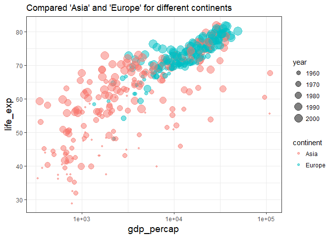

*plot 2: Scatterplot of `year` and `lifeExp`, only consider three countries: France, Canada, China *

``` r
France_Canada_China<- gapminder_dataframe %>% 
    filter(country%in%c("France", "Canada", "China")) %>% 
    select(country,continent,year,lifeExp) %>% 
   ggplot( aes(x = year, y = lifeExp, color = country))+ 
  geom_point()+
  geom_line(aes(group = country))+theme_bw()+
  labs(title="Scatterplot of `year` and `lifeExp`, only consider three countries: France, Canada, China ")+
  theme(axis.title = element_text(size=14))
France_Canada_China
```

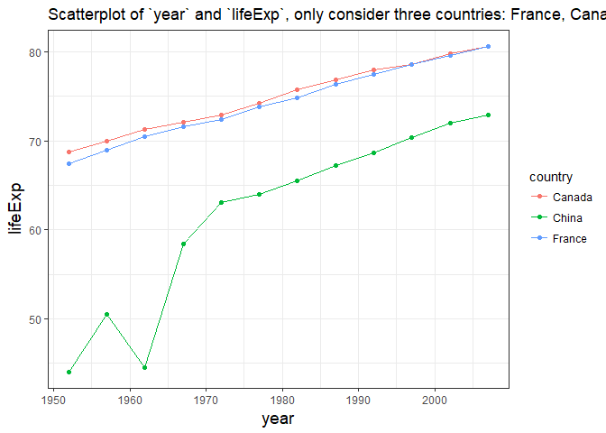

*plot3, using `facet_wrap` for different continent*

In general, lifeExp for different continents was increasing from 1950 to 2007. Asia life expectancy rise sharply and Africa life expectancy rise smoothly.

``` r
life_differentcountry<-ggplot(gapminder_dataframe, aes(x=year, y=lifeExp,color = continent)) +
  geom_jitter(alpha = 1/3, size = 3) +
  facet_wrap(~ continent) +
  geom_smooth(method="lm", span =0.1, color= "red")+
  theme_bw() +
  theme(strip.background = element_rect(fill="orange"),
        axis.title = element_text(size=12),
        strip.text = element_text(size=12, face="bold"))
life_differentcountry
```

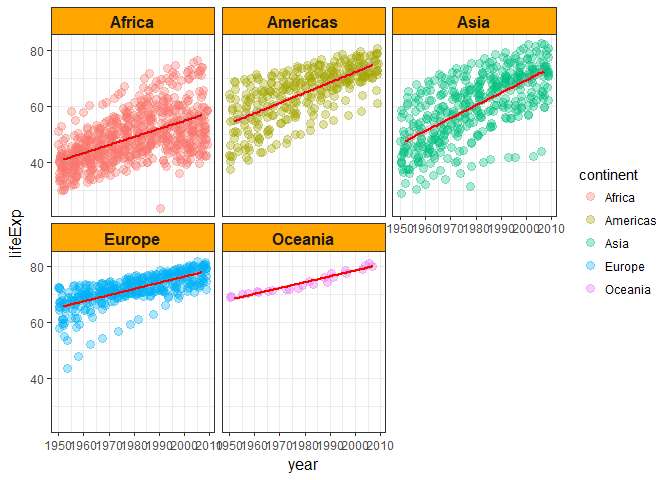 **Reorder the continents based on life expectancy. You decide the details.** **Sort the actual data in a deliberate fashion. You decide the details, but this should at least implement your new continent ordering.**

``` r
Reorder_gapminder <- gapminder_dataframe %>%
  group_by(continent) %>%
  summarize(max_lifeExp=max(lifeExp)) %>% 
  mutate(continent=fct_reorder(continent,max_lifeExp)) %>%
  ggplot(aes(y=max_lifeExp,x=continent,color=max_lifeExp)) + 
  geom_point() + 
  labs(title="maximum lifeExp reordered for different continent") + 
  theme_bw() +
  theme(axis.title = element_text(size=12))
Reorder_gapminder
```

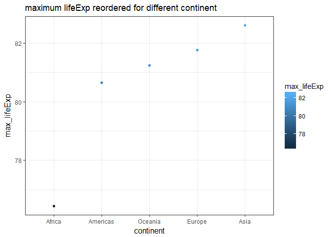

*Reorder the continents based on maximum life expectancy.* Use `max(lifeExp)` to `fct_reorder` continent.

``` r
reordergapminder_dataframe <- gapminder_dataframe %>%
  mutate(continent= fct_reorder(continent, lifeExp, max, .desc = TRUE)) 
```

*compared the plots after and before reordering continent by maximum lifeExp*

``` r
gapminder_dataframe %>% 
  group_by(continent) %>% 
  summarize(max_lifeExp=max(lifeExp)) %>% 
  ggplot(aes(x=continent,y=max_lifeExp,size=max_lifeExp)) + 
  geom_point() + 
  labs(title=" original order fpr each continent based on maximum lifeExp") + 
  theme_bw() +
  theme(axis.title = element_text(size=14))
```

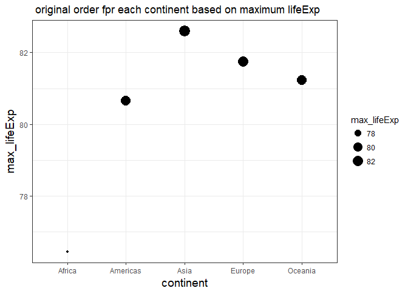

``` r
reordergapminder_dataframe %>% 
  group_by(continent) %>% 
  summarize(max_lifeExp=max(lifeExp)) %>% 
  ggplot(aes(x=continent,y=max_lifeExp,size=max_lifeExp)) + 
    geom_point() + 
  labs(title=" reordered for each continent based on maximum lifeExp") + 
  theme_bw() +
  theme(axis.title = element_text(size=14))
```

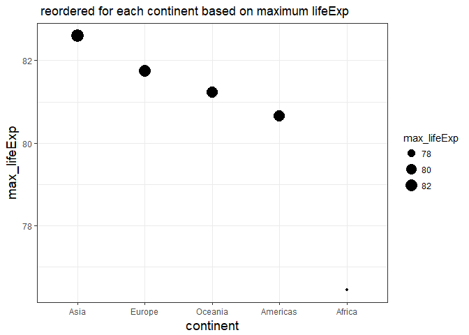

**Write the Gapminder data to file(s), for immediate and future reuse.**

    write.table(reordergapminder_dataframe, "reordergapminder_dataframe.tsv", quote = FALSE,
                sep = "\t", row.names = FALSE)

Perform statistical analyses
----------------------------

**Import the data created in the first script.**

``` r
## Import the data created in the first script.
reordergapminder <- read.delim("reordergapminder_dataframe.tsv")
gapminder_dataframe <- read.delim("gapminder.tsv")
```

**Make sure your new continent order is still in force. You decide the details.**

``` r
#original
gapminder_dataframe %>% 
  group_by(continent) %>% 
  summarize(max_lifeExp=max(lifeExp)) %>% 
  ggplot(aes(x=continent,y=max_lifeExp,size=max_lifeExp)) + 
  geom_point() + 
  labs(title=" original order fpr each continent based on maximum lifeExp") + 
  theme_bw() +
  theme(axis.title = element_text(size=14))
```


``` r
##reorder data
reordergapminder_dataframe %>% 
  group_by(continent) %>% 
  summarize(max_lifeExp=max(lifeExp)) %>% 
  ggplot(aes(x=continent,y=max_lifeExp,size=max_lifeExp)) + 
  geom_point() + 
  labs(title=" reordered for each continent based on maximum lifeExp") + 
  theme_bw() +
  theme(axis.title = element_text(size=14))
```


**Fit a linear regression of life expectancy on year within each country. Write the estimated intercepts, slopes, and residual error variance (or sd) to file. The R package broom may be useful here.**

``` r
(gap_nested <- reordergapminder %>% 
    group_by(continent, country) %>% 
    nest())
```

    ## # A tibble: 142 x 3
    ##    continent     country              data
    ##       <fctr>      <fctr>            <list>
    ##  1      Asia Afghanistan <tibble [12 x 4]>
    ##  2    Europe     Albania <tibble [12 x 4]>
    ##  3    Africa     Algeria <tibble [12 x 4]>
    ##  4    Africa      Angola <tibble [12 x 4]>
    ##  5  Americas   Argentina <tibble [12 x 4]>
    ##  6   Oceania   Australia <tibble [12 x 4]>
    ##  7    Europe     Austria <tibble [12 x 4]>
    ##  8      Asia     Bahrain <tibble [12 x 4]>
    ##  9      Asia  Bangladesh <tibble [12 x 4]>
    ## 10    Europe     Belgium <tibble [12 x 4]>
    ## # ... with 132 more rows

``` r
fit<- function(data) {
  lm(lifeExp ~ I(year - 1950), data = data)
}


gap_nested <- gap_nested %>% 
    mutate(fit = map(data, fit))
#We have a new list-column fit that is even more intimidating than the previous, data. The fit variable holds 142 fitted linear models.
##tidy(): a tidy version of summary(), e.g. a table with one row per parameter estimate
gap_nested <- gap_nested %>% 
  mutate(tidy = map(fit, tidy))
##Apply tidy() to the model for each country 
coefs <- gap_nested %>% 
  select(continent, country, tidy) %>% 
  unnest(tidy)
coefs <- coefs %>%
  mutate(term = recode(term,
                       `(Intercept)` = "intercept",
                       `I(year - 1950)` = "slope"))
write.table(coefs,
            "intercepts_slopes_and_sd.tsv", quote = FALSE,
            sep = "\t", row.names = FALSE)
```

NA

"worst" countries have larger std.error, "best" countries have smaller std.error.

*For Asia:*

``` r
worst_Asia <-coefs %>%
  filter(continent%in%"Asia") %>% 
  arrange(desc(std.error)) %>% 
  head(4)
knitr::kable(worst_Asia)
```

| continent | country          | term      |  estimate|  std.error|  statistic|  p.value|
|:----------|:-----------------|:----------|---------:|----------:|----------:|--------:|
| Asia      | Cambodia         | intercept |  36.22362|   3.218354|   11.25532|    5e-07|
| Asia      | Iraq             | intercept |  49.64304|   2.319155|   21.40566|    0e+00|
| Asia      | Korea, Dem. Rep. | intercept |  54.27275|   2.222595|   24.41864|    0e+00|
| Asia      | China            | intercept |  46.12905|   2.204768|   20.92240|    0e+00|

``` r
best_Asia <-coefs %>%
  filter(continent%in%"Asia") %>% 
  arrange(std.error) %>% 
  head(4)
knitr::kable(best_Asia)
```

| continent | country   | term  |   estimate|  std.error|  statistic|  p.value|
|:----------|:----------|:------|----------:|----------:|----------:|--------:|
| Asia      | Israel    | slope |  0.2671063|  0.0061169|   43.66662|        0|
| Asia      | Pakistan  | slope |  0.4057923|  0.0067390|   60.21549|        0|
| Asia      | Indonesia | slope |  0.6346413|  0.0107967|   58.78112|        0|
| Asia      | Iran      | slope |  0.4966399|  0.0111159|   44.67841|        0|

*For America*

``` r
worst_America <-coefs %>%
  filter(continent%in%"Americas") %>% 
  arrange(desc(std.error)) %>% 
  head(4)
knitr::kable(worst_America)
```

| continent | country             | term      |  estimate|  std.error|  statistic|  p.value|
|:----------|:--------------------|:----------|---------:|----------:|----------:|--------:|
| Americas  | Jamaica             | intercept |  62.21820|  1.1752373|   52.94096|        0|
| Americas  | El Salvador         | intercept |  45.55767|  1.1106673|   41.01828|        0|
| Americas  | Cuba                | intercept |  61.57115|  0.9950017|   61.88044|        0|
| Americas  | Trinidad and Tobago | intercept |  61.70498|  0.9443223|   65.34314|        0|

``` r
best_America <-coefs %>%
  filter(continent%in%"Americas") %>% 
  arrange(std.error) %>% 
  head(4)
knitr::kable(best_America)
```

| continent | country   | term  |   estimate|  std.error|  statistic|  p.value|
|:----------|:----------|:------|----------:|----------:|----------:|--------:|
| Americas  | Canada    | slope |  0.2188692|  0.0041686|   52.50378|        0|
| Americas  | Argentina | slope |  0.2317084|  0.0048888|   47.39585|        0|
| Americas  | Brazil    | slope |  0.3900895|  0.0054562|   71.49417|        0|
| Americas  | Paraguay  | slope |  0.1573545|  0.0065464|   24.03682|        0|

*For Africa*

``` r
worst_Africa <-coefs %>%
  filter(continent%in%"Africa") %>% 
  arrange(desc(std.error)) %>% 
  head(4)
knitr::kable(worst_Africa)
```

| continent | country   | term      |  estimate|  std.error|  statistic|  p.value|
|:----------|:----------|:----------|---------:|----------:|----------:|--------:|
| Africa    | Zimbabwe  | intercept |  55.40729|   4.118834|   13.45218|    1e-07|
| Africa    | Swaziland | intercept |  46.19771|   3.797956|   12.16383|    3e-07|
| Africa    | Rwanda    | intercept |  42.83361|   3.748898|   11.42565|    5e-07|
| Africa    | Botswana  | intercept |  52.80778|   3.493899|   15.11428|    0e+00|

``` r
best_Africa <-coefs %>%
  filter(continent%in%"Africa") %>% 
  arrange(std.error) %>% 
  head(4)
knitr::kable(best_Africa)
```

| continent | country           | term  |   estimate|  std.error|  statistic|  p.value|
|:----------|:------------------|:------|----------:|----------:|----------:|--------:|
| Africa    | Equatorial Guinea | slope |  0.3101706|  0.0054973|   56.42252|        0|
| Africa    | Mauritania        | slope |  0.4464175|  0.0068159|   65.49636|        0|
| Africa    | Comoros           | slope |  0.4503909|  0.0080053|   56.26165|        0|
| Africa    | Mali              | slope |  0.3768098|  0.0080547|   46.78120|        0|

*For Europe*

``` r
worst_Europe <-coefs %>%
  filter(continent%in%"Europe") %>% 
  arrange(desc(std.error)) %>% 
  head(4)
knitr::kable(worst_Europe)
```

| continent | country                | term      |  estimate|  std.error|  statistic|  p.value|
|:----------|:-----------------------|:----------|---------:|----------:|----------:|--------:|
| Europe    | Montenegro             | intercept |  61.65563|   1.574171|   39.16706|        0|
| Europe    | Bulgaria               | intercept |  65.44593|   1.434284|   45.62968|        0|
| Europe    | Bosnia and Herzegovina | intercept |  57.39005|   1.289976|   44.48926|        0|
| Europe    | Albania                | intercept |  58.55976|   1.133576|   51.65933|        0|

``` r
best_Europe <-coefs %>%
  filter(continent%in%"Europe") %>% 
  arrange(std.error) %>% 
  head(4)
knitr::kable(best_Europe)
```

| continent | country     | term  |   estimate|  std.error|  statistic|  p.value|
|:----------|:------------|:------|----------:|----------:|----------:|--------:|
| Europe    | Sweden      | slope |  0.1662545|  0.0035418|   46.94090|        0|
| Europe    | Switzerland | slope |  0.2222315|  0.0035944|   61.82783|        0|
| Europe    | France      | slope |  0.2385014|  0.0036802|   64.80579|        0|
| Europe    | Belgium     | slope |  0.2090846|  0.0048987|   42.68124|        0|

Generate figures
----------------

**Create a figure for each continent, and write one file per continent, with an informative name. The figure should give scatterplots of life expectancy vs. year, faceting on country, fitted line overlaid.** *For Asia*

``` r
plot_worst_Asia<-reordergapminder %>% 
  filter(country %in% worst_Asia$country) %>% 
  ggplot(aes(x=year,y=lifeExp)) + 
  geom_point()+
  geom_smooth(method="lm",se=FALSE) +
  facet_wrap(~country) + 
  labs(titile="Compared lifeExp and year  with large sd 4 countries in Asia")+ 
  theme_bw() +
  theme(strip.background = element_rect(fill="green"),
        axis.title = element_text(size=14),
        strip.text = element_text(size=14, face="bold"))
plot_worst_Asia
```

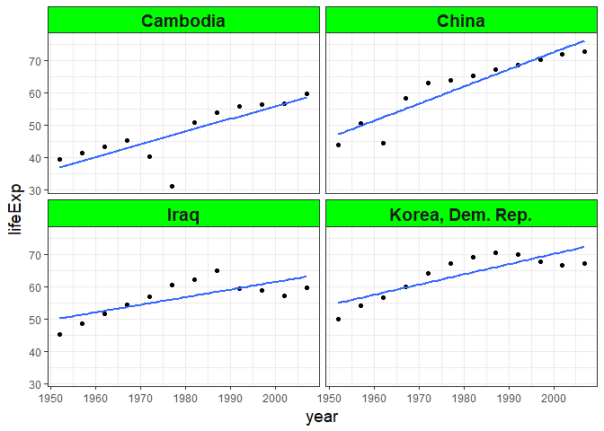

``` r
plot_best_Asia<-reordergapminder %>% 
  filter(country %in% best_Asia$country) %>% 
  ggplot(aes(x=year,y=lifeExp)) + 
  geom_point()+
  geom_smooth(method="lm",se=FALSE) +
  facet_wrap(~country) + 
  labs(titile="Compared lifeExp and year  with small sd 4 countries in Asia")+ 
  theme_bw() +
  theme(strip.background = element_rect(fill="green"),
        axis.title = element_text(size=14),
        strip.text = element_text(size=14, face="bold"))
plot_best_Asia
```

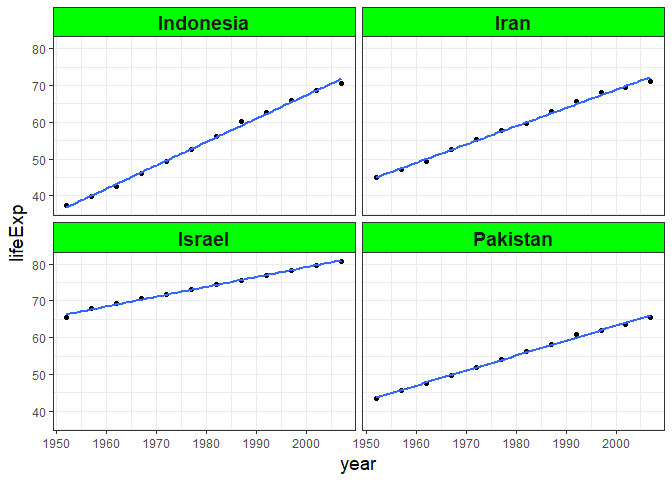

*For America*

``` r
plot_worst_America<-reordergapminder %>% 
  filter(country %in% worst_America$country) %>% 
  ggplot(aes(x=year,y=lifeExp)) + 
  geom_point()+
  geom_smooth(method="lm",se=FALSE) +
  facet_wrap(~country) + 
  labs(titile="Compared lifeExp and year  with large sd 4 countries in America")+ 
  theme_bw() +
  theme(strip.background = element_rect(fill="green"),
        axis.title = element_text(size=14),
        strip.text = element_text(size=14, face="bold"))
plot_worst_America
```

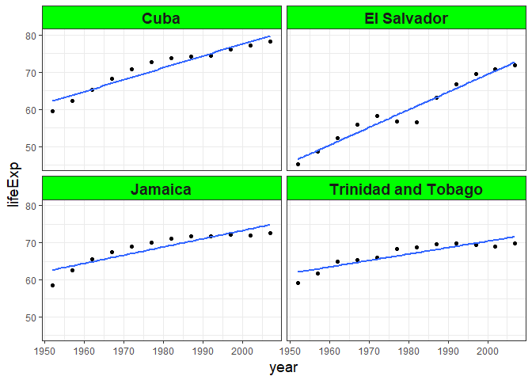

``` r
plot_best_America<-reordergapminder %>% 
  filter(country %in% best_America$country) %>% 
  ggplot(aes(x=year,y=lifeExp)) + 
  geom_point()+
  geom_smooth(method="lm",se=FALSE) +
  facet_wrap(~country) + 
  labs(titile="Compared lifeExp and year  with small sd 4 countries in America")+ 
  theme_bw() +
  theme(strip.background = element_rect(fill="green"),
        axis.title = element_text(size=14),
        strip.text = element_text(size=14, face="bold"))
plot_best_America
```

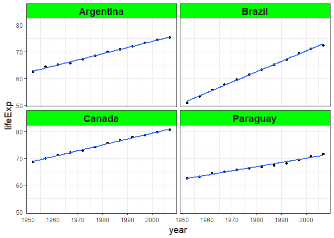

*For Africa*

``` r
plot_worst_Africa<-reordergapminder %>% 
  filter(country %in% worst_Africa$country) %>% 
  ggplot(aes(x=year,y=lifeExp)) + 
  geom_point()+
  geom_smooth(method="lm",se=FALSE) +
  facet_wrap(~country) + 
  labs(titile="Compared lifeExp and year  with large sd 4 countries in Africa")+ 
  theme_bw() +
  theme(strip.background = element_rect(fill="green"),
        axis.title = element_text(size=14),
        strip.text = element_text(size=14, face="bold"))
plot_worst_Africa
```


``` r
plot_best_Africa<-reordergapminder %>% 
  filter(country %in% best_Africa$country) %>% 
  ggplot(aes(x=year,y=lifeExp)) + 
  geom_point()+
  geom_smooth(method="lm",se=FALSE) +
  facet_wrap(~country) + 
  labs(titile="Compared lifeExp and year  with small sd 4 countries in Africa")+ 
  theme_bw() +
  theme(strip.background = element_rect(fill="green"),
        axis.title = element_text(size=14),
        strip.text = element_text(size=14, face="bold"))
plot_best_Africa
```

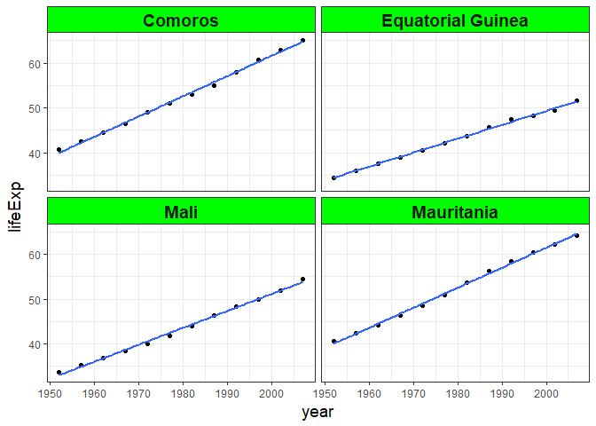

*For Europe*

``` r
plot_worst_Europe<-reordergapminder %>% 
  filter(country %in% worst_Europe$country) %>% 
  ggplot(aes(x=year,y=lifeExp)) + 
  geom_point()+
  geom_smooth(method="lm",se=FALSE) +
  facet_wrap(~country) + 
  labs(titile="Compared lifeExp and year  with large sd 4 countries in Europe")+ 
  theme_bw() +
  theme(strip.background = element_rect(fill="green"),
        axis.title = element_text(size=14),
        strip.text = element_text(size=14, face="bold"))
plot_worst_Europe
```

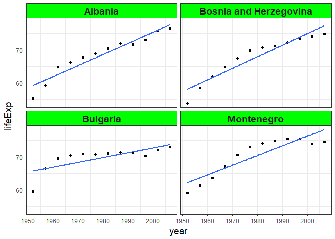

``` r
plot_best_Europe<-reordergapminder %>% 
  filter(country %in% best_Europe$country) %>% 
  ggplot(aes(x=year,y=lifeExp)) + 
  geom_point()+
  geom_smooth(method="lm",se=FALSE) +
  facet_wrap(~country) + 
  labs(titile="Compared lifeExp and year  with small sd 4 countries in Europe")+ 
  theme_bw() +
  theme(strip.background = element_rect(fill="green"),
        axis.title = element_text(size=14),
        strip.text = element_text(size=14, face="bold"))
plot_best_Europe
```

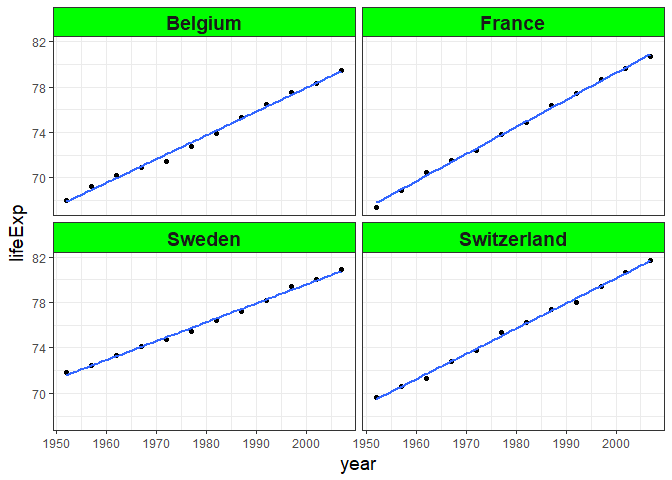
